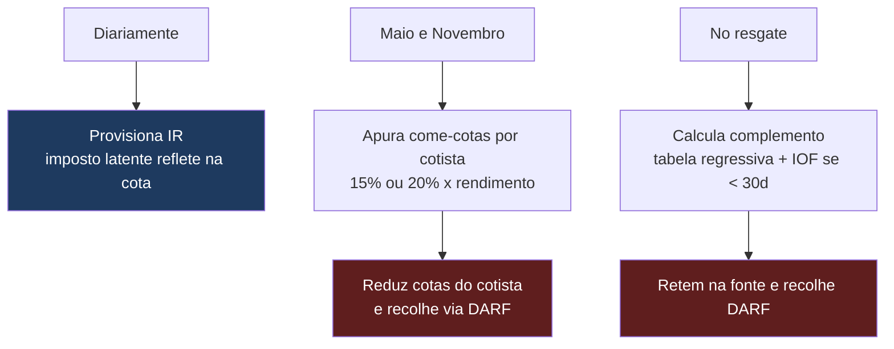

# Manual de Passivo do Cotista e Tributação

> **Base legal:** Resolução CVM nº 21/2021 (autorização e requisitos do administrador fiduciário) e Resolução CVM nº 175/2022 (Marco Regulatório dos Fundos de Investimento), em especial o **art. 104, VII** (nas classes abertas, receber e processar os pedidos de resgate) e o **art. 104, VI** (serviço de atendimento ao cotista), além do **art. 31** (comunicar a primeira integralização de cotas em até 5 dias úteis). Em matéria tributária, a **Lei nº 14.754/2023** define o **administrador fiduciário como o responsável tributário** pelos tributos incidentes sobre os cotistas do fundo. O onboarding e a distribuição envolvem ainda a **Res. CVM nº 50/2021** (PLD/FT) e a avaliação de adequação (*suitability*).
>
> **Natureza deste documento — leia primeiro.** Este Manual é, em sua maior parte, uma **especificação de produção (🟩)**, e não a descrição de um sistema já operante. O piloto trata o cotista como **posição estática**: existem as tabelas [cotistas] e [mov_cotistas], mas **não há motor de aplicação/resgate, motor de cotização, nem motor fiscal**. Praticamente todos os processos descritos adiante estão sinalizados com **🟩 (roadmap de produção)** e ainda **não estão implementados**. Este módulo — o passivo e a tributação — é o **maior módulo ausente** para operar cotista real e é pré-requisito absoluto de produção (ver `../relatorio_gaps_producao_licenca.md`, Bloco 1).
>
> **Documento interno — revisar com as áreas Jurídica, Tributária e de Compliance antes de submeter à CVM ou de operar em produção.** Valores, alíquotas e prazos citados devem ser confirmados na legislação vigente.

---

## 1. Objetivo e abrangência

Este Manual estabelece a especificação funcional e regulatória do **passivo do cotista** — cadastro, aplicações, resgates, extratos e atendimento — e da **tributação** dos cotistas, no âmbito da atividade de **administração fiduciária** de fundos de investimento, com vistas a instruir o pedido de autorização sob a **Res. CVM 21** e a operar sob a **Res. CVM 175**.

A área responsável pelo passivo e pela tributação é encarregada de:

| Frente | Escopo | Situação no piloto |
|---|---|---|
| Onboarding do cotista | Cadastro PF/PJ, KYC/PLD, FATCA/CRS, suitability, adesão. | 🟩 Roadmap |
| Escrituração do passivo | Emissão e cancelamento de cotas; custo médio por cotista. | Parcial — cadastro estático |
| Aplicações e resgates | Cotização, conversão em cotas e liquidação financeira. | 🟩 Roadmap |
| Tributação (responsável tributário) | Come-cotas, IR na fonte, IOF, provisão diária e recolhimento. | 🟩 Roadmap |
| Obrigações acessórias | Informe de rendimentos, DIRF/e-Financeira. | 🟩 Roadmap |
| Atendimento ao cotista (art. 104, VI) | Extrato, canal de atendimento, comunicação de eventos. | Parcial |

A plataforma-piloto de suporte encontra-se em `..\piloto\`, com o portal operacional acessível em `/admin/`. As tabelas e campos do banco de dados são referidos entre [colchetes] ao longo deste documento. O piloto mantém [cotistas] (campos [nome], [documento], [tipo_pessoa], [cotas], [data_entrada]) e [mov_cotistas] (campos [tipo], [valor], [cotas], [data_cotizacao], [data_liquidacao]), suficientes para **representar** posições, mas **sem os motores** que as produziriam de forma controlada.

> 🟩 **Honestidade de escopo.** O piloto **não emite nem cancela cotas por ordem**, **não cotiza**, **não retém tributo** e **não gera guia de recolhimento**. As Seções 2 a 6 descrevem o que **deve ser construído**.

---

## 2. Onboarding do cotista 🟩

O ingresso de um cotista pressupõe cadastro completo, verificação de PLD/FT, classificações fiscais internacionais, avaliação de adequação e formalização da adesão com trilha de aceite. Nada disso existe hoje no piloto além do cadastro estático em [cotistas].

### 2.1 Cadastro PF/PJ

| Dado | PF | PJ | Observação |
|---|---|---|---|
| Identificação | Nome, CPF | Razão social, CNPJ | [documento], [tipo_pessoa] |
| **Beneficiário final** | — | Cadeia societária até a pessoa natural | Vedado cotista "opaco" |
| Endereço e contato | Sim | Sim | Base de comunicação de eventos |
| Situação fiscal | Isento / PF / não residente | PJ / não residente | Define a tributação aplicável (Seção 5) |

### 2.2 KYC/PLD (Res. CVM 50)

O onboarding aplica os procedimentos de **conheça seu cliente** e **prevenção à lavagem de dinheiro e ao financiamento do terrorismo** da **Res. CVM 50**: identificação e qualificação, verificação documental, avaliação de risco do cliente, screening de listas restritivas e de pessoas expostas politicamente, e monitoramento de operações atípicas. 🟩 Não implementado no piloto.

### 2.3 FATCA/CRS

Classificação do cotista para os regimes de troca automática de informações — **FATCA** (EUA) e **CRS/OCDE** — com coleta de autocertificação, identificação de indícios de residência fiscal no exterior e geração das informações à Receita quando aplicável. 🟩 Roadmap.

### 2.4 Suitability (perfil × público-alvo)

Avaliação de **adequação do produto ao perfil** do investidor, confrontando o perfil apurado com o **público-alvo do fundo** ([fundos.publico_alvo]: *investidores em geral*, *qualificados*, *profissionais*). O sistema deve **bloquear ou alertar** aplicações incompatíveis e registrar o consentimento em caso de desenquadramento voluntário admitido. 🟩 Roadmap.

### 2.5 Termo de adesão eletrônico com trilha

Formalização da entrada por **termo de adesão eletrônico**, com apresentação do regulamento, da lâmina (se houver) e dos avisos obrigatórios, registro de data/hora, IP e versão dos documentos aceitos — constituindo **trilha de aceite** auditável. 🟩 Roadmap.

> **Nota de conformidade (art. 31).** A **primeira integralização de cotas** deve ser comunicada nos termos do **art. 31** da Res. CVM 175, no prazo de **5 dias úteis**. O sistema de onboarding deve disparar essa comunicação a partir do evento de primeira aplicação.

---

## 3. Aplicações 🟩

A aplicação transforma um aporte financeiro em cotas do fundo. O piloto **não** possui esse fluxo; [mov_cotistas] apenas **armazena** um registro do tipo *Aplicação*, sem produzi-lo por ordem nem cotizá-lo.

### 3.1 Fluxo-alvo

1. **Ordem de aplicação** — o cotista solicita o aporte de um valor.
2. **Cotização (D+0 ou D+1)** — conforme o regulamento do fundo, define-se a **data de conversão**; o valor é convertido em cotas pela **cota da data de conversão**.
3. **Conversão em cotas** — emite-se a quantidade de cotas, **soma-se** à posição do cotista em [cotistas.cotas] e registra-se o **custo de aquisição do lote** (base para o cálculo de IR — Seção 5).
4. **Liquidação financeira** — o recurso é creditado na conta do fundo (TED/PIX), atualizando o caixa.

```
cotas emitidas = valor aplicado ÷ cota da data de conversão
```

| Marco | Campo/base | Situação |
|---|---|---|
| Data de conversão | [mov_cotistas.data_cotizacao] | 🟩 Motor de cotização ausente |
| Data de liquidação | [mov_cotistas.data_liquidacao] | 🟩 Sem fila/agenda de liquidação |
| Custo de aquisição por lote | — (campo inexistente) | 🟩 A criar — essencial para IR |

> 🟩 O **motor de cotização** — que conhece, por fundo, o tipo de cota (abertura para baixa volatilidade; fechamento para os demais) e os prazos D+ de conversão e liquidação — é item de roadmap. Ver interface com a Controladoria (Seção 8).

---

## 4. Resgates (art. 104, VII) 🟩

Nos termos do **art. 104, VII**, cabe ao administrador, **nas classes abertas, receber e processar os pedidos de resgate**. O piloto não possui motor de resgate; [mov_cotistas] apenas armazena registros do tipo *Resgate*.

### 4.1 Fluxo-alvo

1. **Ordem de resgate** — o cotista solicita a saída total ou parcial.
2. **Fila de resgate** — a ordem entra em fila, respeitando eventuais **carências** e **lock-up** (fundos fechados).
3. **Cotização (D+N)** — na data de conversão definida pelo regulamento, cotas são convertidas em R$ pela **cota da data de conversão**; **subtraem-se** as cotas de [cotistas.cotas].
4. **Retenção tributária** — apura-se e retém-se **IR na fonte** e **IOF** quando aplicável (Seção 5).
5. **Liquidação (D+M)** — o valor **líquido** é pago ao cotista.

```
valor bruto = cotas resgatadas × cota da data de conversão
valor líquido = valor bruto − IR na fonte − IOF
```

### 4.2 Carências, lock-up e resgate compulsório

| Situação | Tratamento-alvo | Situação no piloto |
|---|---|---|
| Carência | Bloqueio do resgate até o prazo mínimo | 🟩 Ausente |
| Lock-up (fundo fechado) | Vedação de resgate durante o período | 🟩 Ausente |
| **Resgate compulsório para come-cotas** | Redução de cotas na apuração semestral (Seção 5) | 🟩 Ausente |

> 🟩 O **motor de resgate** — fila, cotização D+N, retenção tributária e liquidação D+M — é item de roadmap e está diretamente acoplado ao **risco de liquidez** (Seção 8) e ao **motor fiscal** (Seção 5).

---

## 5. Tributação — o administrador como responsável tributário 🟩

**Ponto central.** A **Lei nº 14.754/2023** define o **administrador fiduciário como o responsável tributário** pelos tributos incidentes sobre os cotistas: **é o administrador quem calcula, retém e recolhe**. Erro ou atraso é responsabilidade do administrador. Esta é a função de **maior risco operacional** e a que **não pode ser improvisada** — exige motor fiscal correto e apoio de tributarista. **Nada disso existe no piloto.**

### 5.1 Come-cotas (antecipação semestral)

| Item | Regra |
|---|---|
| **Quando** | Último dia útil de **maio** e de **novembro** (ou antes, em caso de resgate/amortização/distribuição) |
| **Alíquota** | **15%** (fundos de longo prazo) ou **20%** (fundos de curto prazo) |
| **Base** | Rendimento positivo do período (valor patrimonial da cota − custo de aquisição) |
| **Mecânica** | "Come" cotas — **reduz a quantidade de cotas** do cotista, sem alterar o valor da cota |

### 5.2 IR na fonte no resgate (tabela regressiva)

| Prazo da aplicação | Alíquota |
|---|---|
| Até 180 dias | 22,5% |
| De 181 a 360 dias | 20% |
| De 361 a 720 dias | 17,5% |
| Acima de 720 dias | 15% |

No resgate, retém-se o **complemento** entre a alíquota devida pela tabela regressiva e o que o come-cotas já antecipou.

### 5.3 IOF

Incide sobre resgates realizados em **menos de 30 dias** da aplicação, segundo tabela regressiva por dia; **zera após 30 dias**.

### 5.4 Custo médio por cotista

O sistema deve controlar o **custo médio de aquisição por cotista** (por lote e data), pois é a **base** de cálculo tanto do come-cotas quanto do IR no resgate, e determina o **prazo** aplicável na tabela regressiva. 🟩 Campo inexistente no piloto — a criar.

### 5.5 Regimes tributários por tipo de fundo

Cada fundo tem um **regime tributário parametrizado**. O motor fiscal precisa reconhecer o regime de cada fundo, pois há exceções relevantes ao regime geral (come-cotas + tabela regressiva).

| Regime / tipo de fundo | Come-cotas | IR no resgate | Observação |
|---|---|---|---|
| Fundo de RF/multimercado (longo prazo) | Sim — 15% | Complemento regressivo (22,5%→15%) | Regime geral |
| Fundo de RF (curto prazo) | Sim — 20% | Complemento regressivo (mín. 20%) | Prazo médio da carteira ≤ 365 dias |
| **Fundos de ações** | **Não** | **15%** sobre o ganho, só no resgate | Regime mais simples |
| **FII / Fiagro** | Não (regime próprio) | Regra específica | Se entrarem no escopo |
| **ETF** | Conforme índice/ativo | Regra específica | Se entrar no escopo |
| **FIDC** | Conforme enquadramento | Regra específica | Se entrar no escopo |
| **FIP** | Regime próprio | Regra específica | Se entrar no escopo |

> ⚠️ Os regimes específicos (FII/Fiagro, ETF, FIDC, FIP) só são detalhados **se** entrarem no escopo do produto. Cada caso concreto exige validação de tributarista.

### 5.6 Motor fiscal (o que construir) 🟩



| Componente | Função | Situação |
|---|---|---|
| Provisão diária de IR | Reflete o imposto latente na cota, evitando salto na data do come-cotas | 🟩 Ausente |
| Apuração de come-cotas (mai/nov) | Rendimento por cotista, alíquota, redução de cotas | 🟩 Ausente |
| Complemento no resgate | Tabela regressiva por lote + IOF se < 30 dias | 🟩 Ausente |
| Geração de DARF | Guia nos códigos de receita corretos | 🟩 Ausente |
| Controle por regime | Regime tributário parametrizado por fundo (Seção 5.5) | 🟩 Ausente |

> ⚠️ **Interface com a Controladoria.** A **provisão diária de IR** afeta o **valor da cota**, e o come-cotas **reduz o número de cotas** — ambos impactam a cota e o PL apurados pela Controladoria (ver Seção 8 e `manual_controladoria_precificacao.md`).

---

## 6. Obrigações acessórias 🟩

O papel de responsável tributário implica obrigações acessórias perante a Receita Federal, além do recolhimento.

| Obrigação | Periodicidade | Conteúdo | Situação |
|---|---|---|---|
| **Informe de rendimentos** | Anual | Rendimentos, IR retido e posição por cotista | 🟩 Ausente |
| **DIRF / e-Financeira** | Anual / periódica | Declaração de retenções e informações financeiras à RFB | 🟩 Ausente |
| **DARF** | Ao evento (come-cotas/resgate) | Recolhimento do IR/IOF retido | 🟩 Ausente |

> 🟩 A geração do **informe de rendimentos anual** por cotista e o envio de **DIRF/e-Financeira** dependem do custo médio por cotista e do histórico de retenções — ambos inexistentes no piloto. A implementação deve confirmar layouts e prazos na legislação vigente.

---

## 7. Extrato e atendimento ao cotista (art. 104, VI)

Nos termos do **art. 104, VI**, cabe ao administrador prestar o **serviço de atendimento ao cotista**. Neste ponto o piloto oferece suporte **parcial** (posição consolidada estática e módulo de assembleias/chamados), mas sem extrato movimentado nem informe de rendimentos.

### 7.1 Extrato do cotista

| Item do extrato | Fonte-alvo | Situação |
|---|---|---|
| Posição consolidada (cotas e valor) | [cotistas.cotas] × cota | Parcial (estático) |
| Movimentações (aplicações/resgates) | [mov_cotistas] | Parcial |
| Rendimento e IR retido no período | Motor fiscal (Seção 5) | 🟩 Ausente |

### 7.2 Atendimento e comunicação de eventos

- **Canal de atendimento / chamados** — dúvidas, solicitações de extrato, segunda via de informe.
- **Comunicação obrigatória de eventos** — convocação de **assembleias** ([assembleias]) e **alterações de regulamento com direito de retirada**, que devem ser comunicadas aos cotistas com a antecedência e a forma exigidas pela norma.

> 🟩 O extrato com **rendimento e IR** e o **informe de rendimentos** dependem do motor fiscal (Seção 5). A comunicação de eventos com direito de retirada deve ser tratada em conjunto com o fluxo de resgate (Seção 4).

---

## 8. Interfaces com outras áreas

O passivo e a tributação não operam isoladamente; acoplam-se à Controladoria e ao risco de liquidez.

| Interface | Natureza do acoplamento | Referência |
|---|---|---|
| **Controladoria / Precificação** | A **provisão diária de IR** altera o valor da cota; o **come-cotas** e a emissão/cancelamento de cotas alteram o **número total de cotas** e, portanto, a cota (cota = PL ÷ nº de cotas) e o PL. | `manual_controladoria_precificacao.md` |
| **Risco de liquidez** | Resgates, fila de resgate e concentração de cotistas alimentam o monitoramento de liquidez (descasamento ativo × passivo). | `manual_risco_liquidez.md` |
| **Matriz de conformidade** | Mapeamento dos deveres (art. 104, VI–VII; art. 31) às evidências. | `matriz_conformidade_cvm21_175.md` |
| **Estrutura operacional/tecnológica** | Arquitetura de suporte aos motores de passivo e fiscal. | `dossie_estrutura_operacional_tecnologica.md` |

> **Nota.** A cota, o PL e o número de cotas são grandezas **compartilhadas** entre este módulo (passivo/tributação) e a Controladoria. Qualquer motor fiscal ou de cotização deve ser desenvolvido em conjunto com a Controladoria para preservar a consistência entre PL contábil, cota e posição do passivo.

---

## 9. Roadmap de construção e priorização 🟩

Este módulo é **pré-requisito absoluto** para operar um único cotista real. O quadro abaixo resume a ordem sugerida de construção; o detalhamento e o cronograma constam de `../relatorio_gaps_producao_licenca.md` (**Bloco 1 — Passivo do cotista**).

| Ordem | Componente a construir | Por quê | Situação |
|---|---|---|---|
| 1 | **Escrituração do passivo** (cotas por lote, custo de aquisição, beneficiário final) | Sem isso não há cota nem base de IR | 🟩 Parcial (estático) |
| 2 | **Onboarding** (KYC/PLD, FATCA/CRS, suitability, adesão) | Requisito de entrada de cotista | 🟩 Ausente |
| 3 | **Motor de cotização** (cota abertura/fechamento, prazos D+) | Aplicações e resgates corretos | 🟩 Ausente |
| 4 | **Motor fiscal** (provisão diária, come-cotas, IR regressivo, IOF, DARF) | Responsável tributário — não pode errar | 🟩 Ausente |
| 5 | **Obrigações acessórias** (informe de rendimentos, DIRF/e-Financeira) | Obrigação legal perante a RFB | 🟩 Ausente |
| 6 | **Extrato e atendimento** (art. 104, VI) com rendimento/IR | Relação com o cotista | 🟩 Parcial |

> **Bloqueio de produção.** Enquanto os componentes 1 a 4 não estiverem implementados e validados, **não é possível operar cotista real**. A tributação (item 4) e o controle de custo médio (item 1) são as frentes de maior risco e exigem apoio de **tributarista**.

---

## 10. Referência normativa e revisão

**Base normativa:** Resolução CVM nº 21/2021; Resolução CVM nº 175/2022, em especial **art. 31** (comunicação da primeira integralização em 5 dias úteis), **art. 104, VI** (serviço de atendimento ao cotista) e **art. 104, VII** (recebimento e processamento de pedidos de resgate nas classes abertas); **Res. CVM nº 50/2021** (PLD/FT) e regras de *suitability* aplicáveis à distribuição; e **Lei nº 14.754/2023** (tributação de fundos — administrador fiduciário como responsável tributário; come-cotas em maio e novembro; IR na fonte pela tabela regressiva; IOF em resgates com menos de 30 dias).

| Documento | Conteúdo relacionado |
|---|---|
| `matriz_conformidade_cvm21_175.md` | Mapeamento de deveres regulatórios às evidências de controle. |
| `dossie_estrutura_operacional_tecnologica.md` | Arquitetura operacional e tecnológica de suporte. |
| `manual_controladoria_precificacao.md` | Cálculo de cota/PL e interface com a tributação (Seção 8). |
| `manual_risco_liquidez.md` | Risco de liquidez e tratamento de resgates (Seção 8). |
| `../relatorio_gaps_producao_licenca.md` | Bloco 1 — passivo do cotista; priorização e cronograma (Seção 9). |

🟩 Os itens assinalados constituem **roadmap de produção** e ainda **não estão implementados no piloto**, que trata o cotista como posição estática.

> **Este documento deve ser revisado com as áreas Jurídica, Tributária e de Compliance antes de sua submissão à CVM ou de sua adoção em ambiente de produção. As alíquotas, os prazos e as regras tributárias aqui descritos têm caráter geral e devem ser confirmados na legislação vigente e validados por tributarista, dada a frequência de alterações e as exceções por tipo de fundo.**
