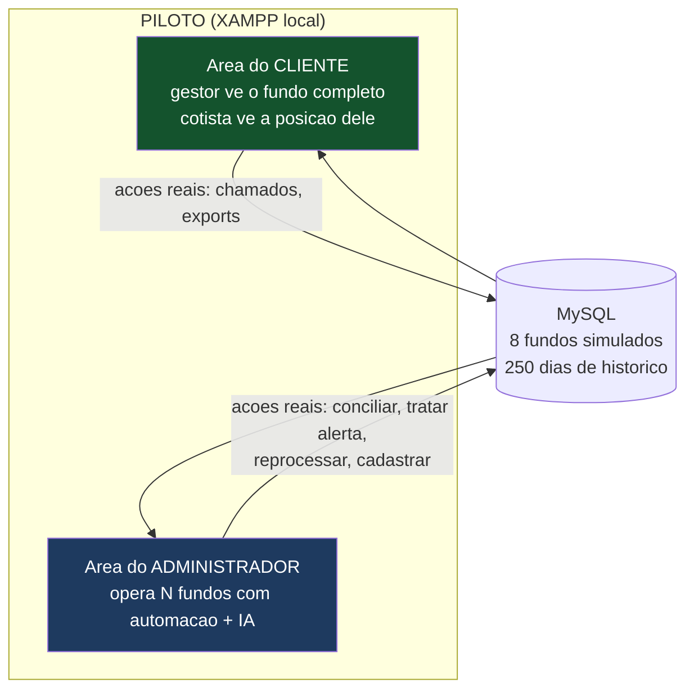

# Especificação do Piloto — Plataforma da Administradora (3 portais + ciclo operacional real)

> **Documento de trabalho — v2.0 (especificação implementada)**
> Descreve **o que o piloto tem**: três portais separados (gestor, cotista, administradora), autenticação real com senha criptografada, cadastro de fundo com exigências da CVM 175, o **ciclo completo da cota D-1** (prévia → aprovação do gestor → rejeição → lançamentos → reprocessamento, inclusive retroativo), liberação controlada de downloads, tokens de acesso do cotista, PDF por classe de ativo e relatórios retroativos. Stack: **XAMPP (PHP + MySQL)**.
>
> **Status:** esta versão **está implementada** na pasta `piloto/` deste diretório.
>
> **Objetivo do piloto:** demonstrar que o produto é real e reproduz o dia a dia de uma administradora fiduciária — não só telas, mas o fluxo operacional que existe na prática: a controladoria precifica e fecha a prévia, o gestor valida ou aponta divergência, a controladoria corrige e reprocessa, e nada é liberado por padrão.

## O que mudou da v1.0 para a v2.0

1. **Três landing pages/portais separados** — `index.php` institucional leva a: Portal do Gestor (login e-mail+senha), Portal do Cotista (**apenas token UUID-36**, sem cadastro) e Área da Administradora (login da equipe). Não há mais atalhos de login: sem credencial válida não se entra em nenhuma aba (sessão validada em toda página).
2. **Senhas com hash bcrypt** (`password_hash`/`password_verify`) e cadastro real de usuários.
3. **Constituição de fundo pelo portal** (`gestor/cadastro.php`): formulário completo (gestora, responsável, fundo, taxas) + **checklist documental que espelha a Res. CVM 175** (contrato social, ato declaratório CVM da gestora, formulário de referência, políticas de risco e PLD/FT, certidões, regulamento com anexo da classe, lâmina, contratos de custódia/auditoria, termo de adesão). Cria usuário gestor + fundo "Em abertura" + checklist no banco.
4. **Gestor de fundo em abertura cai direto no status do processo** ao logar — única tela liberada: etapas + análise documento a documento (com motivo de rejeição e reenvio).
5. **Admin → Aberturas de fundos**: status de todos os fundos, o que falta para lançar cada um, aprovação/rejeição de cada documento, conclusão de etapas e botão **Lançar fundo** (só habilita com checklist completo).
6. **Ciclo da cota D-1 (o coração)**: tabela `fechamentos` com versões. Admin gera a **prévia** → gestor **aprova** (publica) ou **rejeita com motivo** → admin corrige em **Lançamentos & Ajustes** (ajuste de preço/quantidade por ativo, lançamentos de caixa/proventos, tudo com trilha) → **recalcula** (nova versão) → gestor reaprova. **Reprocessamento retroativo**: reabrir fechamento antigo; na aprovação, as cotas posteriores são republicadas em cascata (fator propagado).
7. **Nada liberado por padrão**: downloads do gestor só funcionam para datas com cota **aprovada** e **liberada** pela administradora (cadeado por data no processamento). Admin sempre baixa.
8. **Acessos do cotista por token**: o gestor gera UUIDs v4 na aba **Acessos**, escolhendo o nível — carteira em **tempo real**, **defasagem de 1 mês** ou **3 meses** (padrão de mercado, evita front-running) — e **revoga a qualquer momento** (o acesso cai na hora). O portal do cotista mostra apenas evolução vs benchmark e composição por classe, na data de corte do token.
9. **Snapshots diários de carteira (22 dias úteis)** → carteira, caixa e performance **retroativos** com seletor de data em todas as telas e exports.
10. **PDF gerado em PHP puro** (`includes/pdf.php`, sem dependências): carteira **segregada em seções por classe de ativo**, com subtotais, caixa e PL.
11. **Admin é Vinicius Fernandes** (admin@administradora.com.br).

## O que mudou da v2.0 para a v3.0 (funções de custodiante e agente fiduciário)

12. **Removidos** o simulador de receita do painel de repasses (ferramenta de pitch, não de operação) e a criação rápida de fundo no admin — fundo novo só nasce pela solicitação do gestor com o checklist documental, analisado e lançado na aba Aberturas. **Taxas de gestão e performance não são padronizadas**: o gestor as define no regulamento; a única taxa da plataforma é a de administração (0,08% a.a., piso R$ 100/mês).
13. **Sessão blindada**: versão de autenticação + revalidação do usuário no banco a cada página — sessões de versões antigas do piloto são invalidadas automaticamente.
14. **Módulo Custódia & Liquidação** (funções do custodiante): espelho da posição custodiada por local de guarda (SELIC para títulos públicos, B3/Cetip para crédito privado, Central Depositária para ações) com batimento carteira × custódia; **fila de liquidação física e financeira** (D+1 títulos, D+2 ações — confirmar a liquidação movimenta o caixa do fundo com trilha); **eventos corporativos** (dividendo, JCP, cupom, amortização, bonificação) com o ciclo anunciar → provisionar (reconhece o direito no PL) → liquidar (credita o caixa).
15. **Módulo Regulatório CVM/ANBIMA** (obrigações do administrador fiduciário): fila de **envios periódicos** com prazos reais — informe diário (1 dia útil, **bloqueado até a cota do dia ser aprovada pelo gestor**), balancete, CDA e perfil mensal (10 dias úteis), demonstrações contábeis anuais, estatísticas ANBIMA — com protocolo de envio e reenvio em caso de erro; **ofícios/notificações recebidas do regulador** com prazo de resposta, resposta protocolada ou registro de ciência (o seed traz um ofício real da CVM cobrando o desenquadramento do Atlas); **assembleias de cotistas**: o gestor solicita pela aba Assembleias (alteração de regulamento, taxas, subclasses, prestadores), a administradora convoca (modo eletrônico, CVM 175), conduz e registra quórum e resultado.
16. Todas as novas pendências (envios atrasados, ofícios com prazo, assembleias solicitadas, liquidações pendentes, eventos a processar) entram na **fila unificada de Pendências**.

## O que mudou da v3.0 para a v4.0 (o banco como custodiante)

17. **4º portal — Mesa de Custódia do banco** (`/custodia/`, perfil próprio `custodia`): representa a retaguarda do banco custodiante autorizado pela **Res. CVM 32**. Painel com **contas individualizadas por fundo nas centrais** (SELIC, B3 Depositária, B3 Balcão + conta Reservas/STR do banco); **mensageria RSFN/SPB simulada** (códigos estilo catálogo — SEL1052, STR0008 — com fila, processamento e reprocesso de erro); **instruções & liquidação DVP** (confirmar liquida física+financeira, movimenta o caixa do fundo e registra confirmação na mensageria); **arquivos & extratos** — gera os CSVs diários de posição custodiada e extrato de conta que a administradora usa na conciliação. A divergência do NORD3 (ativo fantasma) atravessa os dois portais, como na vida real.
18. **Acessos de cotistas**: checkbox "mostrar tokens revogados" (desmarcado por padrão — a lista mostra só os ativos).
19. Novo documento de apoio: **`guia_custodia_conexoes.md`** — como o banco vira custodiante (Res. CVM 32), adesões B3/SELIC/RSFN, roadmap pós-licença e análise do sandbox regulatório da CVM. Os demais guias receberam adendos com as correções da pesquisa.

## O que mudou da v4.0 para a v5.0 (boletagem, relatórios e multi-fundo)

20. **Boletagem de operações** (a função básica que faltava): o gestor tem a aba **Boletar operação** — informa compra/venda (ativo, tipo, quantidade, preço, contraparte; venda valida a posição disponível). A boleta cai na **mesa de custódia**, que aceita (gera instrução de liquidação D+1 renda fixa / D+2 bolsa + mensagem na mensageria) ou rejeita com motivo. Na liquidação DVP, **a posição entra/sai da carteira de verdade** (preço médio ponderado na compra; baixa de quantidade na venda; ativo novo é inserido) e o caixa é movimentado — em seguida a administradora reprocessa a cota do dia. Ciclo completo: boleta → aceite → liquidação → carteira → cota.
21. **Regra de disponibilidade corrigida** (a dinâmica real): assim que a administradora **processa o dia** (carteira batida + cota calculada), carteira e relatórios ficam **imediatamente disponíveis** ao gestor — carimbados como **PRÉVIA** até ele aprovar a cota (viram **OFICIAL** depois). O cadeado manual de liberação foi removido; só não há download quando o dia ainda não foi processado. Isso permite ao gestor conferir a posição antes de aprovar (que era o propósito).
22. **Central de Relatórios** reorganizada: seleção de **fundo** (quando a conta tem mais de um), **data** (qualquer dia processado, com selo PRÉVIA/OFICIAL), **tipo** (carteira, fluxo de caixa/extrato, cotistas e participações, série da cota, performance) e **formato** (CSV/JSON, PDF para carteira) — via API única `api/relatorio.php` com controle de acesso por fundo.
23. **Multi-fundo por conta** (estruturas FIC→master e subclasses): tabela `usuario_fundos` (N:N) + **seletor de fundo em foco** na barra lateral do portal do gestor. O seed traz o caso real: Ricardo Nunes administra o **Aurora RF master** e o **Aurora II FIC** (fundo 9, cuja carteira é 100% cotas do master) na mesma conta.

---

## 0. Princípio do piloto: parecer real, com dados simulados

O piloto **não conecta** a custodiante, ANBIMA ou B3 de verdade — usa **dados de exemplo (seed)** no MySQL que imitam 8 fundos reais rodando, com 250 dias úteis de histórico de cota, carteiras coerentes (valor de mercado = quantidade × preço MaM, PL = ativos + caixa), CDI diário para benchmark e uma narrativa de receita visível com o split 25% banco / 75% administradora.

Diferente da v0.1, o piloto v1.0 **não é só vitrine estática**: as ações principais funcionam de verdade contra o banco de dados — resolver divergência de conciliação, tratar alerta de IA, reprocessar etapa do batch, abrir chamado, registrar comentário operacional, cadastrar fundo. Isso muda a percepção na demo: o comercial vê um sistema que *reage*, não um protótipo de telas.



---

## 1. Perfis de acesso e matriz de permissões

O piloto demonstra **segregação de acesso** — um dos pontos que mais passa profissionalismo. Três perfis logam no mesmo sistema e veem coisas diferentes:

| Recurso | Admin (administradora) | Gestor (cliente PJ) | Cotista (investidor) |
|---|---|---|---|
| Painel de todos os fundos | ✅ | ❌ (só o(s) dele(s)) | ❌ |
| Dashboard do fundo | ✅ | ✅ | ✅ versão restrita |
| Carteira detalhada + export | ✅ | ✅ | ❌ (vê só composição % por classe) |
| Caixa, fluxo e previsão | ✅ | ✅ | ❌ |
| Lista nominal de cotistas | ✅ | ✅ visão agregada + concentração | ❌ (vê só a posição própria) |
| Performance e memória de cálculo | ✅ | ✅ | ✅ (rentabilidade da cota) |
| Relatórios / documentos | ✅ | ✅ | ✅ |
| Enquadramento | ✅ | ✅ | ❌ |
| Comunicados / chamados | ✅ | ✅ | ✅ |
| Processamento, conciliação, IA, repasses, cadastros | ✅ | ❌ | ❌ |

**Login real (v2):** três portais separados, sem atalhos. Gestor e administradora entram com e-mail + senha (hash bcrypt no banco; senha demo `demo123`); o cotista entra **apenas com o token UUID** gerado pelo gestor — se o token for revogado, o acesso cai imediatamente. Cada página valida a sessão e o perfil; gestor de fundo em abertura só acessa a tela de status da abertura.

**Estrutura implementada:** `gestor/` (login, cadastro de fundo, abertura, visão geral, aprovação de cota, carteira, caixa, cotistas, acessos/tokens, performance, relatórios, enquadramento, comunicados) · `cotista/` (entrada por token + painel) · `admin/` (login, painel, processamento & cota, lançamentos & ajustes, aberturas, carteiras, conciliação, pendências, IA/fraude, repasses, fundos & clientes) · `api/` (série da cota, export CSV/JSON/PDF com controle de liberação) · `includes/pdf.php` (gerador de PDF puro-PHP) · `sql/` (schema com 26 tabelas + seed determinístico).

---

## PARTE I — ÁREA DO CLIENTE

Precisa transmitir: **"abrir e acompanhar um fundo aqui é simples e transparente"**.

### 1.1 Onboarding / abertura de fundo

Fluxo em duas visões na mesma tela:

1. **Wizard de solicitação (4 passos):** dados do solicitante (gestor/PJ, com KYC/PLD mock retornando "aprovado") → configuração do fundo (nome, classe RF/Ações/Multimercado, público-alvo, condomínio, taxas de administração/gestão/performance, estrutura mono/multiclasse) → upload de documentos (simulado, com checklist: contrato social, Cadastro CVM do gestor, política de investimento) → revisão e envio.
2. **Stepper de acompanhamento do processo real:** etapas Cadastro → Documentos → Análise KYC/PLD → Registro CVM → CNPJ Receita → Conta custodiante → Fundo apto, cada uma com status (concluída / em andamento / pendente), data e responsável. O seed traz o fundo "Nova Fronteira RF Simples" **em abertura**, parado na etapa "Conta custodiante" — mostra o processo vivo.
3. **Tela de conclusão (simulável na demo):** kit de identificação — CNPJ do fundo, código CVM, conta de custódia, credenciais de acesso do gestor.

**Mensagem da demo:** "o que no mercado leva meses e e-mails, aqui é um fluxo digital padronizado — deploy ágil de fundos é diferencial central do plano de negócio."

### 1.2 Dashboard do fundo (tela principal do gestor)

| Bloco | Conteúdo | Fonte |
|---|---|---|
| **Cabeçalho** | Nome, CNPJ, classe, status, data de referência | `fundos` |
| **Cartões KPI** | PL atual; cota do dia com variação diária; rentabilidade no mês e no ano; % do CDI no ano; nº de cotistas; saldo de caixa | `cotas_historico`, `cdi_historico`, `cotistas` |
| **Gráfico cota vs. CDI** | Linha base-100 da cota contra o CDI acumulado, períodos 1M/3M/6M/12M/desde o início (troca via API JSON) | `api/cota_historico.php` |
| **Composição da carteira** | Rosca por classe de ativo + tabela resumida dos maiores ativos com % PL | `ativos_carteira` |
| **Alertas do fundo** | Situação de enquadramento (OK/desenquadrado com regra violada), avisos da administradora | `enquadramento_*`, `comunicados` |
| **Últimas movimentações** | 5 últimos lançamentos de caixa | `movimentacoes` |

**Versão do cotista:** mesmos cabeçalho e gráfico de cota, mas os cartões mostram **a posição dele** (cotas detidas, valor atual, rentabilidade da posição desde a aplicação) e a composição aparece apenas agregada por classe (sem ativos individuais). Sem caixa, sem lista de cotistas.

### 1.3 Carteira detalhada (gestor)

- Tabela completa: código, tipo, quantidade, preço médio de aquisição, preço MaM, **fonte do preço** (B3/ANBIMA/Comitê), valor de mercado, % do PL, **resultado não realizado** (R$ e %) com cor.
- Totalizadores: soma investida, valor de mercado total, caixa, PL.
- **Baixar carteira:** botões CSV e JSON funcionais (`api/carteira_export.php` gera o arquivo com headers de download); botão PDF/Excel presente como "em breve" (honesto e suficiente para demo).
- Filtro por tipo de ativo; destaque visual para ativos precificados por Comitê (menos líquidos).

### 1.4 Caixa e fluxo

- **Saldo atual** e gráfico de barras de entradas/saídas por mês (últimos 6 meses).
- **Extrato de movimentações:** data, tipo (Aplicação, Resgate, Provento, Taxa, Liquidação de compra/venda), descrição, valor com sinal, filtro por tipo.
- **Previsão de caixa (60 dias):** tabela de eventos futuros — proventos a receber, resgates agendados, taxas a pagar, vencimentos de títulos — com **saldo projetado acumulado** linha a linha e alerta visual se o saldo projetado ficar negativo (gestão de liquidez, argumento forte com gestores).

### 1.5 Cotistas e passivo (gestor)

- Cartões: nº de cotistas, cotas emitidas, ticket médio.
- **Concentração:** % dos 5 maiores cotistas com barra de progresso e nota de risco de liquidez (>40% no top 5 = atenção).
- Lista de cotistas com participação % (visão que a administradora libera ao gestor).
- **Movimentação de cotas:** histórico de aplicações e resgates com data de cotização e liquidação.

### 1.6 Performance

- Tabela multi-período: dia, mês, ano, 12 meses, desde o início — fundo vs. CDI vs. **% do CDI**.
- Indicadores de risco calculados da série real do seed: **volatilidade anualizada** (desvio-padrão dos retornos diários × √252) e **drawdown máximo**.
- Gráfico base-100 fundo × CDI (12 meses).
- **Memória de cálculo da taxa de performance:** quando o fundo tem taxa de performance, mostra o cálculo do período (excedente sobre o benchmark × taxa), com marca d'água de linha (high-water mark) simplificada — transparência que gestor valoriza.
- Tabela de rentabilidade mensal (matriz mês × ano).

### 1.7 Relatórios e documentos

- **Extrato do fundo** (por período, gerado da base).
- **Documentos do fundo:** regulamento, lâmina, política de investimento, informe de rendimentos — itens simulados com data, versão e botão de download (gera PDF-placeholder/HTML). 
- **Central de downloads:** os mesmos exports da carteira + série histórica da cota em CSV.

### 1.8 Enquadramento

- **Regras da política do fundo** (ex.: máx. 20% por emissor privado, mín. 80% em RF para fundo RF, máx. 10% em um único ativo de crédito) com **medição atual** calculada da carteira real do seed, barra de utilização do limite e status.
- **Histórico de eventos:** desenquadramentos passados com data, regra, causa (passivo/ativo) e prazo de reenquadramento. O seed inclui um fundo desenquadrado ativo — aparece no dashboard e aqui.

### 1.9 Comunicados e chamados

- **Central de comunicados** da administradora (avisos gerais e por fundo), com lido/não lido.
- **Chamados:** o gestor/cotista **abre chamado real** (formulário grava no banco) — ex.: questionar a cota de um dia; lista com status (Aberto / Em análise / Respondido) e a resposta da administradora.

---

## PARTE II — ÁREA DO ADMINISTRADOR

Precisa transmitir: **"existe um cérebro operacional que controla tudo, com automação e IA, e escala para centenas de fundos com pouca gente"**.

### 2.1 Painel geral

- **Cartões-resumo:** nº de fundos ativos, **PL total sob administração**, receita do mês apurada (com split banco/administradora visível já aqui), fundos com pendência, alertas de IA abertos.
- **Status do batch de hoje:** quantos fundos fecharam a cota, quantos com erro, quantos em processamento — com barra de progresso.
- **Mapa de saúde:** tabela de todos os fundos com semáforo (🟢 OK / 🟡 atenção / 🔴 erro), PL, variação da cota no dia, pendências e link profundo para o problema (erro de batch abre o processamento; divergência abre a conciliação; alerta abre a IA).
- **Feed de atividade:** últimos eventos operacionais (divergência resolvida, alerta escalado, comentário registrado).

### 2.2 Processamento diário (batch)

Pipeline de **6 etapas por fundo**: Posição custodiante → Preços (MaM) → Caixa → Conciliação → Fechamento de cota → Envio ANBIMA.

- Matriz fundo × etapa com status (OK / Rodando / Pendente / Erro) e horário.
- **Fila de processamento** com o que está rodando e o que falhou.
- **Ação real de reprocessar:** botão que reprocessa a etapa com erro (atualiza status e escreve no log) — na demo, o fundo com erro fica verde na frente do comercial.
- **Log de execução** por fundo/etapa com mensagem técnica (ex.: "preço da debênture DEBX12 indisponível na fonte primária — aguardando comitê").

### 2.3 Ativos e carteiras dos fundos

- **Visão consolidada:** exposição agregada de todos os fundos por ativo e por classe — "onde a administradora está exposta como um todo" (útil também para mostrar risco agregado ao banco).
- **Carteira por fundo** com fonte de cada preço.
- **Precificação do dia:** preços capturados (B3/ANBIMA simulados), destaque para **ativos sem preço** ou precificados por Comitê — a fila do comitê de precificação.

### 2.4 Conciliação (o coração operacional)

- **Painel por fundo** com as três frentes: posição × custodiante, operações × gestor, caixa × extrato — status Conciliado/Divergente.
- **Divergências:** lista classificada (Timing / Erro / Suspeita) com detalhe, valor da diferença e **ações reais**: marcar como resolvida (com justificativa), escalar. Divergência classificada como "Suspeita" gera vínculo com alerta de IA.
- **Trilha de auditoria:** histórico do que foi resolvido, por quem e quando — a prova de diligência que protege o banco.

### 2.5 Pendências, erros e comentários

- **Fila de pendências do dia:** tudo que precisa de humano — erros de batch, preços faltantes, divergências abertas, chamados de clientes sem resposta — em uma lista única priorizada.
- **Comentários/anotações por fundo** (insert real): registro operacional com autor e timestamp (ex.: "aguardando preço da debênture X do comitê").
- **Chamados dos clientes:** os chamados abertos na área do cliente caem aqui; o operador **responde de verdade** e o cliente vê a resposta — na demo, o ciclo completo cliente→admin→cliente funciona ao vivo.

### 2.6 Monitoramento de fraude com IA (o diferencial)

Painel de alertas priorizados por risco. Cada alerta: fundo, tipo, severidade (Alta/Média/Baixa), **explicação em linguagem natural** ("por que a IA sinalizou"), evidência (números), status e ações reais (Revisar / Escalar ao compliance / Falso positivo — com registro de quem tratou).

**Motor de regras do piloto (7 regras nomeadas):** no piloto a "IA" é um motor de regras + dados semeados para disparar alertas plausíveis. As regras são documentadas na própria tela (aba "Como funciona"), o que na demo mostra método, não mágica:

| # | Regra | Disparo no piloto |
|---|---|---|
| R1 | **Preço fora da curva** | Preço MaM desvia >5% da referência de mercado do ativo |
| R2 | **Parte relacionada** | CNPJ de contraparte coincide com sócio/ligada do gestor (tabela `partes_relacionadas`) |
| R3 | **Movimentação atípica** | Lançamento >3 desvios-padrão do padrão histórico do fundo |
| R4 | **Ativo fantasma** | Posição na carteira sem correspondência na posição do custodiante |
| R5 | **Timing suspeito** | Aplicação/resgate relevante na véspera de remarcação de ativo ilíquido |
| R6 | **Concentração de resgates** | Resgates >X% do PL em janela curta (risco de liquidez/insider) |
| R7 | **Cota anômala** | Retorno diário fora de 4 desvios-padrão da série do fundo |

- **Grafo de partes relacionadas:** visualização (canvas simples) dos vínculos gestor → sócios → contrapartes → fundo, com a aresta suspeita em vermelho — a tela mais fotografável da demo.
- O seed dispara ao menos um alerta de cada tipo principal (R1, R2, R3, R5) em fundos diferentes.

> 💡 Deixar claro internamente: a IA real (modelos sobre a base histórica) vem na fase de produção; o piloto demonstra o **conceito e o fluxo de tratamento** — que é o que o comercial precisa ver. Se perguntarem, a resposta honesta é: "hoje é um motor de regras; a arquitetura já grava tudo que os modelos precisam".

### 2.7 Repasses e receita (a tela que fecha a venda)

- **Apuração por fundo/competência:** taxa de administração provisionada (0,08% a.a. sobre o PL, **piso de R$ 100/mês** — a regra comercial do plano), taxa de gestão (repasse ao gestor), custódia.
- **Split 25% banco / 75% administradora** calculado e exibido por fundo e no total.
- **Painel de receita:** receita do mês, acumulada no ano, gráfico de evolução mensal e **projeção anualizada** — com o destaque "parte do banco" em cor própria.
- **Simulador de escala (JS, ao vivo na demo):** sliders de nº de fundos e PL médio → receita anual projetada e fatia do banco, aplicando a regra piso × percentual. É o momento "e se em vez de 8 fundos forem 300?" — o comercial mexe no slider e vê a fatia do banco crescer.
- **Instruções de pagamento:** fila de repasses com status (Apurado / Instruído / Pago).

### 2.8 Gestão de fundos e clientes

- **Cadastro de fundos (consultivo):** fundo novo **não nasce por atalho** — nasce pela solicitação da gestora no portal, com o checklist documental da CVM 175, e é lançado na aba **Aberturas** quando todos os documentos e etapas estão aprovados. A tela Fundos & Clientes lista fundos, usuários e tokens para supervisão. Taxas de gestão/performance são definidas pelo gestor no regulamento (não são padronizadas); a única taxa da plataforma é a de administração (0,08% a.a., piso R$ 100/mês).
- **Usuários/clientes:** lista de gestores e cotistas com perfil, vínculo e status KYC (mock aprovado/pendente).
- **Regras de enquadramento por fundo:** cadastro dos limites que alimentam a tela do cliente.

---

## PARTE III — STACK TÉCNICA E COMO RODAR NO XAMPP

### 3.1 Tecnologia

- **Servidor:** Apache (XAMPP). **Linguagem:** PHP 8.x (compatível 7.4+). **Banco:** MySQL/MariaDB (XAMPP).
- **Front:** Bootstrap 5 + Bootstrap Icons + Chart.js, todos via CDN — sem build, sem instalação.
- **Sem framework pesado:** PHP estruturado (PDO, includes compartilhados, helpers) — roda direto no XAMPP.
- **Padrões:** todas as queries com prepared statements; formatação monetária/percentual centralizada em `helpers.php`; layout único em `layout.php` (menu muda por perfil).

### 3.2 Estrutura de arquivos (implementada)

```
piloto/
├── index.php                  (login: acesso rápido por perfil + formulário)
├── logout.php
├── README.md                  (instalação passo a passo)
├── config/db.php              (conexão PDO)
├── includes/
│   ├── auth.php               (sessão, exigir_perfil, fundo do usuário)
│   ├── helpers.php            (moeda, %, badges, rentabilidade, períodos)
│   └── layout.php             (header/menu por perfil + footer)
├── assets/css/style.css       (tema visual da plataforma)
├── assets/js/app.js           (padrões Chart.js, grafo de partes relacionadas)
├── api/
│   ├── cota_historico.php     (?fundo_id&periodo → JSON cota vs CDI base-100)
│   ├── carteira_export.php    (?fundo_id&formato=csv|json → download)
│   └── alertas.php            (alertas de fraude em JSON)
├── cliente/
│   ├── index.php  onboarding.php  carteira.php  caixa.php  cotistas.php
│   ├── performance.php  relatorios.php  enquadramento.php  comunicados.php
├── admin/
│   ├── index.php  processamento.php  carteiras.php  conciliacao.php
│   ├── pendencias.php  fraude.php  repasses.php  fundos.php
└── sql/
    ├── schema.sql             (21 tabelas)
    ├── seed.sql               (gerado — dados coerentes de 8 fundos)
    └── gerar_seed.py          (gerador determinístico do seed)
```

### 3.3 Esquema do banco (21 tabelas)

Núcleo: `fundos`, `usuarios`, `ativos_carteira`, `cotas_historico`, `cdi_historico`, `cotistas`, `mov_cotistas` (aplicações/resgates de cotas), `movimentacoes` (caixa), `previsao_caixa`.
Operação: `processamento` (batch por etapa), `log_processamento`, `conciliacao`, `comentarios`, `onboarding_etapas`.
Risco/IA: `alertas_fraude`, `partes_relacionadas`, `enquadramento_regras`, `enquadramento_eventos`.
Relacionamento/receita: `comunicados`, `chamados`, `repasses`, `documentos`.

O DDL completo está em `piloto/sql/schema.sql` (fonte da verdade). Destaques em relação à v0.1: benchmark CDI diário próprio (permite % do CDI real nos cálculos), separação movimentação de caixa × movimentação de cotistas, regras de enquadramento parametrizadas (medição calculada da carteira), log de batch, trilha de resolução em conciliação e alertas (quem tratou, quando, justificativa), e partes relacionadas para o grafo.

### 3.4 Seed — a base simulada (gerada por script)

`sql/gerar_seed.py` gera `seed.sql` deterministicamente (seed fixa → demo reprodutível):

- **8 fundos** (R$ 3 mi a R$ 95 mi; PL total ≈ **R$ 210 mi** — bate a meta do plano de negócio): RF crédito privado, ações, multimercado, debêntures incentivadas, agro, small caps, multiestratégia e um fundo **em abertura** (para o stepper de onboarding).
- **250 dias úteis** de cota por fundo (random walk com drift por classe: RF ≈ CDI+1, ações mais voláteis) + série diária de CDI.
- **Carteiras coerentes**: 6–14 ativos por fundo, com preço médio ≠ MaM (P&L não realizado), fontes B3/ANBIMA/Comitê; soma dos ativos + caixa = PL.
- **Cotistas** (3 a 40 por fundo) com concentração variada; movimentações de cotas.
- **Movimentações de caixa** de 6 meses + **previsão de 60 dias** (incluindo um dia com saldo projetado negativo para o alerta de liquidez).
- **Batch do dia**: maioria OK, 1 fundo com erro na etapa de preços, 1 aguardando ANBIMA.
- **Conciliação**: maioria conciliada, 3 divergências (2 timing, 1 suspeita vinculada a alerta).
- **Alertas de IA**: 5+ alertas cobrindo R1, R2, R3 e R5, com explicações plausíveis; partes relacionadas para o grafo.
- **Repasses de 3 competências** com split 25/75 e o piso de R$ 100 aplicado onde o percentual não alcança.
- **Enquadramento**: regras por fundo; 1 fundo desenquadrado ativo.
- **Comunicados, chamados (1 aberto, 1 respondido), documentos e comentários** para as telas terem vida.

### 3.5 Instalação no XAMPP

```
1. Instalar o XAMPP (https://www.apachefriends.org); iniciar Apache + MySQL.
2. Copiar a pasta piloto/ para C:\xampp\htdocs\piloto\
3. Abrir http://localhost/phpmyadmin → criar banco 'administradora'
   (utf8mb4_unicode_ci) → importar sql/schema.sql e depois sql/seed.sql.
4. Conferir config/db.php (padrão XAMPP: host localhost, user root, senha vazia).
5. Acessar http://localhost/piloto/ e usar os botões de acesso rápido.
```

**Credenciais demo** (senha única `demo123`, hash bcrypt): `admin@administradora.com.br` (**Vinicius Fernandes**, administradora) · `gestor@auroracapital.com.br` (Aurora RF, com prévia D-1 a aprovar) · `gestor@horizonteinvest.com.br` (Horizonte FIA) · `gestor@atlascapital.com.br` (Atlas, batch travado) · `gestor@novafronteira.com.br` (fundo **em abertura** — cai no status do processo). **Tokens de cotista** (Aurora RF): tempo real `3f2a1c9e-8b47-4d10-9e2f-6a5d4c3b2a19` · 1 mês `7c9e4b2a-1f3d-4e8c-a6b5-0d9f8e7c6b5a` · revogado `a1b2c3d4-e5f6-4789-8abc-def012345678`.

Para regenerar dados: `python3 sql/gerar_seed.py > sql/seed.sql` e reimportar.

---

## PARTE IV — ROTEIRO DA DEMO (15 minutos, 8 atos)

```mermaid
flowchart LR
    D1[1. Login por perfis<br/>segregacao de acesso] --> D2[2. Onboarding<br/>deploy agil de fundo]
    D2 --> D3[3. Dashboard do gestor<br/>cota vs CDI, carteira]
    D3 --> D4[4. Baixar carteira +<br/>previsao de caixa]
    D4 --> D5[5. Admin: batch de N fundos<br/>reprocessar erro AO VIVO]
    D5 --> D6[6. Conciliacao +<br/>alertas de IA + grafo]
    D6 --> D7[7. Criar um fundo<br/>em 30 segundos]
    D7 --> D8[8. Receita + simulador<br/>de escala — fecha na fatia do banco]
    style D1 fill:#14532d,color:#fff
    style D8 fill:#3b2e1e,color:#fff
```



1. **Login** — mostre os três perfis em 30s: "cada um vê só o que deve".
2. **Onboarding** — o wizard e o fundo em abertura no stepper: "o que leva meses vira um fluxo digital".
3. **Dashboard do gestor** — cota vs CDI, composição, alertas: "acompanhamento em tempo real".
4. **Transparência** — baixe a carteira em CSV na frente dele; mostre a previsão de caixa com o alerta de liquidez.
5. **Vire a chave para o admin** — painel de 8 fundos, batch com um erro… **clique em reprocessar e o fundo fica verde ao vivo**.
6. **Controle** — conciliação com trilha de auditoria; alertas de IA com explicação; abra o grafo de partes relacionadas: "isso protege o banco — e as grandes não oferecem isso para fundos pequenos".
7. **Deploy ágil** — cadastre um fundo novo em 30 segundos; ele aparece no painel.
8. **Receita** — painel com split 25/75 e o **simulador de escala**: deixe o comercial arrastar o slider para 300 fundos. **Termine com a fatia do banco na tela.**

> 💡 **Regra de ouro:** começar encantando com a experiência, terminar convencendo com a receita. O último número que o comercial vê é o ganho do banco.

---

## PARTE V — O QUE O PILOTO NÃO É + CRITÉRIOS DE ACEITE

**Não é:** conectado a fontes reais (custodiante/ANBIMA/B3); IA com modelos reais (é motor de regras documentado); seguro para produção (login mock, sem hardening, senha demo); o motor de cálculo homologado (a prova de que a cota calcula certo vem na fase técnica, seguindo o guia técnico).

**Critérios de aceite do piloto (checklist):**

- [x] 3 perfis logam e veem escopos diferentes (matriz da Seção 1)
- [x] Dashboard com cota vs CDI real (calculado da série do seed) em múltiplos períodos
- [x] Export de carteira CSV/JSON baixando de verdade
- [x] Previsão de caixa com saldo projetado e alerta de negativo
- [x] Batch com erro reprocessável ao vivo
- [x] Divergência de conciliação resolvível com trilha
- [x] Alertas de IA (≥4 tipos) tratáveis + grafo de partes relacionadas
- [x] Ciclo de chamado cliente→admin→cliente funcionando
- [x] Repasses com piso R$ 100 × 0,08% a.a. e split 25/75 + simulador de escala
- [x] Cadastro de fundo novo refletindo no painel
- [x] Instalação limpa no XAMPP seguindo o README

---

> **Resumo em uma frase:** o piloto é uma **réplica funcional em PHP + MySQL (XAMPP)** da plataforma da administradora — três perfis com permissões segregadas, área do cliente completa (onboarding, dashboard cota vs CDI, carteira com export real, caixa com previsão de liquidez, cotistas com concentração, performance com memória de cálculo, relatórios, enquadramento medido da carteira, comunicados e chamados) e área do administrador operacional (painel de 8 fundos, batch reprocessável, conciliação com trilha, fila de pendências, motor de alertas de IA com 7 regras e grafo de partes relacionadas, repasses com split 25/75 e simulador de escala, cadastros) — sobre uma base simulada coerente de R$ 210 mi em 8 fundos com 250 dias de histórico. A demo começa na experiência e termina na receita do banco.

> **Resumo da v2.0 em uma frase:** o piloto agora reproduz o **dia a dia real** de uma administradora — três portais com autenticação de verdade, constituição de fundo com o checklist da CVM 175 e aprovação documento a documento, batch D-1 com prévia de cota que o **gestor aprova ou rejeita**, correções via lançamentos com trilha e **reprocessamento retroativo com republicação em cascata**, downloads bloqueados até a liberação da administradora, acesso do cotista por **token revogável com defasagem configurável**, PDF da carteira por classe e todos os relatórios navegáveis retroativamente.

*Documento v2.0 — implementado em `piloto/`. Alterações de escopo devem ser refletidas primeiro aqui, depois no código.*
