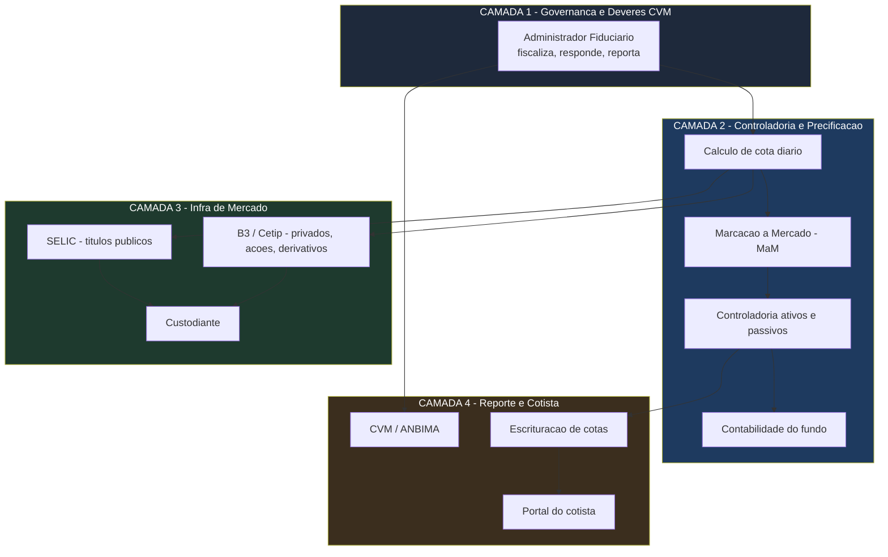
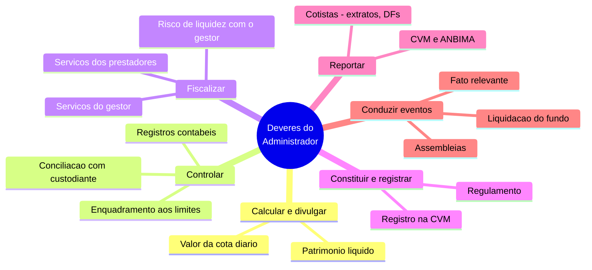
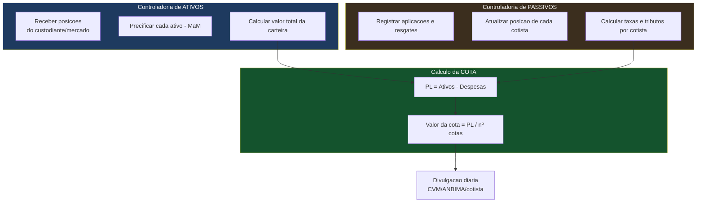
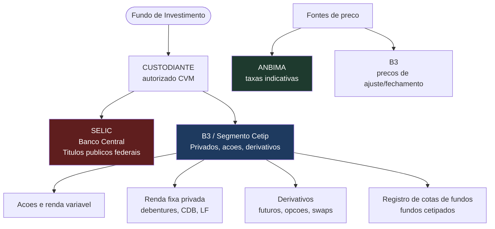
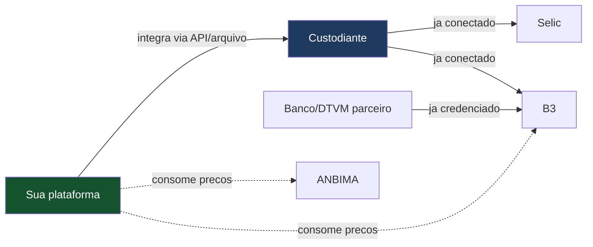
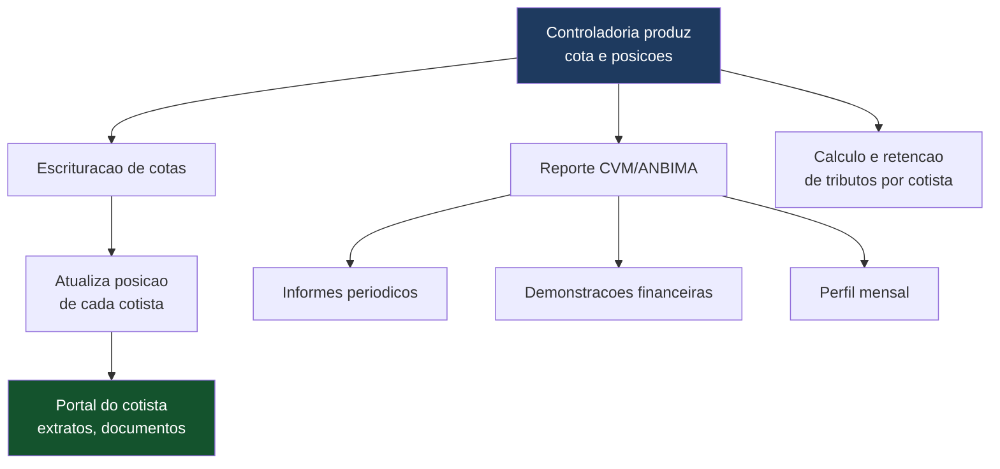
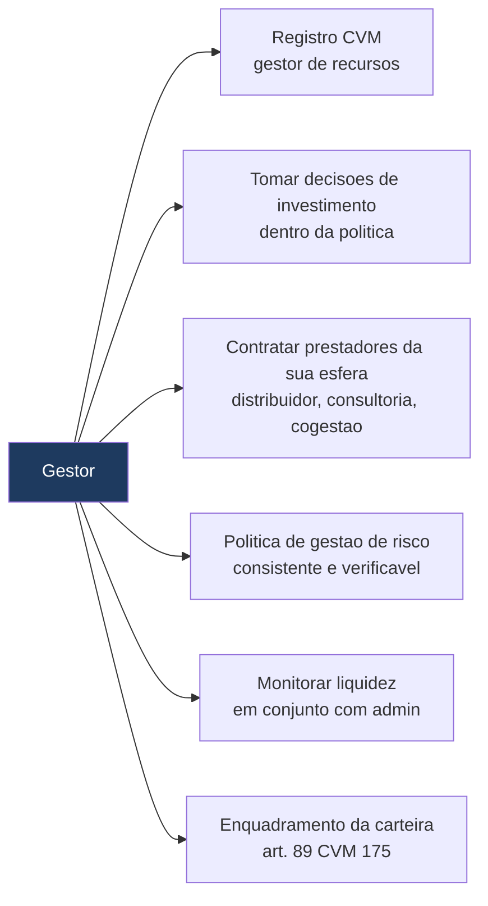
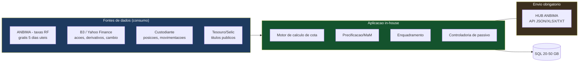
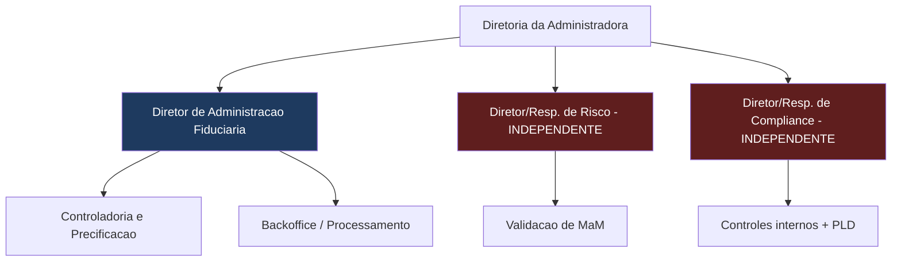
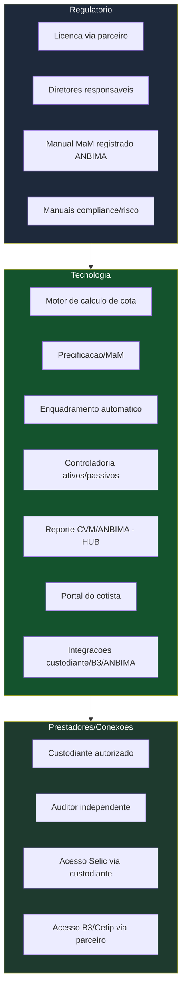

# Estrutura Operacional — Administradora Fiduciária (Fundos de Ações, Multimercado/Macro, Renda Fixa e Private Equity)

> **Documento de trabalho — v0.2 (consolidado)**
> Mapa técnico de **tudo que uma administradora fiduciária precisa fazer e ter** para operar fundos das classes-alvo, suportando ações, debêntures, swaps, derivativos, títulos públicos e privados. Cobre: (1) deveres regulatórios do administrador, (2) o que o gestor precisa para manter o fundo rodando, (3) a máquina de controladoria e precificação, e (4) as conexões com a infraestrutura de mercado (Selic, B3/Cetip) e sistemas.
>
> **Aviso:** organiza informação pública da CVM, ANBIMA e do mercado; **não é parecer jurídico nem projeto de engenharia final**. Cada item deve ser validado com especialistas antes da implementação.

---

## 1. Visão Geral — As Quatro Camadas da Operação

**Princípio operacional central:** o administrador é o **responsável pela verdade dos números** (cota, PL, posições) e pela conformidade; o gestor decide os investimentos; o custodiante guarda os ativos; e a infraestrutura de mercado (Selic, B3/Cetip) registra e liquida. A sua tecnologia coordena e automatiza a Camada 2, integrando-se às Camadas 3 e 4.

---

## 2. Camada 1 — Deveres do Administrador Fiduciário (CVM 175, art. 104 e Resolução CVM 21)

### 2.1 O núcleo de obrigações

### 2.2 Deveres detalhados e o que exigem operacionalmente

| Dever regulatório | O que significa na prática | O que exige do sistema |
|---|---|---|
| Cálculo e divulgação do valor da cota e do PL | Apurar a cota diariamente (abertura ou fechamento) | Motor de cálculo de cota integrado à precificação |
| Manutenção dos registros contábeis | Contabilidade do fundo sempre atualizada e em ordem | Módulo contábil por fundo/classe |
| Conciliação com custodiante e mercados | Garantir que os ativos declarados existam e estejam corretos | Rotina de conciliação automática com custodiante e B3/Selic |
| Controle de enquadramento | Verificar limites de concentração por emissor/modalidade | Motor de enquadramento com alertas automáticos |
| Fiscalização do gestor e prestadores | Verificar que cumprem regras, têm estrutura e política de risco | Trilha de monitoramento + revisão humana de exceções |
| Gestão do risco de liquidez (com o gestor) | Monitorar descasamento ativo/passivo | Módulo de liquidez com reporte periódico |
| Divulgação de fato relevante | Comunicar eventos relevantes a todos os cotistas | Fluxo de publicação equitativa |
| Convocação e condução de assembleias | Organizar decisões dos cotistas | Módulo de assembleias (pode ser digital) |
| Envio de informações periódicas à CVM | Demonstrações, informes, formulários nos prazos | Integração de reporte automatizado à CVM/ANBIMA |
| Guarda de documentos | Manter documentos por no mínimo 5 anos após encerramento | Repositório documental auditável |

> 💡 **Onde a tecnologia entra:** praticamente todos esses deveres são **automatizáveis na execução** (cálculo, conciliação, enquadramento, reporte) — é o coração do diferencial. O que **não** é automatizável é o *julgamento* na fiscalização de conduta e nas exceções, que exige a camada humana de risco/compliance.

---

## 3. Camada 2 — Controladoria e Precificação (o Motor)

Esta é a máquina que produz o número mais importante: **o valor da cota**. Ela se divide em controladoria de ativos, controladoria de passivos, precificação (MaM) e contabilidade.

### 3.1 Marcação a Mercado (MaM) — o ponto técnico mais sensível

A MaM registra todos os ativos pelo valor justo, para evitar transferência de riqueza entre cotistas. **Exigências regulatórias:**

- Ter um **Manual de Marcação a Mercado** público, registrado na ANBIMA e mantido atualizado.
- Fazer a MaM com **frequência mínima igual à do cálculo da cota** (diária).
- Ter área de precificação **segregada e independente** da gestão.
- Usar **fontes primárias** definidas e documentar quando usar fontes alternativas.
- Ter um **Comitê de Marcação a Mercado** que delibera casos excepcionais (atas guardadas por 5 anos).

### 3.2 Fontes de preço por tipo de ativo (as classes-alvo)

Este é o mapa direto para os ativos que você quer suportar:

| Ativo | Fonte primária de preço | Onde registra/liquida |
|---|---|---|
| Títulos públicos federais (LFT, NTN-B, LTN) | Taxas indicativas **ANBIMA** | **Selic** (Banco Central) |
| Debêntures | PU / taxas indicativas **ANBIMA**; B3 | **B3/Cetip** |
| CDBs, Letras Financeiras | Preços do emissor / ANBIMA; curva | **B3/Cetip** |
| Ações | Preço de fechamento do pregão **B3** | **B3** |
| Opções, termo, futuros | Preços de ajuste divulgados pela **B3** | **B3** |
| Swaps / NDF (derivativos de balcão) | Curvas de mercado; contraparte; modelo | **B3/Cetip** (registro) |
| Cotas de fundos | Cota patrimonial diária (ANBIMA/CVM) ou pregão | ANBIMA/B3 |
| Participações (Private Equity / FIP) | **Laudo a valor justo** (Instrução/normas específicas) | — (ativo não listado) |

> ⚠️ **Ponto de atenção — Private Equity (FIP) é o mais complexo:** ativos de FIP (participações em empresas fechadas) **não têm preço de mercado**; exigem **laudo de avaliação a valor justo**, com metodologia consistente e auditável, e são o caso onde a precificação depende mais de julgamento e menos de fonte automática. Suportar FIP eleva a complexidade de MaM significativamente — vale tratar como módulo à parte, possivelmente numa fase posterior.

### 3.3 Curvas e insumos que o sistema precisa consumir diariamente

- **Curva DI (pré)**: contratos futuros de DI de 1 dia da B3.
- **Curvas de inflação e cupom**: NTN-B / projeções ANBIMA.
- **Taxas indicativas ANBIMA**: para títulos públicos e privados.
- **Preços de ajuste B3**: para derivativos listados.
- **Spreads de crédito**: curva de crédito privado ANBIMA + monitoramento de risco de emissor.

---

## 4. Camada 3 — Infraestrutura de Mercado (as Conexões)

Aqui está o mapa de "com o que eu preciso me conectar". No Brasil, há **duas grandes clearing houses**:

### 4.1 As duas clearing houses

| Sistema | Administrado por | Custodia/liquida | Relevante para |
|---|---|---|---|
| **Selic** (Sistema Especial de Liquidação e Custódia) | Banco Central | Títulos públicos federais (Tesouro) | Renda fixa, macro, caixa dos fundos |
| **B3 (inclui o antigo Cetip)** | B3 S.A. | Ações, renda variável, renda fixa privada, derivativos, cotas de fundos | Todas as classes-alvo |

**Nota sobre a "CETIP":** desde 2017, a Cetip foi incorporada à B3 e hoje é o **Segmento Cetip da B3**. Então "conectar à Cetip" e "conectar à B3" são, hoje, a mesma infraestrutura, com subsistemas diferentes (registro, compensação e liquidação). É a maior depositária de títulos privados da América Latina.

### 4.2 Como a conexão acontece na prática (a solução de acesso)

> 💡 **Solução central:** você **não se conecta diretamente** à Selic e à B3 como administradora nova — o **acesso a essas infraestruturas se dá através do custodiante e do banco/DTVM parceiro**, que já têm as contas, os credenciamentos e a integração técnica. Isso é uma vantagem enorme da Rota A (parceria): a conexão pesada com a infraestrutura de mercado **já existe do lado do parceiro**.

- **O que a startup constrói:** integrações (via API ou troca de arquivos) para *receber* posições e movimentações do custodiante, *consumir* preços da ANBIMA e da B3, e *enviar* comandos/informações.
- **O que a startup NÃO precisa construir do zero:** o credenciamento e a conexão institucional bruta com Selic/B3 — isso vem do custodiante e do parceiro.

> ⚠️ **Decisão de custódia (afeta esta camada):** o custodiante é quem detém a conexão bruta com Selic/B3. Duas opções: **(a)** contratar um custodiante terceiro já autorizado (as conexões já existem, despesa do fundo); ou **(b)** o banco parceiro se licenciar como custodiante (Resolução CVM 32) e absorver o custo (~R$ 38 mil/ano de taxa CVM de custodiante + estrutura de conciliação/controles). A opção (b) só compensa em escala, mas permite **custódia a custo zero para o fundo**, melhorando a viabilidade dos fundos pequenos. Ver detalhes na planilha de custos e no guia burocrático. Em ambos os casos, **você integra ao custodiante via API**, não constrói a conexão institucional.

---

## 5. Camada 4 — Reporte, Escrituração e Cotista

### 5.1 Escrituração de cotas (controladoria de passivo)

O sistema precisa, por fundo e por cotista: controlar e liquidar aplicações e resgates; atualizar a posição de cada cotista pelo valor da cota; calcular performance, taxas de entrada/saída; calcular, apurar e reter tributos; conciliar movimentações financeiras com a conta do fundo.

### 5.2 Reporte obrigatório

- **À CVM/ANBIMA:** informes periódicos, demonstrações contábeis anuais auditadas (até 90 dias após o encerramento do exercício), formulários. Envio via **HUB ANBIMA** (plataforma que substituiu o antigo Site Fundos para dados de PL e cota).
- **Aos cotistas:** valor da cota, extratos, demonstrações, fatos relevantes — tudo por meio eletrônico.

---

## 6. O Que o Gestor Precisa Para Manter o Fundo Rodando

O gestor é prestador de serviço **essencial** (elevado de papel pela CVM 175) e é seu contraparte na operação. Para o fundo rodar, o gestor precisa:

| Responsabilidade do gestor | Interface com o administrador |
|---|---|
| Decisões de compra/venda de ativos | Admin recebe e reflete na controladoria |
| Enquadramento da carteira (é o responsável) | Admin fiscaliza e alerta desenquadramentos |
| Política de gestão de risco | Admin supervisiona diligentemente |
| Gestão do risco de liquidez | **Conjunta** — admin + gestor trocam informações |
| Contratação de distribuidor | Admin registra no regulamento |

> 💡 **Divisão de fronteira (CVM 175):** o gestor *decide e executa* investimentos; o administrador *garante os instrumentos, controles e a aferição de conformidade*. Cinco responsabilidades são **conjuntas**: constituição do fundo, não-divulgação de fato relevante, gerenciamento de liquidez, resolução de PL negativo, e liquidação do fundo.

---

## 7. Sistemas e Software — O Que Existe no Mercado

Você não precisa inventar tudo do zero: há sistemas de mercado consolidados que fazem partes disso, e a decisão é **construir vs. integrar vs. licenciar**.

| Função | Sistema de mercado usado (referência) | Decisão sugerida |
|---|---|---|
| Precificação de renda fixa / cálculo na curva | **Britech** (amplamente usado) | Integrar/licenciar no início; construir depois |
| Registro/liquidação de ações e derivativos | **Sinacor+** (B3) | Acessar via parceiro/custodiante |
| Reporte de dados de fundos | **HUB ANBIMA** | Integrar (obrigatório) |
| Controladoria e cálculo de cota | Sistemas proprietários ou de mercado | **Core da startup** — construir |
| Fontes de preço | **ANBIMA**, **B3** | Consumir via API/arquivo |

> 💡 **Estratégia de construção:** a norma aceita **ferramentas proprietárias** como comprovação de estrutura tecnológica. O caminho mais enxuto é: no início, **integrar** sistemas consolidados (ex.: Britech para precificação) para não reinventar o difícil e ganhar credibilidade regulatória; em paralelo, **construir** a camada proprietária de controladoria/cota/enquadramento que é o seu diferencial; e **acessar** a infraestrutura de mercado via parceiro. Construir o motor de precificação de derivativos e FIP do zero é o pedaço mais caro e arriscado — comece integrando.

### 7.1 Dimensionamento Técnico da Infraestrutura (~50 fundos, construção in-house)

Para a operação enxuta construída pelos próprios sócios, o dimensionamento é **modesto** — cálculo de cota é processamento em lote (batch) diário pós-fechamento, não carga contínua de alta frequência.

| Recurso | Necessidade (~50 fundos) | Racional |
|---|---|---|
| Processamento (CPU) | 2 vCPUs (ex.: t3.medium) | Batch diário; picos curtos, não carga constante |
| Memória (RAM) | 4 GB | Carteiras pequenas, processamento sequencial |
| Banco de dados (SQL) | 20–50 GB no 1º ano; +5–15 GB/ano | Posições, cotistas, movimentações, histórico — dados leves e textuais |
| APIs a consumir | 4–6 fontes | ANBIMA (RF), B3/Yahoo (ações/derivativos), HUB ANBIMA (envio), custodiante (posições), Tesouro/Selic (públicos) |

**Fontes de dados — o que é gratuito e o que é pago:**

| Dado | Fonte | Custo |
|---|---|---|
| Taxas indicativas de títulos públicos (MaM renda fixa) | ANBIMA (site) | **Grátis** — últimos 5 dias úteis (basta p/ MaM diária) |
| Taxas indicativas de debêntures / curva de crédito | ANBIMA (site) | **Grátis** — últimos 5 dias úteis |
| Histórico longo + API ANBIMA Feed | ANBIMA | Pago / para associados |
| Preços de fechamento de ações | B3 / Yahoo Finance | **Grátis** (API pública) |
| Preços de ajuste de derivativos listados | B3 | Público |
| VNA (LFT, NTN-B) | ANBIMA / Tesouro | **Grátis** |
| Posições e movimentações dos fundos | Custodiante | Via contrato (parceiro) |

> 💡 **Envio ao HUB ANBIMA é integrável in-house:** a plataforma obrigatória de envio de PL/cota e movimentação de cotas aceita **API nos formatos JSON, XLSX e TXT** — ou seja, seu sistema pode gerar e enviar os arquivos automaticamente, sem software de terceiros. A obrigação de envio é do administrador (o banco, na Rota A), que pode delegar operacionalmente a você.

> ⚠️ **Ponto de atenção sobre dados gratuitos:** o "grátis por 5 dias úteis" da ANBIMA cobre a MaM diária, mas **não** guarda histórico longo. Você precisará **capturar e armazenar** esses dados diariamente no seu próprio banco (o que é trivial e legal) para construir a série histórica — ou, mais tarde, assinar o Feed quando o volume justificar. Planeje a captura diária desde o dia 1.

---

## 8. Estrutura de Pessoas Mínima (áreas segregadas)

A regulação e a ANBIMA exigem **segregação funcional**: a área que precifica e controla **não pode** se subordinar à gestão. Estrutura mínima viável:

- **Áreas obrigatórias segregadas:** administração fiduciária (controladoria, backoffice, precificação) de um lado; **risco** e **compliance/PLD** do outro, com independência.
- **Comitê de Marcação a Mercado:** órgão que delibera precificação em casos excepcionais — membros de áreas segregadas.
- **Solução enxuta:** aproveitar diretores/estrutura do banco parceiro onde a regra permite; contratar o mínimo de responsáveis certificados para os papéis independentes; a tecnologia reduz a necessidade de equipe *operacional*, mas **não elimina** os responsáveis por risco e compliance.

---

## 9. Mapa Consolidado — Tudo Que Precisa Existir

### Checklist por classe de fundo-alvo

| Classe | Complexidade de MaM | Conexões-chave | Nota |
|---|---|---|---|
| **Renda Fixa** | Média (curvas, títulos públicos/privados) | Selic + B3/Cetip + ANBIMA | Boa classe para começar |
| **Ações** | Baixa-média (preço de pregão) | B3 | Preço de fechamento é direto |
| **Multimercado / Macro** | Alta (derivativos, swaps, múltiplos ativos) | B3 + Selic + ANBIMA | Exige motor de derivativos |
| **Private Equity (FIP)** | Muito alta (laudo a valor justo) | Sem preço de mercado | Módulo à parte; fase posterior |

> 💡 **Sequência sugerida de suporte a classes:** começar por **Renda Fixa e Ações** (precificação mais direta, fontes automáticas), depois **Multimercado/Macro** (quando o motor de derivativos amadurecer), e **Private Equity por último** (por depender de laudo e julgamento, é o mais distante da automação e o mais intensivo em revisão humana).

---

## 10. Onde a Tecnologia Ganha e Onde a Regulação Impõe Limite

Resumo honesto para calibrar expectativas de automação:

| Função | Automatizável? | Observação |
|---|---|---|
| Cálculo de cota, PL | **Sim, quase total** | Core do diferencial |
| Enquadramento | **Sim** | Motor de regras + alertas |
| Conciliação com custodiante | **Sim** | Integração automatizada |
| Reporte CVM/ANBIMA | **Sim** | Via HUB ANBIMA |
| Precificação de ativos líquidos | **Sim** | Fontes ANBIMA/B3 |
| Precificação de FIP / ilíquidos | **Parcial** | Depende de laudo e julgamento |
| Fiscalização de conduta do gestor | **Parcial** | IA sinaliza; humano decide exceções |
| Deliberação do Comitê de MaM | **Não** | Exige decisão humana documentada |
| Responsabilidade fiduciária | **Não** | É do administrador (parceiro), por design |

---

> **Conclusão em uma frase:** a operação tem quatro camadas — governança/deveres, controladoria/precificação, infraestrutura de mercado e reporte/cotista. A **Camada 2 (controladoria e cálculo de cota) é o que a startup constrói e onde mora o diferencial**; a **Camada 3 (Selic, B3/Cetip) é acessada via custodiante e parceiro**, não construída; e as Camadas 1 e 4 são majoritariamente automatizáveis, exceto o núcleo de julgamento (fiscalização de conduta, precificação de ilíquidos, comitê de MaM) que permanece humano por exigência regulatória. Começar por Renda Fixa e Ações minimiza a complexidade de precificação; Private Equity é o módulo mais distante da automação.

---

## Adendo (jul/2026) — a Camada 3 detalhada

A validação sugerida abaixo ("como se dará o acesso técnico à Selic e à B3") foi pesquisada e documentada no **`guia_custodia_conexoes.md`**: o banco parceiro precisa da autorização de custódia da **Res. CVM 32**, das adesões B3 (Central Depositária + Balcão + Termo de Adesão Participante Selic, como participante liquidante usando a própria conta Reservas) e da conexão **RSFN** homologada. Do ponto de vista da administradora, a interface prática com essa camada são **os arquivos diários de posição e extrato do custodiante** + a mensageria de confirmações — exatamente os insumos do batimento diário da Camada 2. Acrescente ao organograma a **mesa de custódia** do banco (2–3 pessoas + diretor responsável próprio), que é função separada da controladoria de fundos por desenho de governança. O piloto simula as duas pontas (portais Administradora e Banco Custodiante) trocando esses insumos.

*Documento de trabalho. Próximo passo sugerido: definir a estratégia construir-vs-integrar por módulo (especialmente precificação), e validar com o custodiante/parceiro como se dará o acesso técnico à Selic e à B3.*
