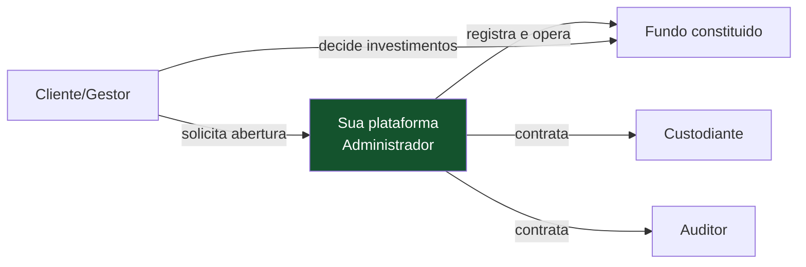
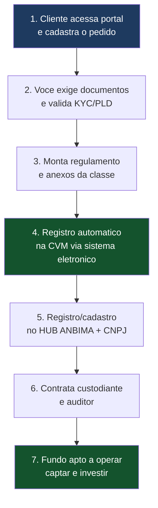
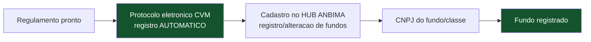
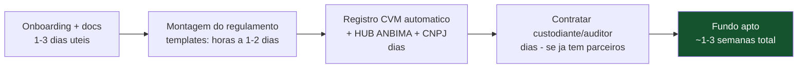
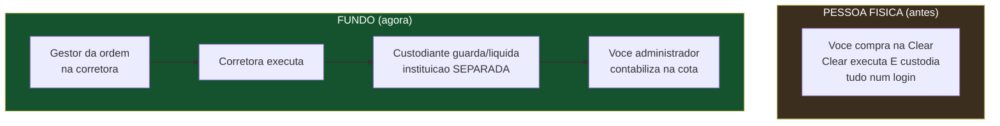
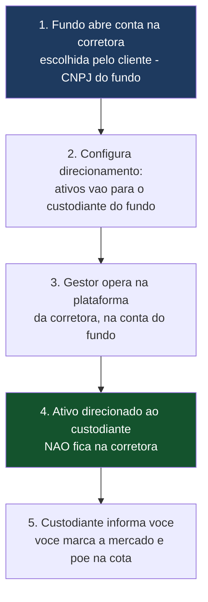
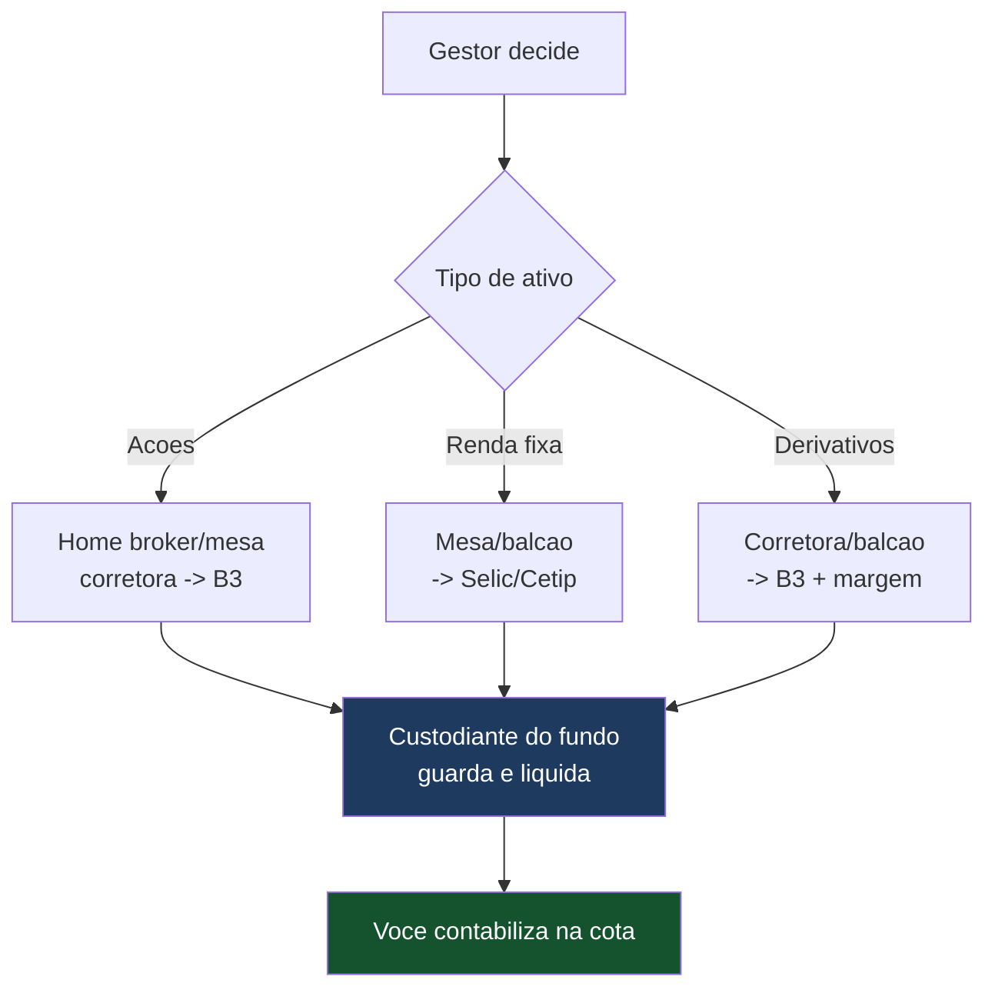
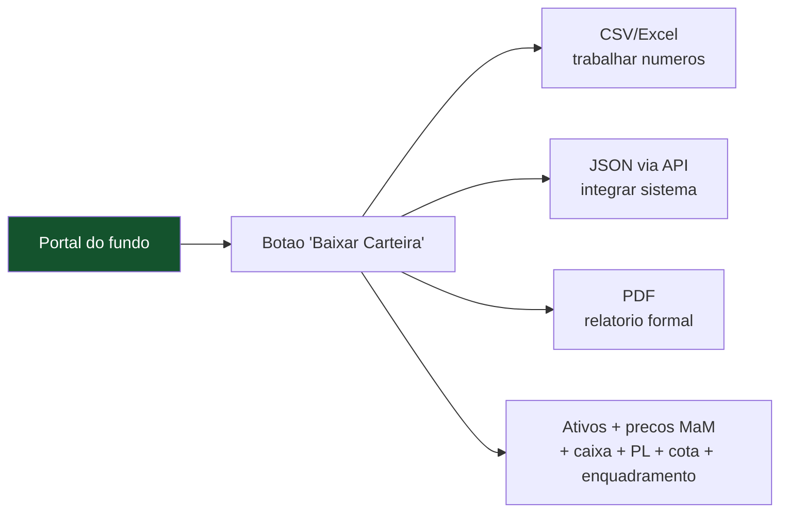
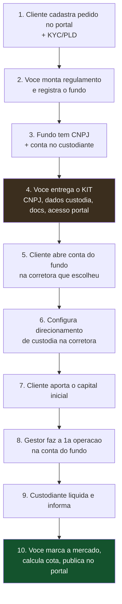

# Guia Prático — Abertura de um Fundo (com a Administradora já pronta)

> **Documento de trabalho — v0.1 (guia prático)**
> Assumindo que a administradora fiduciária **já está de pé** (banco habilitado + sua plataforma), este guia descreve **como um cliente abre um fundo** na sua estrutura: o que ele acessa, quais informações cadastra, o que você exige dele, quanto tempo demora, que sistema/API você oferece, e quais custos fogem do seu controle.
>
> **Aviso:** prazos e exigências conferidos em jul/2026; a CVM/ANBIMA atualizam procedimentos. Não substitui assessoria jurídica.

---

## 0. Quem é o "cliente" que abre o fundo

O cliente que procura você para abrir um fundo é, tipicamente, o **gestor** (ou quem quer constituir um fundo e será/contratará o gestor). Você é o **administrador fiduciário** — quem registra, controla e responde pela conformidade. Fique claro desde o início: **você administra, ele gere.** Você não escolhe os investimentos.

---

## 1. O FLUXO DE ABERTURA — VISÃO GERAL

---

## 2. O QUE O CLIENTE ACESSA E CADASTRA (o portal)

O cliente entra no **seu portal** (que você constrói) e preenche um formulário de solicitação. As informações que você coleta:

**Sobre o solicitante/gestor:**
- Identificação completa (PJ ou PF): CNPJ/CPF, razão social, endereço, contatos.
- Comprovação de que o gestor é **credenciado na CVM** como gestor de recursos (ou vai contratar um que seja). *Você não pode registrar um fundo com um gestor não habilitado.*
- Dados dos representantes legais e beneficiários finais (para KYC/PLD).

**Sobre o fundo desejado:**
- Nome pretendido do fundo.
- **Classe / estratégia:** renda fixa, ações, multimercado, etc. (define a política de investimento e a MaM).
- **Público-alvo:** investidores em geral, qualificados ou profissionais.
- **Estrutura:** monoclasse ou multiclasse; subclasses (se vários grupos de cotistas na mesma estratégia).
- Política de investimento resumida (limites, ativos permitidos).
- Taxas: administração, gestão, performance (se houver), custódia máxima.
- Regras de aplicação/resgate (cotização, prazos, liquidez).
- Aporte inicial previsto e projeção de PL.

> 💡 **Sistema a oferecer aqui:** um **portal de onboarding** com formulário estruturado que já valida os campos (ex.: alerta se o gestor não está na base da CVM) e gera automaticamente a minuta de regulamento a partir de *templates* por classe. Isso é parte do seu diferencial de "deploy ágil".

---

## 3. O QUE VOCÊ EXIGE DO CLIENTE (checklist)

| Exigência | Por quê |
|---|---|
| Gestor **credenciado na CVM** (ou contrato com um) | Não se registra fundo sem gestor habilitado |
| Documentos societários/identificação do gestor | KYC |
| **KYC / PLD completo** (Res. CVM 50) — beneficiário final, origem de recursos | Prevenção à lavagem de dinheiro é obrigação sua como administrador |
| Política de investimento definida | Vai para o regulamento |
| Definição de taxas e público-alvo | Vai para o regulamento e anexos |
| Aceite dos termos e do regulamento | Formaliza a relação |
| Aporte inicial | Fundo precisa de PL para operar (piso regulatório R$ 1 mi) |

> ⚠️ **KYC/PLD é responsabilidade sua (do administrador), não opcional.** A Resolução CVM 50 obriga quem presta serviços de administração/custódia a identificar clientes e beneficiários finais, monitorar e reportar. Seu sistema precisa ter um módulo de onboarding com verificação — não dá para pular.

---

## 4. REGISTRO DO FUNDO — O PASSO QUE É AUTOMÁTICO

Aqui está a grande vantagem regulatória para o "deploy ágil":

- O **registro do fundo na CVM é automático**, via sistema eletrônico, no ato do protocolo pelo administrador. Não há análise prévia caso a caso para o registro do fundo em si.
- Na prática, o **administrador** (você, operando pelo banco) registra o fundo, e ele nasce apto.
- Em paralelo: **cadastro no HUB ANBIMA** (registro do fundo, emissão de taxa de análise de registro) e obtenção do **CNPJ** do fundo/classe.

**Nota sobre CNPJ (Res. 175):** fundo **monoclasse** pode usar o mesmo CNPJ para fundo e classe; fundo **multiclasse** exige CNPJs distintos por classe (mesmo com uma só classe no início).

---

## 5. QUANTO TEMPO DEMORA (no seu caso)

- **A parte que você controla (onboarding, regulamento, registro):** de **dias** a **poucas semanas**, dependendo da padronização. Com templates por classe e parceiros de custódia/auditoria já contratados, é rápido — é justamente o diferencial.
- **O gargalo não é o registro** (automático), mas: (a) completar KYC/PLD, (b) o cliente definir bem a política, (c) contratar custodiante/auditor se ainda não houver parceria pronta.

> 💡 **Para o "deploy ágil" funcionar:** tenha **antes** — templates de regulamento por classe, contratos-quadro com custodiante e auditor parceiros, e o onboarding digital. Assim cada fundo novo é encaixe, não projeto.

---

## 6. SISTEMAS E APIs QUE VOCÊ PRECISA OFERECER AO CLIENTE

O cliente/gestor espera enxergar e operar o fundo. O que construir:

| Sistema / API | Função | Prioridade |
|---|---|---|
| **Portal de onboarding** | Cadastro do pedido de fundo, KYC/PLD, upload de docs | Alta |
| **Dashboard do fundo** | PL, cota do dia, posições, rentabilidade | Alta |
| **API / tela de "baixar carteira"** | Gestor baixa a composição da carteira (posições, preços, PL) em CSV/JSON/PDF | Alta |
| **API de movimentação** | Aplicações e resgates de cotistas, cotização | Alta |
| **API de boletagem/ordens** (opcional) | Gestor informa operações; ou integra com a corretora dele | Média |
| **Relatórios regulatórios** | Extratos, informe de rendimentos, lâminas | Média |
| **Envio automático ao HUB ANBIMA** | PL/cota/movimentação (JSON/XLSX/TXT via API) | Alta (obrigatório) |

> 💡 **"Baixar carteira":** o gestor quer, a qualquer momento, exportar a posição do fundo. Sua API deve entregar: para cada ativo — quantidade, preço de marcação, valor de mercado, % do PL; mais o caixa e o PL total. Formatos CSV e JSON cobrem a maioria dos usos; PDF para relatório formal.

---

## 7. CUSTOS QUE FOGEM DO SEU CONTROLE (despesas do fundo)

Deixe isso **explícito para o cliente** — são custos do fundo, não seus, e você não os define:

| Custo | Natureza | Ordem de grandeza |
|---|---|---|
| **Taxa CVM do fundo** | Tributo anual, fixo por faixa de PL | R$ 3.162/ano (PL até ~R$ 5 mi); **grátis no 1º ano se criado após abril** |
| **Auditoria independente** | Obrigatória, anual | faixa negociada (~R$ 1.500 no modelo adaptado em lote) |
| **Custódia** | Despesa do fundo (ou R$ 0 se banco absorver) | % do PL ou zero |
| **Taxa de análise de registro ANBIMA** | Por registro no HUB | conforme tabela ANBIMA |
| **Taxa de oferta CVM** (se oferta pública) | 0,03% sobre o valor da oferta | só fundos fechados/oferta pública |
| **Cartório / registro** (quando aplicável) | Eventual | baixo |

> ⚠️ **Transparência protege sua reputação.** O cliente precisa saber, antes de abrir, que existem custos do fundo além da sua taxa de administração. Deixar claro que a taxa CVM entra no ano 2 (e não no 1º ano, se criado após abril) evita a frustração de "por que o custo subiu?".

---

## 8. COMO O GESTOR OPERA O FUNDO NA PRÁTICA (a parte que confunde todo mundo)

Esta é a seção que responde à pergunta que todo cliente vindo da pessoa física faz no primeiro dia: **"tenho o fundo, mas onde eu clico para comprar?"** A confusão é real e tem uma causa: na pessoa física, tudo estava fundido numa corretora só (ela executava, custodiava, e você era o dono). No fundo, essas funções **se separam** em instituições diferentes.

### 8.1 A virada mental — o que muda em relação à pessoa física

**Quem é quem agora:** o **gestor** (seu cliente) decide e dá a ordem; a **corretora** executa; o **custodiante** guarda e liquida (instituição separada da corretora); **você** contabiliza. O ativo comprado **não fica na corretora** — vai para a conta de custódia do fundo no custodiante.

### 8.2 Os DOIS acessos que o cliente terá (a fonte da confusão)

O cliente vai ter **dois logins diferentes**, e isso precisa ficar claro desde o início:

| Acesso | Gerado por | Serve para |
|---|---|---|
| **Acesso de negociação** (home broker / mesa) | **A corretora** que ele escolher | *Executar* compras e vendas em nome do fundo |
| **Acesso ao portal do fundo** | **Você** (administrador) | *Acompanhar* cota, PL, posição; baixar carteira; ver relatórios |

> 💡 **Resposta direta a "tenho que gerar credencial e passar ao cliente?":** para **comprar ativos, não** — essa credencial é da **corretora**, não sua (você não é corretora). Você gera o acesso ao **seu portal**. O cliente opera na corretora e acompanha no seu portal.

### 8.3 O modelo escolhido: cliente usa a corretora que quiser

Você optou por deixar o cliente usar **a corretora que preferir**. Isso é possível via **direcionamento de custódia** (mecanismo padrão da B3): a corretora executa, mas os ativos são direcionados para o custodiante do fundo.

> ⚠️ **O limite honesto do "qualquer corretora":** o direcionamento exige que a corretora e o custodiante "se conheçam" operacionalmente. Corretoras institucionais grandes (XP, BTG, Itaú...) fazem isso de rotina; corretoras muito pequenas/varejo puro podem não ter o fluxo. Então, na prática, é **"qualquer corretora que suporte conta de fundo com direcionamento de custódia para o nosso custodiante"**. Cada corretora nova pode exigir um **primeiro acerto operacional** com o custodiante; depois disso, os próximos fundos naquela corretora são fáceis.

> 💡 **Meio-termo recomendado:** mantenha o modelo aberto, mas tenha **1–2 corretoras pré-integradas** que você recomenda como caminho rápido. Cliente sem preferência usa a recomendada e opera em dias; cliente que faz questão da dele usa a dele, ciente do acerto operacional inicial.

### 8.4 Como opera cada tipo de ativo (o fluxo muda por mercado)

**AÇÕES (renda variável):**
- O gestor opera pela **plataforma da corretora** (home broker ou mesa), parecido com o que já conhecia — mas na conta do *fundo*.
- A ação é executada na B3 e **direcionada ao custodiante** do fundo (não fica na corretora).
- Liquidação em D+2. O custodiante te repassa a posição.

**RENDA FIXA (títulos públicos, debêntures, CDBs, crédito privado):**
- Aqui é **diferente de ações** — normalmente **não é home broker**. O gestor negocia via **mesa de operações** da corretora/distribuidora, ou em plataformas de balcão. Títulos públicos podem ser negociados no mercado secundário; privados no balcão.
- A liquidação e custódia vão para **Selic** (títulos públicos) ou **Segmento Cetip da B3** (privados) — sempre **através do custodiante**, que tem as conexões.
- **Você não se conecta à Cetip/Selic para "enviar" nada** — quem registra e liquida é o custodiante; você **recebe** dele a posição. Se o banco parceiro for o custodiante, essa conexão já é dele.

**DERIVATIVOS (futuros, opções, swaps, NDF):**
- Listados (futuros/opções): operados via corretora, na conta do fundo na B3; margens e ajustes diários informados pelo custodiante/corretora.
- Balcão (swap/NDF): registrados na B3; liquidação e informação via custodiante.
- **Ponto de atenção:** derivativos exigem que a política do fundo permita, controle de margem e, muitas vezes, limites específicos. Não é "clicar e comprar" — envolve conta habilitada para derivativos e gestão de garantias.

### 8.5 O KIT DE ONBOARDING que você entrega ao cliente

Quando o fundo abre, o cliente recebe de você um pacote que "materializa" o fundo e permite operar. É isto que evita a sensação de estar perdido:

| Item entregue | Para que serve |
|---|---|
| **CNPJ do fundo** | É em nome disso que a conta na corretora é aberta |
| **Dados do custodiante + número da conta de custódia** | Para configurar o direcionamento na corretora |
| **Documentos do fundo** (regulamento, comprovante de registro CVM, ata de designação, cadastro) | A corretora pede na abertura da conta do fundo |
| **Acesso ao portal** (login gerado por você) | Acompanhar cota, PL, baixar carteira |
| **Guia do gestor** (meia página) | "Opere na corretora X na conta do fundo; posição aparece no portal em D+1; baixe carteira aqui" |
| **Lista de corretoras pré-integradas** (se houver) | Caminho rápido para quem não tem preferência |

### 8.6 O cliente precisa APROVAR as cotas?

Pergunta importante, e a resposta esclarece um papel: **o cálculo e a divulgação da cota são responsabilidade sua (administrador), não do cliente.** O gestor **não "aprova"** a cota — quem calcula e responde pela veracidade do PL e da cota é o administrador. Isso é da essência do papel fiduciário: a cota é a "verdade oficial" do fundo, e ela não pode depender do aval de quem gere (seria conflito).

O que existe, sim:
- **Transparência:** o gestor **vê** a cota, o PL e a posição no portal, e pode questionar/conciliar se achar divergência (ex.: uma operação que ele fez e não apareceu).
- **Conciliação:** o gestor confirma que as operações que ele executou batem com o que o custodiante reportou e você contabilizou. Isso é conciliação, não aprovação.
- **Exceção (cotização):** em fundos fechados ou situações específicas, há eventos que passam por assembleia de cotistas — mas isso é sobre decisões do fundo, não sobre a cota diária.

> 💡 **Em resumo:** o gestor **acompanha e concilia**, mas **não aprova** a cota. Você calcula, você divulga, você responde. Se ele discordar de um número, abre um chamado de conciliação — não um "veto" à cota.

### 8.7 Como o cliente BAIXA A CARTEIRA e o que você fornece

O gestor quer, a qualquer momento, exportar a posição do fundo. Você oferece isso no portal (tela + API):

**O que a "baixar carteira" entrega** (por fundo, numa data):
- Para **cada ativo**: identificação (código/ISIN), quantidade, **preço de marcação a mercado**, valor de mercado, % do PL, e (renda fixa) taxa/vencimento.
- **Caixa e valores a receber/pagar.**
- **PL total** e **valor da cota** do dia.
- **Enquadramento:** se a carteira está dentro dos limites da política.

**Formatos a oferecer:**
- **CSV / Excel** — para o gestor trabalhar os números.
- **JSON** (via API) — para integração com sistemas do gestor.
- **PDF** — relatório formal (extrato de carteira).

**Frequência:** a posição fica disponível tipicamente em **D+1** (após o fechamento e o processamento do dia). Intraday, se disponível, é indicativo — a posição oficial é a de fechamento.

### 8.8 Onboarding completo — a sequência do zero à primeira operação

---

## 9. O QUE ACONTECE DEPOIS DE ABERTO (resumo operacional)

Uma vez aberto, o ciclo diário roda (detalhado no guia técnico):
1. Custodiante informa posições e movimentações.
2. Sua plataforma **precifica** os ativos (MaM), calcula **PL e cota**.
3. Processa **aplicações/resgates** dos cotistas.
4. **Enquadramento** (verifica limites da política).
5. **Envia** PL/cota/movimentação ao HUB ANBIMA.
6. Disponibiliza no **dashboard** e para "baixar carteira".

---

> **Resumo em uma frase:** com a administradora pronta, abrir um fundo é: cliente cadastra o pedido no seu portal → você valida KYC/PLD e monta o regulamento por template → registra o fundo (automático na CVM) + HUB ANBIMA + CNPJ → contrata custodiante/auditor parceiros → **entrega o kit de onboarding** (CNPJ, dados de custódia, docs, acesso ao portal) → cliente abre conta do fundo na corretora que escolher e configura o direcionamento de custódia → gestor opera na conta do fundo (ações via home broker/mesa, renda fixa via mesa/balcão, tudo liquidado pelo custodiante) → você marca a mercado, calcula e **divulga a cota** (o cliente acompanha e concilia, mas **não aprova**), e disponibiliza "baixar carteira" (CSV/JSON/PDF). Fundo apto em **dias a poucas semanas**. Lembre dos **dois acessos** do cliente — negociação (na corretora) e acompanhamento (no seu portal) — e da transparência sobre custos do fundo (taxa CVM, auditoria, custódia).

*Documento v0.1. O grande facilitador é o registro automático do fundo na CVM; o diferencial competitivo está em ter templates, parcerias e onboarding digital prontos para que cada fundo seja encaixe, não projeto.*
