# Guia Burocrático e Regulatório — Administradora Fiduciária *Low-Cost* para Fundos Pequenos

> **Documento de trabalho — v0.2 (consolidado)**
> Mapa das exigências jurídicas, regulatórias e burocráticas do projeto, **em tom de solução**: para cada exigência, uma resposta prática de *como resolver*. Onde há um limite regulatório real que não some, ele é apontado como *parâmetro de projeto* (algo a desenhar em torno), não como bloqueio.
>
> **Aviso necessário:** este material organiza informação regulatória pública para orientar decisões; **não é parecer jurídico**. Cada passo concreto deve ser validado com um advogado de mercado de capitais e um contador — e o plano abaixo mostra, inclusive, *como* obter essa validação de forma barata.

---

## 1. Visão Geral — As Duas Rotas Possíveis

Antes de detalhar, é essencial fixar a decisão estrutural que define todo o resto: **quem carrega a licença de administrador fiduciário?**

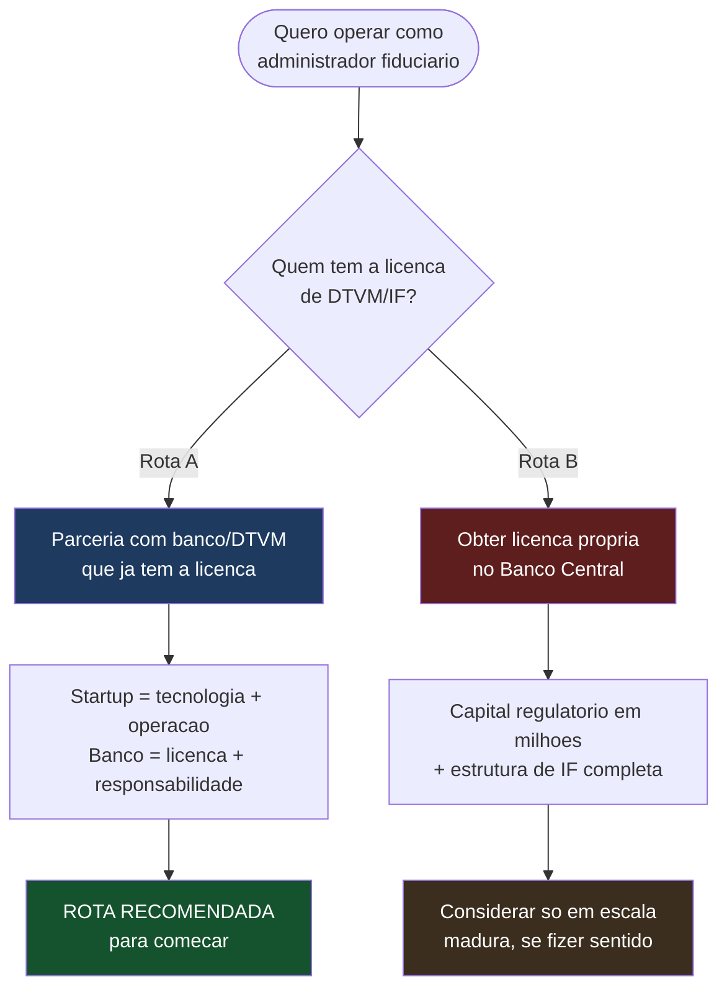

**Decisão de projeto:** a Rota A (parceria) é o caminho recomendado para começar, porque transfere a barreira mais pesada — ser instituição autorizada pelo Banco Central, com capital regulatório na casa dos milhões — para um parceiro que já a cumpriu. Todo o restante deste guia assume a **Rota A**.

> 💡 **Princípio-solução que atravessa o documento:** você **não precisa construir** a maior parte da estrutura regulatória — precisa **acessá-la**, seja pela licença do banco parceiro, seja contratando prestadores especializados (auditor, custodiante, jurídico, contábil). O negócio é montar a *camada de tecnologia e coordenação* por cima de uma infraestrutura regulada que já existe.

---

## 2. Mapa Geral de Exigências → Soluções

Visão de todas as frentes antes do detalhamento:

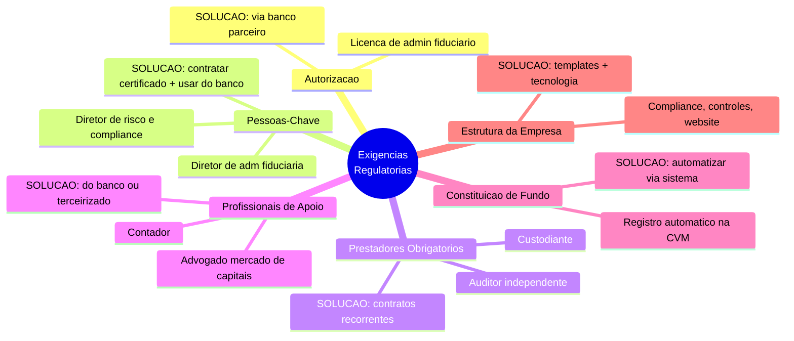

---

## 3. Frente 1 — Autorização para Atuar

### 3.1 A exigência

A atividade de **administrador fiduciário** só pode ser exercida por **instituição autorizada a funcionar pelo Banco Central** (tipicamente uma DTVM) ou por pessoa jurídica que mantenha, continuamente, o maior valor entre **0,20% dos recursos sob administração** ou **R$ 550.000,00** em patrimônio líquido e em disponibilidades — este segundo caminho é a via "não-IF", mas traz exigência de capital que escala com o volume administrado.

### 3.2 A solução

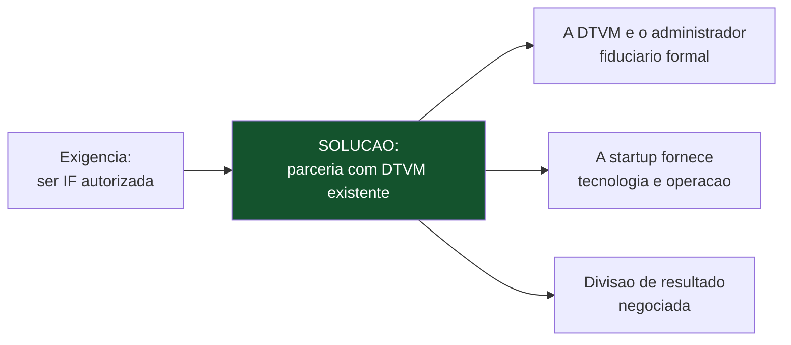

- **Solução principal:** firmar parceria com um banco/DTVM que já é instituição autorizada pelo BC. Ele é o administrador fiduciário de direito; a startup é o motor operacional e tecnológico.
- **Alvo ideal do parceiro:** DTVMs pequenas ou bancos regionais/básicos — para eles, a parceria é receita incremental sobre uma estrutura que já existe e já custa.
- **O que a startup oferece ao parceiro:** tecnologia que reduz o custo por fundo, originação de novos fundos (novos clientes), e uma fatia do resultado.

> 💡 **Achado-chave: um banco "básico" já está mais perto do que parece.** A Resolução CVM 21 permite ser administrador fiduciário às "instituições financeiras e demais instituições autorizadas a funcionar pelo BC". **Um banco já é isso** — não precisa virar DTVM nem obter nova licença bancária. Falta só uma **habilitação adicional na CVM** para a atividade de administrador fiduciário — um credenciamento sobre a licença que ele já tem, não uma nova instituição.

### 3.3 As 6 exigências ao banco (o que você pede e guia na negociação)

Se o banco é básico (título de banco, sem DTVM nem habilitações de mercado de capitais), este é o roteiro do que ele precisa fazer — e você chega com tudo pronto para reduzir o esforço percebido dele:

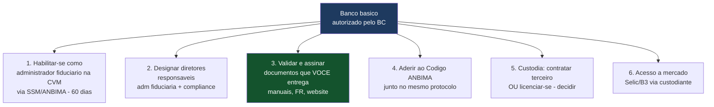

1. **Habilitar-se como administrador fiduciário na CVM** — protocolo no SSM, análise ANBIMA + CVM (60 dias). Registrando **só** como administrador fiduciário (não gestor), dispensa-se o diretor exclusivo de administração de carteiras.
2. **Designar os diretores responsáveis** — um pela administração fiduciária, um por compliance/controles. Podem ser pessoas do banco; você opera, eles respondem formalmente. **É o coração do acordo.**
3. **Validar e assinar os documentos que você entrega prontos** — manuais (MaM, compliance, ética), formulário de referência, website. Você constrói (IA + validação); ele valida e assina.
4. **Aderir ao Código ANBIMA** — pode ser pedido **junto** com a habilitação CVM, no mesmo protocolo.
5. **Custódia** — decidir entre contratar terceiro autorizado (mais leve) ou o banco se licenciar como custodiante (ver Frente 3, Seção 5.2).
6. **Acesso à infraestrutura de mercado** (Selic/B3) — via o custodiante, que já tem as conexões.

> ⚠️ **Enquadramento honesto para a negociação:** mesmo sendo "só" uma habilitação adicional, o banco assume **responsabilidade regulatória e reputacional real** perante a CVM por tudo que os fundos fizerem. Não apresente como "é rapidinho, você não faz nada" — o enquadramento vencedor é "você já tem o mais difícil (ser IF autorizada); eu trago tudo pronto e **reduzo o seu risco** com controles e operação bem-feita". Isso é o núcleo do business case na ótica do banco.

---

## 4. Frente 2 — Pessoas-Chave Obrigatórias

### 4.1 A exigência

A regulação (Resolução CVM 21) exige que o administrador de carteiras pessoa jurídica designe **diretores estatutários responsáveis**, com papéis segregados:

| Papel | Exigência | Pode acumular? |
|---|---|---|
| Diretor de administração fiduciária | Responsável formal pela atividade | Ver nota abaixo |
| Diretor de risco | Deve atuar com **independência** | **Não** pode atuar em administração/gestão/distribuição |
| Diretor de compliance / controles internos | Deve atuar com **independência** | **Não** pode atuar em administração/gestão/distribuição |

**Nota importante (solução regulatória embutida na norma):** quando a instituição é registrada **apenas na categoria "administrador fiduciário"** (não como gestora), a própria Resolução CVM 21 **dispensa** a designação de um diretor exclusivo para administração de carteiras — o papel pode recair sobre um diretor que tenha vínculo com outras atividades, vedada apenas a acumulação com a gestão dos recursos da própria instituição. Isso **reduz** o número de pessoas dedicadas exigidas.

### 4.2 As soluções

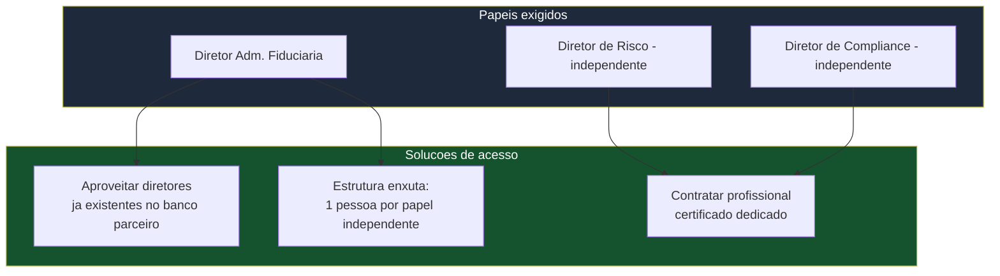

- **Solução A — usar a estrutura do banco parceiro:** como o parceiro já é o administrador fiduciário formal, **ele já possui** (ou precisa possuir) os diretores responsáveis. Parte da exigência de pessoal já está resolvida do lado dele. Essa é a economia central da Rota A.
- **Solução B — contratar os certificados que faltarem:** para os papéis que a operação exige dedicação própria, contratar profissionais com a **certificação exigida** (ex.: CGA/CGE da ANBIMA, ou CFA nível III / ACIIA para pessoas naturais autorizadas). O mercado tem profissionais certificados disponíveis.
- **Solução C — respeitar a segregação como desenho, não como custo extra:** risco e compliance precisam ser **independentes** da operação. Em vez de ver isso como "mais gente", desenhe desde o início 1 responsável por risco e 1 por compliance que não se misturam com a operação — estrutura mínima viável que já cumpre a norma.

> 💡 **Sobre certificação:** os responsáveis pela administração de carteiras precisam de certificação/qualificação reconhecida. **Solução:** se você (ou o sócio) já tem experiência de gestão, obter a certificação é um passo pessoal alcançável; para os papéis independentes, contrata-se quem já é certificado.

---

## 5. Frente 3 — Prestadores de Serviço Obrigatórios

Todo fundo, por lei, precisa de certos prestadores além do administrador. A boa notícia: **nenhum deles precisa ser construído internamente — todos são contratados.**

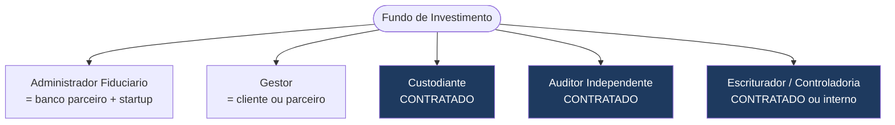

### 5.1 Auditor Independente

- **Exigência:** demonstrações contábeis do fundo auditadas anualmente por auditor independente **registrado na CVM**. É obrigatório e **não pode** ser ligado ao administrador (independência). O auditor é ele próprio um regulado da CVM.
- **Solução de custo:** o custo da auditoria é **despesa do próprio fundo** (repassada aos cotistas), ou seja, **fora** da planilha de custo da administradora.
- **Solução de fornecedor (auditoria adaptada):** firmar parceria com **auditor(es) independente(s) menores** registrados na CVM que se adaptem à dinâmica de auditar **muitos fundos padronizados** em lote e com agilidade. Com volume (dezenas de fundos), o custo por fundo cai bastante — a referência de trabalho é ~**R$ 1.500/fundo/ano** num modelo de carteira grande com o mesmo auditor.
- **Parâmetro de projeto (rodízio):** o mesmo auditor pode ser usado por até **5 anos** (regra geral), 3 anos de intervalo para recontratar; manter 2–3 auditores parceiros para rodiziar sem perder padronização.

> ⚠️ **Risco a precificar (não é conselho de moral, é de negócio):** a **independência e a qualidade** da auditoria são exatamente o que a CVM fiscaliza. Um modelo de "auditoria simbólica em lote" a preço muito baixo cria vulnerabilidade regulatória que **respinga no banco** (o administrador formal). A economia de custo é real, mas carrega um passivo: o compliance do banco vai examinar isso, e pode limitar o quão baixo dá para ir com segurança. Trate como risco a gerir, não como economia garantida.

### 5.2 Custodiante — o que é, quem pode ser, e o caminho do banco básico

- **O que é:** o custodiante **guarda os ativos** do fundo e **liquida** as operações (compra/venda física e financeira), com conexão institucional às centrais depositárias (B3/Cetip e Selic). É quem detém o ativo, separado do administrador e do gestor — a segregação de poderes que dificulta fraude.
- **Quem contrata:** o **administrador** contrata o custodiante, em nome do fundo (você acerta isso).
- **Quem PODE ser custodiante:** lista fechada, exige **autorização própria da CVM** (Resolução 32): bancos comerciais/múltiplos/de investimento, caixas econômicas, corretoras, DTVMs, e entidades de compensação/liquidação/depósito central. **Não é automático** — ter licença bancária dá o *direito de pedir*, não a autorização em si.

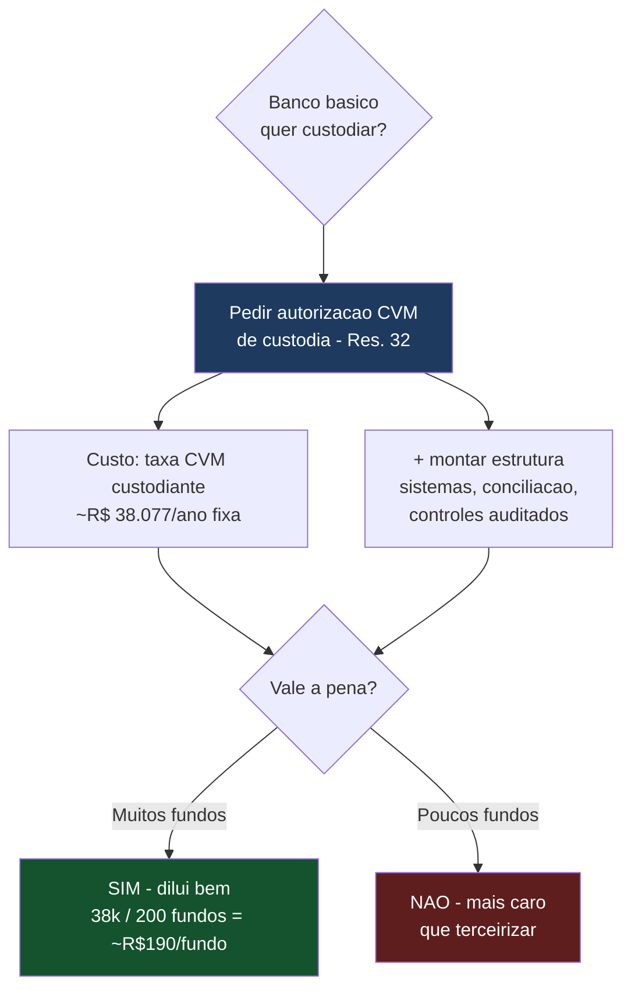

- **Duas estratégias de custódia:**
  - **(a) Terceirizar** com custodiante já autorizado — despesa do fundo, sem o banco montar nada. Melhor no início.
  - **(b) Banco vira custodiante** — o banco pede a autorização e absorve o custo (~R$ 38 mil/ano de taxa CVM de custodiante + estrutura). **Só compensa em escala** (muitos fundos diluindo os R$ 38 mil). A vantagem: permite oferecer **custódia a custo zero para o fundo**, o que melhora muito a viabilidade dos fundos pequenos (ver planilha de custos). A desvantagem: é mais uma autorização a pedir e um investimento do banco, que o compliance dele vai pesar.
- **Alívio marginal:** a norma **dispensa** contratação de custódia para ativos que representem até **5% do PL** da classe, desde que negociados em mercado organizado ou registrados em sistema autorizado pelo BC/CVM.
- **Taxa de custódia:** quando cobrada, é **despesa do fundo** (percentual anual do PL no regulamento). Se o banco absorve, pode-se optar por **não repassar ao fundo** — custódia R$ 0 para o cotista.

### 5.3 Escrituração e Controladoria de Cotas

- **Exigência:** controle de ativos, passivos e escrituração de cotas — atividade que o administrador organiza.
- **Solução:** esta é justamente **a camada que a tecnologia da startup automatiza** (cálculo de cota, escrituração, controladoria). Aqui o custo marginal por fundo tende a baixo — é o coração do diferencial. Onde não for possível internalizar de início, terceiriza-se via BPO especializado até a tecnologia amadurecer.

---

## 6. Frente 4 — Preciso de Contador e Advogado?

Resposta direta: **sim, você precisa de acesso a ambos — mas "acesso" não significa "contratar em tempo integral desde o dia 1".** Aqui estão as soluções por perfil.

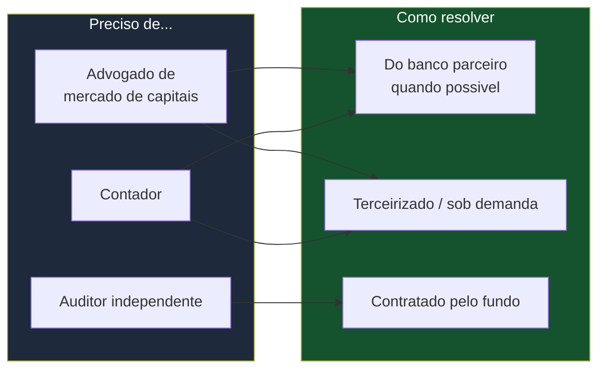

### 6.1 Advogado de mercado de capitais

- **Para quê:** estruturar a parceria com o banco (contrato de divisão de risco e resultado), desenhar os regulamentos-modelo dos fundos, validar o canal de captação (assessorias), garantir conformidade com a CVM 175.
- **Solução 1 (a sua ideia — válida):** **usar o jurídico do banco parceiro.** O banco já tem advogados de mercado de capitais; parte do trabalho de estruturação pode ser apoiada por eles, sobretudo o que envolve a licença dele. É uma economia real e legítima.
- **Solução 2 (complementar):** para o que for interesse específico *seu* (ex.: proteger a startup na divisão de responsabilidade com o banco), contratar um advogado **sob demanda / por projeto**, não em tempo integral. Escritórios de mercado de capitais trabalham por projeto.
- **Ressalva honesta:** em pontos onde os interesses da startup e do banco **divergem** (quem carrega qual risco), é prudente ter aconselhamento *próprio*, não só o do banco — o advogado do banco protege o banco.

### 6.2 Contador

- **Para quê:** contabilidade da própria empresa (a startup) e apoio na contabilidade dos fundos.
- **Solução 1 (a sua ideia — válida):** **aproveitar a estrutura contábil do banco parceiro** para a parte contábil dos fundos, já que o banco, como administrador formal, tem essa estrutura.
- **Solução 2:** para a contabilidade da própria startup, um **BPO contábil / contador terceirizado** resolve com baixo custo — não precisa de contador interno no início.
- **Solução 3 (tecnologia):** a controladoria contábil dos fundos é parte do que o sistema automatiza; o contador atua na supervisão e no fechamento, não no lançamento manual.

### 6.3 Resumo da Frente 4

| Profissional | Preciso? | Solução mais enxuta |
|---|---|---|
| Advogado mercado de capitais | Sim (acesso) | Jurídico do banco + advogado próprio sob demanda para pontos de divergência |
| Contador | Sim (acesso) | BPO contábil terceirizado + estrutura do banco para os fundos |
| Auditor independente | Sim (obrigatório) | Contratado pelo fundo; custo do fundo, não da startup |

---

## 7. Frente 5 — Constituição e Registro dos Fundos

### 7.1 A exigência

Sob a **Resolução CVM 175**, o fundo é constituído por **deliberação conjunta dos prestadores de serviços essenciais** (administrador e gestor), que aprovam o regulamento. O funcionamento depende de **registro na CVM** — e aqui está a boa notícia estrutural:

> **O registro de funcionamento é concedido AUTOMATICAMENTE** com o envio dos documentos e informações pelo administrador via sistema eletrônico da CVM.

### 7.2 A solução — este ponto é um presente para a tese de *deploy* ágil

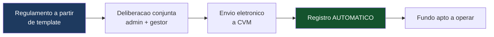

- **Solução central:** como o registro é **automático via sistema**, ele é **automatizável**. A startup pode padronizar regulamentos-modelo (por tipo de fundo) e integrar o envio à CVM, tornando a constituição rápida — exatamente o diferencial de *deploy* ágil do plano.
- **Parâmetro de projeto (PL mínimo):** uma classe que mantiver PL diário inferior a **R$ 1 milhão por 90 dias consecutivos** (após 90 dias do início) deve ser liquidada ou incorporada. **Solução:** definir R$ 1 milhão como piso operacional de fundo aceito na plataforma, alinhando o produto à regra.
- **Solução multiclasse (redução de custo estrutural, com ressalva):** a CVM 175 permite **classes e subclasses** sob um mesmo fundo. **Correção:** isso **não dilui a taxa CVM** (que segue o PL). O que **subclasses** poupam é a **duplicação de auditoria/contabilidade/registro** — e só quando você consolidaria várias estruturas da **mesma estratégia** numa só. **Classes** separam ativos de estratégias diferentes, mas cada uma carrega seu próprio custo fixo (CNPJ, contabilidade, taxa CVM própria) — não economizam. Subclasses não podem ter prestadores essenciais distintos nem alterar o regime tributário. O desenho exato precisa de validação jurídica; o caminho existe, mas a economia é **condicional**, não automática (ver guia de estruturas de classes/subclasses).

---

## 8. Frente 6 — Estrutura Mínima da Própria Empresa

Para obter e manter a habilitação, a pessoa jurídica precisa demonstrar estrutura. Aqui está o mínimo, com a solução enxuta para cada item.

| Exigência | O que é | Solução enxuta |
|---|---|---|
| Estrutura societária | Diretores responsáveis definidos em contrato/estatuto | Definir papéis desde a constituição; aproveitar o banco onde couber |
| Estrutura funcional | Analistas de compliance e risco | Começar com o mínimo: 1 responsável por cada função independente |
| Estrutura física | Espaço de trabalho | Modelo enxuto/digital; validar exigência atual de espaço físico com a ANBIMA |
| Estrutura tecnológica | Sistemas robustos, com registros auditáveis e backups | **É o core da startup** — a tecnologia própria *é* a comprovação |
| Website | Exigência formal: site com informações da estrutura e políticas | Criar antes do pedido; pode ficar restrito com senha na fase pré-operacional |
| Manual de compliance e controles internos | Documento com políticas e controles | Usar templates de mercado + validação jurídica pontual |

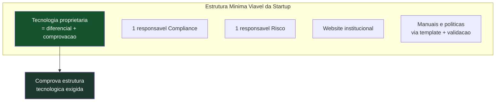

> 💡 **Solução elegante:** a exigência de "estrutura tecnológica robusta" — que para um administrador tradicional é um custo — para você é **o próprio produto**. A norma até prevê que, se a instituição não contrata sistemas de terceiros, deve desenvolver ferramentas proprietárias e apresentá-las. Ou seja: **a sua tecnologia própria já é a resposta à exigência**, não um custo adicional.

---

## 9. O Papel da ANBIMA

- **O que é:** além da CVM, a **ANBIMA** faz a análise prévia dos pedidos de habilitação (em convênio com a CVM) e mantém códigos de melhores práticas. Fundos e instituições costumam passar por registro/adesão à ANBIMA.
- **Solução:** tratar a ANBIMA como parte do checklist de habilitação — seguir os guias de habilitação de PJ da própria ANBIMA (que são públicos) como roteiro. O banco parceiro, já habilitado, conhece esse caminho e é fonte de apoio.

---

## 10. Prazos — O Que Esperar

```mermaid
gantt
    title Linha do tempo aproximada (Rota A - parceria)
    dateFormat X
    axisFormat %s
    section Validacao
    Consulta juridica + planilha custos    :0, 2
    Reunioes com bancos parceiros          :1, 4
    section Estruturacao
    Fechar parceria com DTVM               :4, 6
    Montar estrutura minima + website      :5, 7
    section Operacao
    Automatizar constituicao de fundos     :6, 9
    Primeiros fundos-piloto                :9, 11
```

- **Autorização de administrador de carteiras (CVM):** o prazo de análise foi reduzido para **60 dias corridos** a partir do protocolo do último documento; na prática, projetos completos levam de **4 a 6 meses** considerando preparação.
- **Solução de aceleração:** na Rota A, você **aproveita a licença que o banco já tem**, encurtando drasticamente esse caminho — a sua constituição foca na camada operacional e nos contratos, não na obtenção da licença do zero.
- **Registro de cada fundo:** **automático** via sistema — rápido por design (base do *deploy* ágil).

---

## 11. Checklist Consolidado — Como Fazer, na Ordem

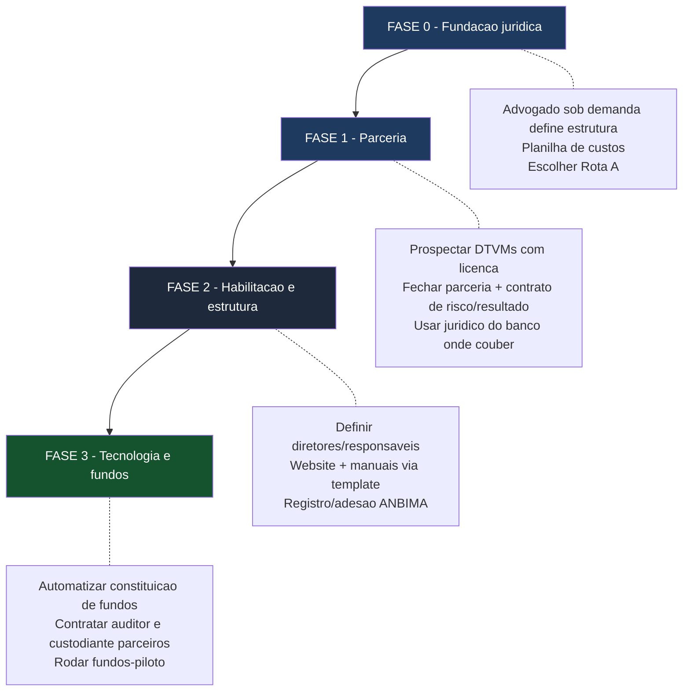

### Passo a passo

1. **Fundação jurídica (Fase 0):** contratar advogado de mercado de capitais **por projeto** para desenhar a estrutura e confirmar a Rota A. Montar a planilha de custos. *(Aqui a sua ideia de usar profissionais sob demanda em vez de contratar full-time se aplica bem.)*
2. **Parceria (Fase 1):** prospectar DTVMs/bancos que **já têm licença** e a subutilizam; fechar parceria com contrato claro de divisão de **resultado e de responsabilidade**; aproveitar o jurídico e a estrutura contábil do banco onde os interesses coincidem, mantendo aconselhamento próprio nos pontos de divergência.
3. **Habilitação e estrutura (Fase 2):** definir diretores responsáveis (aproveitando o banco), montar website e manuais a partir de templates validados, seguir os guias de habilitação da ANBIMA.
4. **Tecnologia e fundos (Fase 3):** automatizar a constituição de fundos (registro automático na CVM), firmar contratos recorrentes com auditor(es) menor(es) e custodiante, rodar os fundos-piloto medindo o custo unitário real.

---

## 12. Resumo — Preciso de Quem e de Quê?

| Pergunta | Resposta curta | Solução enxuta |
|---|---|---|
| Preciso de licença própria? | Não, na Rota A | Parceria com DTVM/banco que já tem |
| Preciso de advogado? | Sim, acesso | Do banco + próprio sob demanda nos pontos de divergência |
| Preciso de contador? | Sim, acesso | BPO terceirizado + estrutura do banco para os fundos |
| Preciso contratar auditor? | Sim (obrigatório por fundo) | Contratado pelo fundo; custo do fundo; auditores menores em rodízio |
| Preciso de custodiante? | Sim (obrigatório) | Contratado; pode ser o próprio banco parceiro |
| Preciso de diretores dedicados? | Alguns, com segregação | Aproveitar os do banco + contratar certificados p/ risco e compliance |
| Preciso de estrutura tecnológica? | Sim | **É o seu próprio produto** — já é a comprovação |
| O registro de fundo é difícil? | Não | **Automático** via sistema CVM — automatizável |

---

> **Conclusão em uma frase:** na Rota A, a maior parte da burocracia pesada (licença, capital, boa parte do jurídico e contábil, custódia) é **acessada via parceiro e prestadores**, não construída — o que a startup constrói é a **camada de tecnologia e coordenação**, que por sinal é exatamente o que a norma aceita como comprovação de estrutura tecnológica. O caminho é montável; os pontos que exigem cuidado real são a **divisão de responsabilidade com o banco** e a **validação jurídica** de cada etapa — ambos endereçáveis com aconselhamento sob demanda.

---

## Adendo (jul/2026) — obrigações contínuas confirmadas + sandbox

**Prazos de reporte confirmados (Res. CVM 175):** informe diário em **1 dia útil** (na prática, só sai após a validação da cota pelo gestor); balancete, CDA (composição e diversificação de carteira) e perfil mensal em **10 dias úteis** do fim do mês; demonstrações contábeis auditadas anuais; estatísticas ANBIMA mensais. Ofícios da CVM chegam com prazo de resposta e exigem trilha de tratamento. **Assembleias de cotistas** (alteração de regulamento, taxas, prestadores essenciais) podem ser 100% eletrônicas. Todos esses fluxos estão modelados no piloto (aba Regulatório CVM).

**Custódia:** é autorização própria (Res. CVM 32) com adesões de mercado próprias (B3/SELIC/RSFN) — mapa completo no **`guia_custodia_conexoes.md`**.

**Sandbox regulatório (Res. CVM 29/2021):** dispensa temporária de requisitos para modelos inovadores. No 1º ciclo (2021–2026), 4 autorizadas em 33 propostas. Para a Rota A (parceria com banco licenciado) o sandbox **não é necessário**; guarde-o como rota alternativa caso a parceria não avance, e monitore a abertura do próximo ciclo. Análise completa na Seção 4 do guia de custódia.

*Documento de trabalho. Próximo passo sugerido: levar este mapa a um advogado de mercado de capitais em uma consulta pontual para validar a estrutura da Rota A e o desenho da parceria — o investimento jurídico mais barato e de maior retorno neste estágio.*
