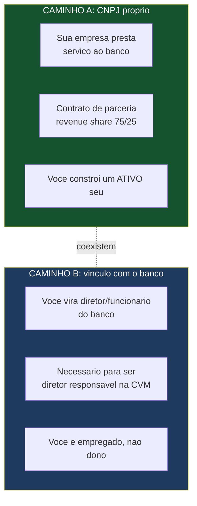
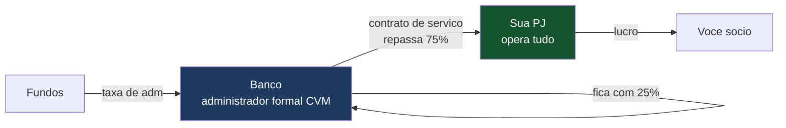
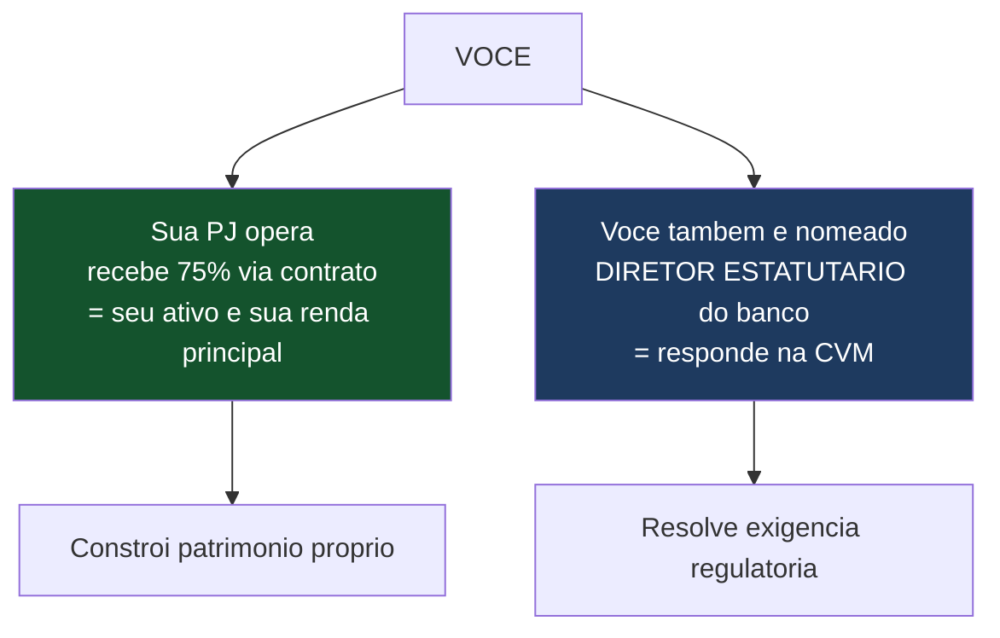

# CNPJ Próprio vs. Trabalhar Dentro do Banco — Diferenças e Procedimentos

> **Documento de trabalho — v0.1**
> As diferenças, exigências e burocracias entre **(A) abrir um CNPJ próprio para atuar em parceria com o banco** e **(B) ser contratado/vinculado diretamente ao banco** (por exemplo, como diretor da área de administração fiduciária). Cobre: se você precisa ser contratado, qual cargo teria, o que cada caminho exige, e uma recomendação.
>
> **Aviso:** baseado na Resolução CVM 21 e normas correlatas (jul/2026). A escolha tem efeitos societários, tributários e trabalhistas — valide com advogado e contador antes de decidir.

---

## 0. A pergunta por trás da pergunta

Você quer saber: "para fazer isso funcionar, eu abro uma empresa e faço parceria, ou eu viro funcionário/diretor do banco?" A resposta curta é que **os dois papéis podem coexistir**, e provavelmente vão — mas por razões diferentes. Deixa eu separar.

---

## 1. A EXIGÊNCIA REGULATÓRIA QUE FORÇA UMA PARTE DO VÍNCULO

Aqui está um ponto técnico que muda tudo e que você precisa saber: a CVM exige que o **diretor responsável pela administração fiduciária seja um diretor estatutário da instituição administradora** — ou seja, do banco.

- A norma diz que a responsabilidade pela administração de carteiras deve ser atribuída a **um diretor, gerente-delegado ou sócio-gerente da instituição**, autorizado pela CVM.
- Como o **administrador formal é o banco**, o diretor responsável precisa ter **vínculo estatutário com o banco**.
- **Boa notícia (categoria "administrador fiduciário"):** a Resolução CVM 21 dispensa que esse diretor seja *exclusivo* da administração de carteiras — a designação pode recair sobre um diretor que já tem outras funções no banco (vedada só a acumulação com a gestão dos recursos próprios do banco).

> ⚠️ **Implicação prática:** *alguém* precisa ser diretor estatutário do banco para responder pela administração fiduciária na CVM. Esse alguém pode ser **você** (se o banco te fizer diretor) **ou** um diretor que o banco já tem. Isso é o que cria a possível necessidade de um vínculo formal seu com o banco — mas não obrigatoriamente.

---

## 2. CAMINHO A — CNPJ PRÓPRIO EM PARCERIA COM O BANCO

Você abre uma empresa (a sua administradora operacional / "a sua DTVM" no sentido de negócio) que **presta serviços ao banco** e recebe a partilha de receita.

### 2.1 Como funciona

- O **banco** é o administrador formal na CVM (recebe a taxa dos fundos).
- A **sua PJ** presta os serviços operacionais (a plataforma, o controle, a MaM, o monitoramento) via **contrato de prestação de serviços / parceria**.
- O contrato prevê a **partilha 75/25** da receita de administração.
- Você é **sócio da sua PJ** — dono de um ativo.

### 2.2 O que exige

| Exigência | Detalhe |
|---|---|
| **Abrir a PJ** | Constituir empresa (provável LTDA), objeto social compatível, CNPJ |
| **Contrato de parceria com o banco** | Prestação de serviços auxiliares à administração; a CVM/norma prevê que a contratação de terceiros para serviços auxiliares seja formalizada e, em certos casos, submetida a consentimento prévio |
| **Enquadramento tributário** | Simples, Presumido ou Real — definir com contador (impacta muito o líquido) |
| **Estrutura contábil/fiscal** | Contador, emissão de notas, obrigações acessórias |
| **Possível certificação/registro** | Se a sua PJ for exercer atividades que exijam registro próprio; se for só operacional sob o banco, pode não precisar de habilitação própria na CVM |

### 2.3 Vantagens e desvantagens

**Vantagens:**
- **Você constrói um ativo seu** — a PJ tem contratos, receita recorrente e valor de venda. Se um dia quiser vender ou captar investimento, é a PJ que vale.
- **Autonomia** — você é dono, define como opera, contrata, cresce.
- **Flexibilidade tributária** — pode otimizar a carga (dentro da lei).
- **Escala** — a mesma PJ pode, no futuro, atender mais de um banco/parceiro.

**Desvantagens:**
- **Você assume o risco empresarial** — se não der certo, o custo é seu.
- **Não resolve, sozinho, a exigência do diretor estatutário** — ainda precisa haver um diretor do banco responsável na CVM (pode ser você, se o banco te nomear — ver Caminho C híbrido).
- **Mais burocracia** — abrir e manter empresa, contabilidade, tributos.

---

## 3. CAMINHO B — SER CONTRATADO/VINCULADO AO BANCO

Você vira **funcionário ou diretor do banco**, e opera a administração fiduciária de dentro da estrutura dele.

### 3.1 Como funciona

- Você é **contratado pelo banco** (CLT como executivo, ou nomeado **diretor estatutário**).
- Se nomeado diretor estatutário responsável pela administração fiduciária, você **é** a pessoa que responde na CVM — o que resolve a exigência regulatória diretamente.
- Sua remuneração é **salário / pró-labore** (+ eventual bônus), não partilha de receita via PJ.

### 3.2 Qual cargo você teria?

O cargo natural seria **Diretor de Administração Fiduciária** (ou Diretor de Recursos de Terceiros) — um diretor estatutário do banco responsável pela atividade perante a CVM. Não é exatamente "CEO da DTVM" (o banco não é uma DTVM separada; a administração fiduciária é uma atividade dentro do banco), mas é o cargo de **diretor responsável pela área**.

> 💡 Se no futuro o banco constituir uma **subsidiária/DTVM separada** para a atividade, aí sim poderia existir o cargo de "CEO/Diretor-Presidente da DTVM". Mas no arranjo inicial (atividade dentro do banco), o cargo é "diretor responsável pela administração fiduciária".

### 3.3 O que exige

| Exigência | Detalhe |
|---|---|
| **Vínculo com o banco** | CLT executivo ou nomeação estatutária (ata) |
| **Autorização/aptidão na CVM** | O diretor responsável precisa comprovar aptidão (certificação — você tem CGA/CGE — ou experiência/notório saber) e reputação ilibada |
| **Declaração de idoneidade** | Semelhante à exigida de administradores de instituições financeiras |
| **Sujeição às regras de conduta** | Como diretor, você responde pessoalmente (de forma subjetiva) pela atividade |

### 3.4 Vantagens e desvantagens

**Vantagens:**
- **Resolve a exigência regulatória diretamente** — você é o diretor responsável na CVM.
- **Menos burocracia empresarial** — você não gere uma PJ.
- **Renda estável** — salário/pró-labore.
- **Sua certificação (CGA/CGE) é aproveitada** para comprovar aptidão.

**Desvantagens:**
- **Você não constrói um ativo próprio** — você é empregado/diretor, não dono. Se sair, não leva nada além da experiência.
- **Menos autonomia** — você opera dentro das regras e da hierarquia do banco.
- **Teto de ganho** — salário, não participação no crescimento (a menos que negocie participação/bônus).
- **A lógica 75/25 fica estranha** — se você é funcionário, não faz sentido "receber 75% da receita"; você receberia salário. A partilha 75/25 pressupõe que você é um **parceiro externo** (Caminho A), não um empregado.

---

## 4. CAMINHO C (RECOMENDADO) — O HÍBRIDO

Na prática, o arranjo que melhor concilia tudo costuma ser **combinar os dois**:

- Você **abre a PJ** (Caminho A) — que opera e recebe a partilha 75/25, construindo seu ativo.
- Você **também é nomeado diretor estatutário** do banco (Caminho B), especificamente para ser o diretor responsável pela administração fiduciária na CVM — resolvendo a exigência regulatória.
- Assim você **une** o melhor dos dois: constrói um ativo próprio (a PJ) **e** ocupa o cargo que a norma exige.

> ⚠️ **Ponto a validar com advogado:** essa dupla condição (sócio de uma PJ que presta serviço + diretor estatutário do banco) precisa ser desenhada para não gerar conflito de interesses vedado nem problema trabalhista/societário. É viável no mercado, mas exige desenho jurídico cuidadoso — especialmente as regras de independência e segregação do diretor responsável.

> 💡 **Alternativa ao híbrido:** se o desenho híbrido for complicado, o banco designa **um diretor próprio dele** como responsável na CVM, e você fica **só com a PJ** (Caminho A puro), operando como parceiro. Você não ocupa cargo no banco, mas também opera tudo e recebe a partilha. Menos controle regulatório formal, mais simplicidade para você.

---

## 5. COMPARATIVO DIRETO

| Aspecto | A) CNPJ próprio | B) Vínculo com banco | C) Híbrido |
|---|---|---|---|
| Constrói ativo seu | ✅ Sim | ❌ Não | ✅ Sim |
| Resolve diretor responsável CVM | ❌ Não (sozinho) | ✅ Sim | ✅ Sim |
| Autonomia | ✅ Alta | ❌ Baixa | 🟡 Média |
| Burocracia | 🟡 PJ + tributos | ✅ Menor | ❌ Maior (os dois) |
| Faz sentido com a partilha 75/25 | ✅ Sim | ❌ Não | ✅ Sim |
| Renda | Partilha (variável) | Salário (fixo) | Partilha + pró-labore |
| Risco empresarial | ❌ Seu | ✅ Do banco | 🟡 Seu (PJ) |

---

## 6. BUROCRACIAS DE CADA CAMINHO (resumo)

**Para o CNPJ próprio (A):**
- Registro da empresa (Junta Comercial), CNPJ, inscrições.
- Definição de objeto social e enquadramento tributário.
- Contrato de parceria/prestação de serviços com o banco (formalizado; possível consentimento prévio conforme a norma de contratação de terceiros).
- Contador, emissão de notas, obrigações acessórias.
- Eventual registro/certificação conforme as atividades.

**Para o vínculo com o banco (B):**
- Nomeação estatutária (ata) ou contrato de trabalho.
- Comprovação de aptidão e reputação ilibada na CVM (sua CGA/CGE ajuda).
- Declaração de idoneidade.
- Sujeição às regras de conduta e responsabilidade pessoal (subjetiva).

**Para o híbrido (C):** as duas listas acima, com desenho jurídico que evite conflito/vedação de independência.

---

> **Resumo em uma frase:** a norma exige que **um diretor estatutário do banco** seja o responsável pela administração fiduciária na CVM — o que cria a possível necessidade de um vínculo formal seu com o banco. Mas a lógica de partilha 75/25 que você quer só faz sentido se você for um **parceiro externo** (CNPJ próprio), não um empregado. Por isso o arranjo recomendado é o **híbrido**: abrir sua PJ (que opera, recebe a partilha e vira seu ativo) **e** ser nomeado diretor estatutário do banco (que resolve a exigência regulatória) — ou, se o híbrido for complexo, ficar só com a PJ enquanto o banco designa um diretor dele como responsável na CVM. O cargo, se você for diretor, é "Diretor de Administração Fiduciária" do banco, não "CEO de DTVM" (que só existiria se o banco criasse uma subsidiária separada). Valide o desenho com advogado e contador, porque tem efeito societário, tributário e trabalhista.

*Documento v0.1. A escolha entre os caminhos afeta impostos, responsabilidade e controle — decida com contador e advogado de mercado de capitais, à luz do que o banco preferir.*
