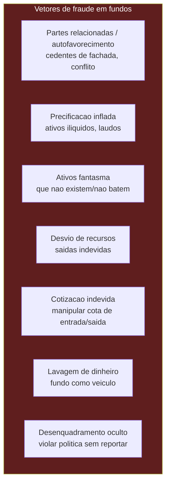
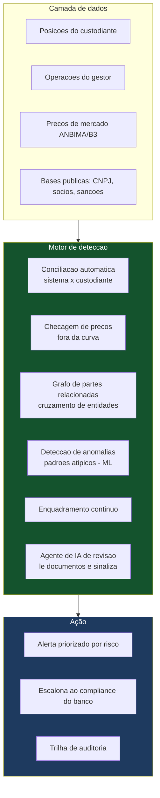
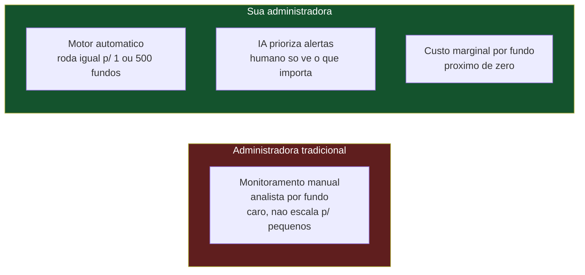

# Controle de Fraudes e Riscos — Como a Administradora Monitora

> **Documento de trabalho — v0.1**
> Os principais tipos de fraude e risco em fundos de investimento, com **casos reais recentes**, e como a sua administradora monitora isso de forma eficiente para muitos fundos usando **agentes de IA, tratamento de dados e cálculos sofisticados**. É a base do argumento de que você **reduz o risco do banco**.
>
> **Aviso:** casos citados são públicos (decisões CVM/notícias). Não substitui parecer de compliance/jurídico. As técnicas de monitoramento descritas são o desenho proposto — a implementação deve seguir os manuais aprovados.

---

## 0. Por que isto importa para o pitch

O maior medo do banco é ter o nome ligado a uma fraude. A CVM **pune o administrador e o custodiante** quando falham na diligência — não só o fraudador. Então mostrar que você tem um sistema de detecção de fraude de verdade é o que separa "mais uma administradora" de "um parceiro que protege o banco".

---

## 1. OS CASOS REAIS (o que o banco teme, com nome e valor)

### 1.1 Silverado / FIDCs Maximum (a multa de R$ 497,5 milhões)

<cite index="168-1">A CVM multou a gestora Florim (ex-Silverado) e seu ex-diretor em cerca de R$ 245 milhões cada, por fraudes em três FIDCs. O caso veio à tona em 2016 quando a S&P retirou os ratings, apontando irregularidades.</cite> O esquema: <cite index="168-1">alguns cedentes dos fundos eram partes relacionadas à gestora, caracterizando empresas de fachada.</cite>

**O ponto que apavora o banco:** não foi só a gestora que pagou. <cite index="168-1">As administradoras fiduciárias e a custodiante também foram multadas por não cumprirem as diligências necessárias — BNY Mellon (administradora) multada em R$ 1,2 milhão, Deutsche Bank (custodiante) em R$ 500 mil, Santander Caceis em R$ 2,72 milhões.</cite> <cite index="168-1">Administradores pessoas físicas também foram responsabilizados individualmente.</cite>

> ⚠️ **A lição:** o administrador foi punido por **não ter diligenciado** — por não perceber que os cedentes eram empresas de fachada ligadas à gestora. Um sistema que cruza dados de partes relacionadas teria levantado a bandeira.

### 1.2 Fraude em RPPS (R$ 451 milhões bloqueados)

<cite index="169-1">A PF e a CVM desarticularam um grupo que teria captado e desviado R$ 239 milhões de 69 Regimes Próprios de Previdência Pública em 11 estados, com bloqueio de contas e ativos somando R$ 451 milhões.</cite> Fundos usados como veículo para desviar recursos de previdências municipais.

### 1.3 FIP LSH (laudo de avaliação inflado)

No caso do FIP LSH, a CVM apontou <cite index="172-1">sobrevalorização do laudo de avaliação da investida, que viabilizou transferência de riqueza por meio da venda de cotas</cite>, com <cite index="172-1">laudos elaborados sob forte influência de interessado e premissas "excessivamente otimistas"</cite>. A gestora foi condenada.

> ⚠️ **A lição:** em ativos sem preço de mercado (FIP, crédito ilíquido), a **precificação inflada** é o vetor de fraude — infla-se o valor para vender cotas caras ou mascarar perdas. Monitorar a razoabilidade dos preços é essencial.

---

## 2. OS PRINCIPAIS TIPOS DE FRAUDE E RISCO (o mapa)

| Tipo | Como funciona | Sinal detectável |
|---|---|---|
| **Partes relacionadas** | Fundo compra de/vende para empresas ligadas ao gestor | Cruzamento de CNPJs, sócios, endereços |
| **Precificação inflada** | Ativo ilíquido marcado acima do justo | Preço fora da curva/comitê; laudo otimista |
| **Ativos fantasma** | Ativos declarados que não existem ou não batem com o custodiante | Divergência posição sistema × custodiante |
| **Desvio de recursos** | Saídas financeiras indevidas | Movimentação sem lastro em operação |
| **Cotização indevida** | Manipular a cota de entrada/saída para beneficiar alguém | Aplicações/resgates em momentos suspeitos |
| **Lavagem de dinheiro** | Fundo como veículo de recursos ilícitos | Padrões atípicos de aplicação/resgate; beneficiário final oculto |
| **Desenquadramento oculto** | Violar a política sem reportar | Enquadramento automático contínuo |

---

## 3. COMO A ADMINISTRADORA MONITORA — A ARQUITETURA

O diferencial da sua operação é fazer isso **automaticamente, para muitos fundos, com IA e dados** — o que administradoras tradicionais fazem de forma manual e cara (e por isso não fazem bem para fundos pequenos).

### 3.1 Os controles automáticos (o que roda todo dia)

**Conciliação automática (contra ativos fantasma):** o sistema cruza, diariamente, a posição que você contabiliza com a posição reportada pelo custodiante. **Qualquer divergência é alertada.** Ativo que existe no seu sistema mas não no custodiante (ou vice-versa) é bandeira vermelha imediata. Este controle sozinho teria pegado boa parte das fraudes de "ativos que não existem".

**Checagem de preços fora da curva (contra precificação inflada):** para cada ativo, o sistema compara o preço de marcação com a referência de mercado (ANBIMA/B3) ou com a curva do comitê de crédito. Preço que se desvia além de um limite estatístico é sinalizado para revisão. Para ativos ilíquidos (FIP, crédito), o agente de IA lê o laudo/justificativa e sinaliza premissas "otimistas demais".

**Grafo de partes relacionadas (contra autofavorecimento):** o sistema mantém um **grafo de entidades** — cruzando CNPJs, sócios, endereços, controladores — para detectar quando um fundo negocia com uma contraparte ligada ao gestor. Cruza com bases públicas (Receita, sócios, listas de sanções, PEPs). Teria levantado a bandeira no caso Silverado (cedentes de fachada ligados à gestora).

**Detecção de anomalias por machine learning (contra padrões atípicos):** modelos que aprendem o comportamento normal de cada fundo e sinalizam desvios — resgates atípicos antes de eventos, aplicações em timing suspeito, movimentações sem lastro. É o que pega cotização indevida e lavagem.

**Enquadramento contínuo (contra desenquadramento oculto):** o sistema verifica, a cada cálculo, se a carteira respeita todos os limites da política. Desenquadramento é detectado no dia, não meses depois.

**Agente de IA de revisão documental:** um agente que lê contratos, laudos, regulamentos e comunicações, e sinaliza inconsistências, cláusulas de risco, conflitos de interesse — o trabalho que um analista de compliance faria manualmente, feito em escala.

### 3.2 KYC/PLD reforçado (contra lavagem)

No onboarding e continuamente: identificação de beneficiário final, cruzamento com listas de sanções/PEPs, monitoramento de operações atípicas, e reporte ao COAF quando aplicável. É obrigação do administrador (banco) — você opera.

---

## 4. COMO ISSO ESCALA PARA MUITOS FUNDOS COM EFICIÊNCIA

A chave do negócio: fazer isso para 50, 200, 500 fundos **sem multiplicar equipe**. Como:

- **O motor roda igual para 1 ou 500 fundos** — o custo de adicionar o fundo nº 500 ao monitoramento é quase zero. É por isso que administradoras grandes não monitoram bem fundos pequenos (não compensa o custo manual), e você consegue.
- **A IA prioriza:** em vez de um humano olhar tudo, o sistema gera **alertas priorizados por risco**, e o humano (você + compliance do banco) só revisa o que realmente importa. Isso transforma "vigiar 500 fundos" em "revisar os 5 alertas mais críticos do dia".
- **Trilha de auditoria automática:** cada checagem fica registrada, comprovando a diligência do administrador perante a CVM — exatamente o que faltou nos casos punidos.

> 💡 **O argumento matador para o banco:** "As grandes administradoras não monitoram fundos pequenos com esse rigor porque o custo manual não compensa. Eu monitoro **todos** com o mesmo rigor, porque o meu custo é de software, não de gente. Então, na prática, os fundos pequenos sob a minha operação são **mais bem vigiados** do que estariam numa administradora tradicional — e isso protege o seu nome."

---

## 5. LIMITES HONESTOS (o que a IA NÃO resolve sozinha)

Para manter credibilidade com o compliance do banco, seja honesto sobre os limites:

- **IA gera alertas, não decisões finais.** Um humano (com o compliance do banco) decide o que fazer com cada alerta. A IA reduz o trabalho, não elimina o julgamento.
- **Falsos positivos existem.** O sistema vai sinalizar coisas que são inocentes; calibrar isso leva tempo e dados.
- **Fraude sofisticada pode escapar.** Nenhum sistema é infalível; o objetivo é reduzir drasticamente a probabilidade e criar trilha de diligência, não prometer zero fraude.
- **Precificação de ilíquidos sempre tem julgamento.** FIP e crédito ilíquido dependem de laudo/comitê; a IA ajuda a sinalizar, mas não substitui o avaliador.
- **A responsabilidade final é do administrador (banco).** A ferramenta apoia a diligência; não a transfere.

> ⚠️ **Não venda "IA que elimina fraude".** Venda "IA que torna a diligência muito mais forte, contínua e barata do que o padrão de mercado para fundos pequenos" — isso é verdadeiro e defensável perante um compliance sério. Prometer infalibilidade destrói credibilidade.

---

> **Resumo em uma frase:** os casos reais (Silverado, RPPS, FIP LSH) mostram que a CVM pune o administrador e o custodiante quando falham na diligência — e os vetores de fraude (partes relacionadas, precificação inflada, ativos fantasma, desvio, lavagem) têm sinais detectáveis. Sua administradora monitora tudo isso automaticamente (conciliação diária, checagem de preços, grafo de partes relacionadas, anomalias por ML, agente de IA de revisão), gerando alertas priorizados e trilha de auditoria — com custo de software que escala para centenas de fundos, tornando os fundos pequenos sob sua operação **mais bem vigiados** do que numa administradora tradicional. A IA reforça a diligência, não elimina o julgamento nem promete infalibilidade — e é exatamente essa honestidade que convence um compliance sério.

*Documento v0.1. As técnicas descrevem o desenho proposto; a implementação e os limiares devem ser validados e documentados nos manuais de controle aprovados pelo banco e refletidos na política de PLD.*
