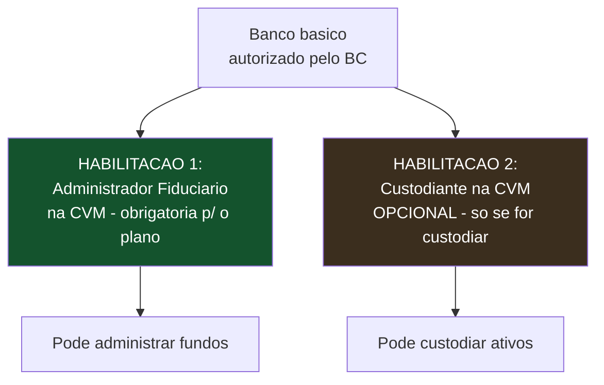
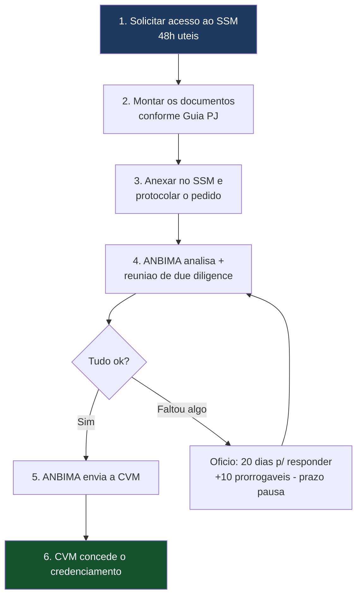
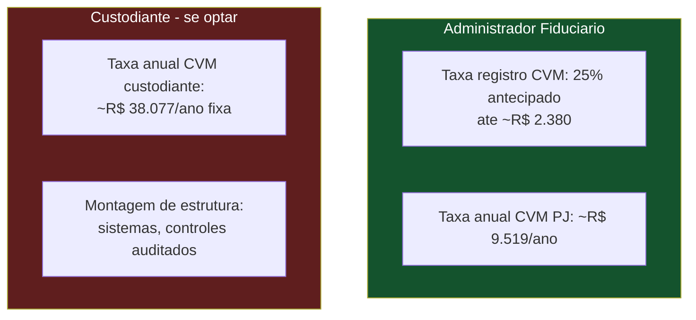
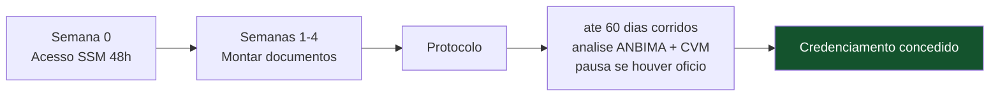

# Guia Prático — Credenciar o Banco como Administrador Fiduciário e Custodiante

> **Documento de trabalho — v0.1 (guia prático)**
> Roteiro passo a passo para você **conduzir um banco pequeno** (do interior, com título de banco mas sem DTVM nem habilitações de mercado de capitais) a se credenciar como **administrador fiduciário** e, se decidir, como **custodiante** na CVM. Traz links, documentos, prazos, estrutura necessária e custos reais.
>
> **Aviso:** links e valores conferidos em jul/2026; a CVM/ANBIMA podem atualizar formulários e taxas — sempre confirme na fonte oficial antes de protocolar. Não substitui assessoria jurídica de mercado de capitais.

---

## 0. Antes de tudo — o mapa mental

**Duas verdades que orientam tudo:**
1. Um banco **já é** "instituição autorizada a funcionar pelo Banco Central" — então **já cumpre** o pré-requisito de base. Ele **não precisa virar DTVM**. Falta apenas o **credenciamento de atividade** na CVM.
2. Administrador fiduciário e custodiante são **duas habilitações separadas**. A primeira é indispensável para o plano; a segunda é opcional (você pode contratar custódia de terceiro).

---

## PARTE I — VERIFICAR O QUE O BANCO JÁ TEM

Antes de iniciar qualquer processo, confirme o status atual do banco. Faça estas quatro checagens:

### 1.1 O banco é autorizado pelo Banco Central? (quase certo que sim)
- **Onde verificar:** site do BC → "Encontre uma instituição" / relação de instituições autorizadas.
  - Link: `https://www.bcb.gov.br/estabilidadefinanceira/encontreinstituicao`
- **O que procurar:** o CNPJ do banco na lista de instituições autorizadas. Se está lá como banco, o pré-requisito de base está cumprido.

### 1.2 O banco já é credenciado como administrador de carteiras na CVM?
- **Onde verificar:** consulta pública de administradores de carteira na CVM.
  - Link: `https://sistemas.cvm.gov.br/?AdmCart` (consulta de administradores de carteira)
  - Ou a busca geral: `https://cvmweb.cvm.gov.br/SWB/`
- **O que procurar:** o CNPJ do banco na categoria "administrador fiduciário". Se **não aparece**, é o que vamos habilitar.

### 1.3 O banco já é custodiante autorizado?
- **Onde verificar:** lista de custodiantes registrados na CVM.
  - Link: `https://sistemas.cvm.gov.br/asp/cvmwww/invnres/tabecus.asp`
- **O que procurar:** o CNPJ do banco. Se não está, e você quiser que ele custodie, será a segunda habilitação.

### 1.4 O banco é aderente ao Código ANBIMA?
- **Onde verificar:** site da ANBIMA → associados/aderentes.
  - Link: `https://www.anbima.com.br/pt_br/associar/associados.htm`
- **Por quê:** para enviar dados de fundos (HUB ANBIMA), o administrador precisa aderir ao Código. Se o banco não é aderente, pediremos a adesão **junto** com a habilitação.

> 💡 **Resultado desta Parte:** você chega na reunião com o banco sabendo exatamente o que ele já tem e o que falta — em vez de tratar tudo como do zero. Isso passa competência e reduz a insegurança do lado dele.

---

## PARTE II — HABILITAR O BANCO COMO ADMINISTRADOR FIDUCIÁRIO

Esta é a habilitação central. O processo é feito pelo **SSM (Sistema de Supervisão de Mercados)** da ANBIMA, que tem convênio com a CVM: a ANBIMA analisa primeiro, depois envia à CVM.

### 2.1 Onde começa (o link do processo)

- **Página oficial do processo:** `https://www.anbima.com.br/pt_br/autorregular/servicos/habilitacao-de-administradores-de-carteira.htm`
- **Solicitar acesso ao SSM:** pelo link na página acima. O acesso é liberado em **até 48 horas úteis**.
- **Guia oficial de documentação (PJ):** "Guia de Documentação para Pedidos de Habilitação PJ" — baixável na mesma página. **Leia este guia inteiro antes de montar os documentos.**
- **Norma base:** Resolução CVM nº 21 (administrador de carteiras).
  - Link: `https://conteudo.cvm.gov.br/legislacao/resolucoes/resol021.html`

### 2.2 A categoria a pedir

No SSM, escolher: **"administrador fiduciário"** (não "gestor de recursos" nem "administrador pleno").

> 💡 **Vantagem de pedir só administrador fiduciário:** a Resolução CVM 21 **dispensa** a designação de um diretor exclusivo de administração de carteiras. O papel pode recair sobre um diretor que já tem outras funções no banco (vedada só a acumulação com a gestão dos recursos próprios do banco). Menos gente nova para designar.

### 2.3 Passo a passo do protocolo

1. **Solicitar acesso ao SSM** (48h úteis para liberar login/senha).
2. **Montar a documentação** (lista na seção 2.4). Dá para salvar como rascunho no SSM e só protocolar quando estiver 100%.
3. **Protocolar** — anexar todos os arquivos obrigatórios e gerar o número de protocolo. O prazo passa a contar no dia útil seguinte.
4. **Análise ANBIMA + due diligence** — reunião com os diretores da requerente.
5. **Ofícios (se houver):** se faltar algo, a ANBIMA envia ofício inicial; o prazo de 60 dias **pausa** e você tem 20 dias corridos (prorrogáveis por +10) para responder.
6. **Envio à CVM e decisão** — a CVM concede ou rejeita, dentro do prazo total de **60 dias corridos** (descontadas as pausas por ofício).

### 2.4 Documentos necessários (checklist prático)

Esta é a lista central. **Os documentos marcados 🟢 são os que VOCÊ entrega prontos ao banco** (montados com IA + validação do advogado conhecido); os 🔵 são do banco.

| Documento | Quem provê | Nota |
|---|---|---|
| 🔵 Ato societário designando os **diretores responsáveis** (adm. fiduciária + compliance/controles), registrado | Banco | Ata do conselho/diretoria; endereço comercial no Brasil |
| 🔵 Documentos dos diretores (identificação, cargo, posse, currículo) | Banco | Diretor de compliance **não** precisa de certificação, mas precisa de experiência adequada |
| 🟢 **Formulário de Referência** (conteúdo do Anexo E da Res. 21) | Você monta | Modelo no SSM; deve refletir exatamente o pedido |
| 🟢 **Código de Ética** | Você monta | Concretiza os deveres do art. 18 da Res. 21 |
| 🟢 **Manual de Precificação / Marcação a Mercado (MaM)** | Você monta | Pode ser desenvolvido por terceiros; é o coração técnico (ver guia técnico) |
| 🟢 **Manual de Compliance e Controles Internos** | Você monta | Regras, segregação, confidencialidade |
| 🟢 **Política de Negociação de Valores Mobiliários** (sócios/colaboradores) | Você monta | Art. 16 da Res. 21 |
| 🟢 **Política de Rateio e Divisão de Ordens** | Você monta | Critérios equitativos, formalizados, verificáveis |
| 🟢 **Política de Seleção, Contratação e Supervisão de Prestadores** | Você monta | Deve considerar obrigatoriamente a variável "custo" |
| 🟢 **Manual de Gestão de Risco de Liquidez** | Você monta | Feito em conjunto com o gestor; estrutura compatível |
| 🔵🟢 **Website** com os documentos obrigatórios publicados | Ambos | Você constrói; deve ter disclaimer de "em processo de credenciamento / pré-operacional" durante a análise |
| 🔵 Descrição da **estrutura tecnológica** (sistemas de tesouraria, controle de ativos, escrituração) | Você descreve | Se usar ferramentas **proprietárias**, anexar prints de tela + descrição das funcionalidades |
| 🔵 Comprovante de **pagamento da taxa** de credenciamento | Banco | Ver custos (Parte IV) |

> 💡 **A norma aceita ferramentas proprietárias** como comprovação de estrutura tecnológica. Se o banco optar por não contratar sistemas de mercado, você anexa prints e descrição das suas ferramentas in-house — exatamente o seu caso.

> ⚠️ **Ponto de atenção — capital mínimo:** o requisito de capital mínimo (0,20% dos recursos administrados ou R$ 550 mil) e a entrega de demonstrações financeiras auditadas comprovando-o é exigido **apenas** para PJ que **não seja** instituição financeira. **Como o banco É instituição financeira autorizada pelo BC, ele é dispensado desse requisito de capital.** É uma das grandes vantagens de usar um banco em vez de montar uma PJ do zero.

### 2.5 Adesão ANBIMA simultânea

No SSM, selecionar também **"Adesão aos Códigos ANBIMA"** no mesmo pedido. Se não for feito junto, a adesão só pode ocorrer **depois** de concluída a habilitação — então **peça junto** para economizar tempo.

---

## PARTE III — (OPCIONAL) HABILITAR O BANCO COMO CUSTODIANTE

Só siga esta parte se a decisão for o banco **custodiar** (em vez de contratar custódia de terceiro). Reveja a análise de custo antes: internalizar custódia só compensa em escala.

### 3.1 Onde começa

- **Página oficial do serviço (CVM/gov.br):** `https://www.gov.br/pt-br/servicos/solicitar-a-cvm-a-autorizacao-para-prestacao-de-servico-de-custodia-de-valores-mobiliarios-icvm-542`
- **Norma base:** Resolução CVM nº 32/21 (custódia de valores mobiliários).
  - Link: `https://conteudo.cvm.gov.br/legislacao/resolucoes/resol032.html`
- **Quem pode pedir:** bancos comerciais/múltiplos/de investimento, caixas econômicas, corretoras, DTVMs, e entidades de compensação/liquidação/depósito central. **O banco pode pedir** — o pedido pode ser feito com assinatura simples (Decreto 10.543/20).

### 3.2 Documentos e estrutura exigidos (Anexo da Res. 32)

| Documento / requisito | Nota |
|---|---|
| Razão social, CNPJ, endereço, contatos, website | Cadastrais |
| Atos constitutivos atualizados | Societários |
| **Demonstração de capacidade organizacional, técnica, operacional e financeira** | O núcleo — descrição dos sistemas informatizados, estrutura de contas de custódia, segurança |
| Descrição dos processos e **sistemas informatizados** (rotinas, controles internos) | Sistema de registro, processamento e controle de posições e contas |
| Estrutura de **contas de custódia** | Como as contas serão organizadas e segregadas |
| Normas de segurança (instalações, equipamentos, dados) | Cibersegurança e física |
| Recursos humanos alocados à custódia + **segregação de funções** | Organograma funcional |
| Ata designando **diretores responsáveis** pela custódia e pelos controles | Governança |
| Contratos de cessão/desenvolvimento de software (se sistema de terceiros) | Se não for proprietário |
| **Relatório de controles (tipo 1) por auditor independente** registrado na CVM (NBC TO 3402) | Exigência pesada — atesta a efetividade operacional dos controles |
| Plano de contingência / continuidade de negócios | Recuperação de arquivos e banco de dados |

> ⚠️ **Este é o pedaço trabalhoso.** A custódia exige montar uma operação de verdade (sistemas de conciliação, controles auditados, segregação). Não é um formulário — é um projeto. Por isso a recomendação de **começar terceirizando** e internalizar só quando a escala justificar.

---

## PARTE IV — CUSTOS REAIS DO CREDENCIAMENTO

| Custo | Natureza | Valor | Quem paga |
|---|---|---|---|
| Taxa de registro CVM (administrador) | One-time, 25% antecipado | até ~R$ 2.380 | Banco |
| Taxa anual de fiscalização CVM (administrador PJ) | Recorrente anual | ~R$ 9.519/ano | Banco |
| Adesão / contribuição ANBIMA | Recorrente | negociada (some do seu lado se sob o banco) | Banco |
| Montagem dos documentos/manuais | One-time | ~R$ 0 (IA) + validação advogado | Você |
| **Se custodiante:** taxa anual CVM custódia | Recorrente anual | ~R$ 38.077/ano fixa | Banco |
| **Se custodiante:** estrutura + relatório auditor tipo 1 | One-time + recorrente | investimento relevante (projeto) | Banco |

> **Leitura de custo:** habilitar-se como **administrador** é barato (poucos milhares one-time + ~R$ 9,5 mil/ano). Habilitar-se como **custodiante** adiciona ~R$ 38 mil/ano fixos + o custo de montar a operação — por isso só faz sentido em escala.

---

## PARTE V — ESTRUTURA QUE O BANCO PRECISA TER (resumo)

Para o **administrador fiduciário**, a estrutura mínima é enxuta porque o banco já tem base institucional:
- Diretores responsáveis designados (adm. fiduciária + compliance) — **pessoas do banco**.
- Os manuais e políticas (você entrega).
- Website com os documentos publicados (você constrói).
- Estrutura tecnológica de controle/tesouraria/escrituração — **a sua plataforma in-house** (comprovada por prints + descrição).
- Segregação funcional: a área que controla/precifica não se subordina à gestão.

Para o **custodiante** (se optar), soma-se: sistemas de custódia e conciliação, contas de custódia segregadas, controles auditados (relatório tipo 1), plano de continuidade, e diretores próprios de custódia.

---

## PARTE VI — LINHA DO TEMPO REALISTA

- **Preparação dos documentos:** algumas semanas (depende da sua agilidade montando os manuais).
- **Análise ANBIMA + CVM:** **60 dias corridos** de prazo regulatório, que **pausa** a cada ofício de exigência. Na prática, some o tempo de suas respostas aos ofícios.
- **Custódia (se optar):** processo próprio, tende a ser mais longo pela exigência de estrutura e do relatório de auditor.

---

## PARTE VII — ROTEIRO DE CONVERSA COM O BANCO (o que você conduz)

Chegue com este roteiro, que transforma "burocracia assustadora" em "passos claros que eu conduzo":

1. **"Você já tem o mais difícil"** — é instituição autorizada pelo BC, dispensado de capital mínimo. Falta só uma habilitação de atividade na CVM.
2. **"Eu trago tudo pronto"** — os manuais, o formulário de referência, o website, a estrutura tecnológica. Você valida e assina.
3. **"De você eu preciso de:"** designar 1–2 diretores responsáveis, assinar os documentos, pagar as taxas (baratas para administrador), aderir à ANBIMA junto.
4. **"A custódia a gente decide junto"** — terceirizar (leve) ou você se licenciar (escala). Mostre os dois caminhos e o custo de cada.
5. **"Eu reduzo seu risco"** — controles, operação bem-feita, segregação correta. O banco assume responsabilidade regulatória real; seu valor é minimizá-la.

---

> **Resumo em uma frase:** para o banco básico, virar **administrador fiduciário** é um credenciamento de atividade barato e relativamente rápido (SSM → ANBIMA → CVM, ~60 dias, ~R$ 9,5 mil/ano), no qual você entrega quase tudo pronto e ele designa diretores e assina; virar **custodiante** é um projeto separado, mais caro (~R$ 38 mil/ano + estrutura auditada) que só compensa em escala — comece administrador, decida custódia depois.

---

## Adendo (jul/2026) — o trilho completo da custódia

A pesquisa detalhou o "projeto separado" de custódia citado acima; o passo a passo completo está no **`guia_custodia_conexoes.md`**. Síntese: (1) autorização CVM pela **Res. CVM 32** (capacidade operacional/tecnológica, diretor responsável, manuais); (2) adesões de mercado — **agente de custódia na B3 Central Depositária**, segmento **Balcão** (crédito privado), **Termo de Adesão Participante Selic** via Central de Cadastro B3, escolha entre participante **liquidante** (usa a própria conta Reservas — caso do banco) ou não-liquidante; (3) **conexão RSFN** com homologação de mensageria junto a BCB/B3; (4) adesão ao **Código ANBIMA de Serviços Qualificados**. Sequência recomendada mantida: credenciar como administrador fiduciário primeiro; iniciar o projeto de custódia em paralelo apenas quando houver pipeline de fundos que a justifique.

*Documento v0.1. Confirme links e taxas na fonte oficial (CVM/ANBIMA/BC) antes de protocolar, pois formulários e valores são atualizados periodicamente.*
