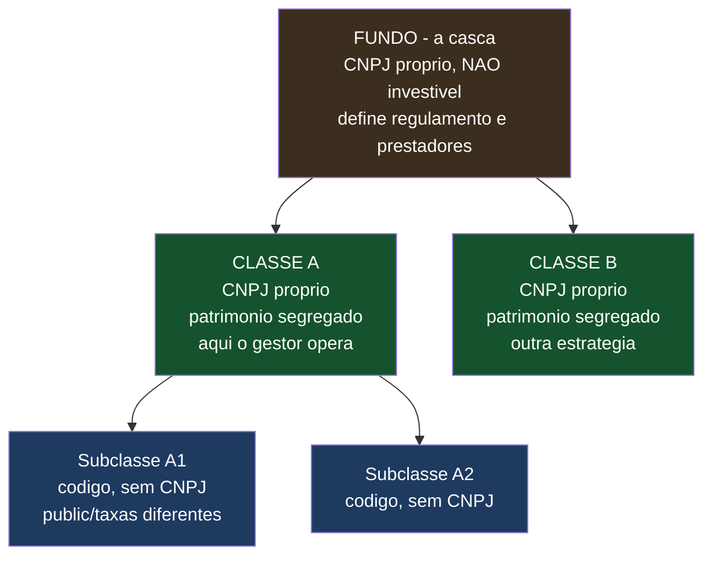
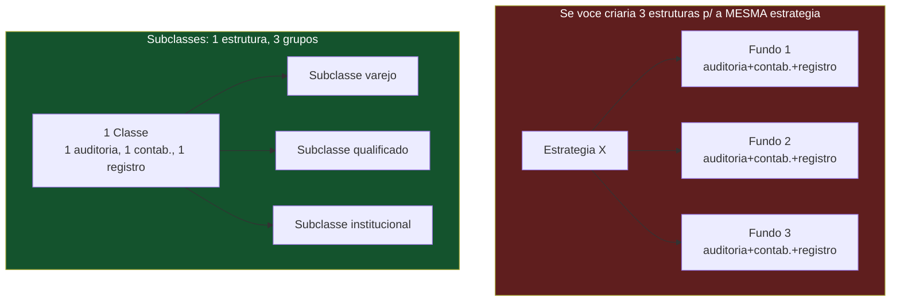
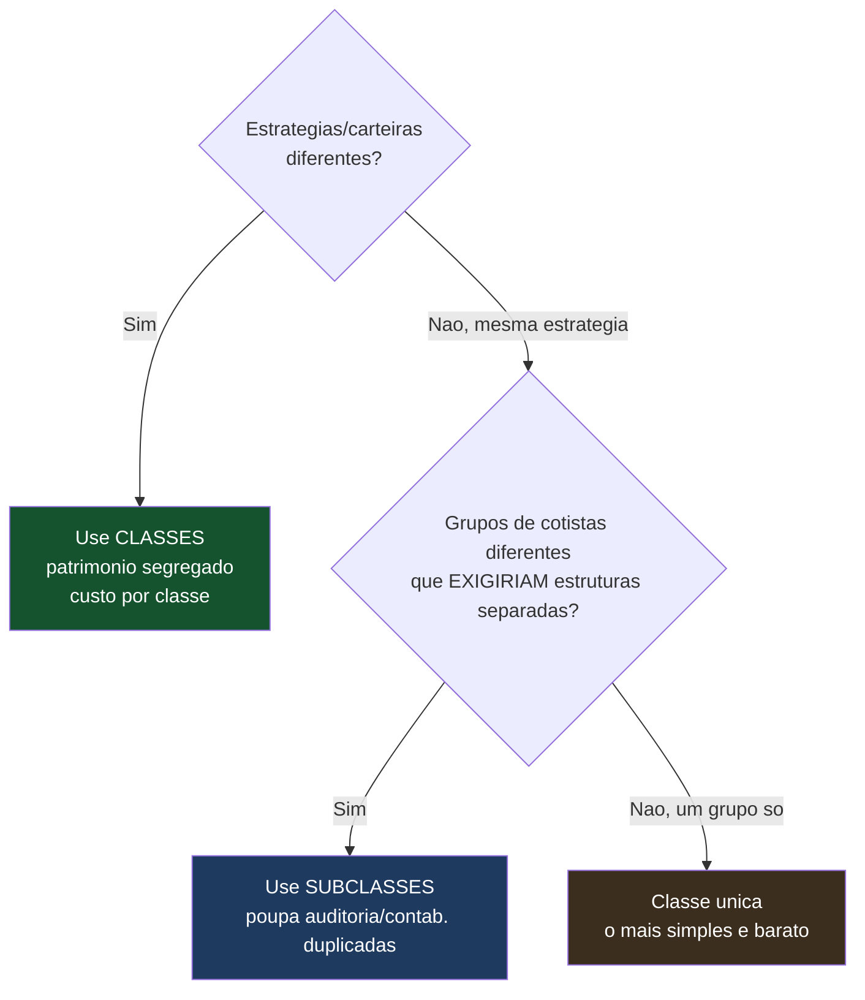

# Estruturas de Fundos — Classes, Subclasses e Como Montar Cada Arranjo

> **Documento de trabalho — v0.1**
> As estruturas que uma administradora pode montar sob a **Resolução CVM 175**: fundo, classes e subclasses. O que cada camada é, o que segrega, quanto custa, e **como usar isso a favor do seu modelo de fundos pequenos** (a alavanca de barateamento via subclasses). Corrige e detalha o que eu havia dito antes de forma incompleta.
>
> **Aviso:** baseado na Res. CVM 175 (consolidada) e tabela ANBIMA 2025 (jul/2026). A estrutura de classes/subclasses vige desde out/2024. Há restrição tributária importante (§4). Não substitui parecer de advogado — a modelagem de cada estrutura deve ser validada.

---

## 0. Por que isso importa para você

Duas razões diretas: (1) a estrutura de **subclasses** pode economizar custo **em um cenário específico** — quando você acomodaria vários grupos de cotistas na mesma estratégia que, de outro modo, exigiriam estruturas separadas (§3 explica quando vale e quando não); (2) se um gestor perguntar "consigo ter dois perfis de cotista no mesmo fundo?" ou "dá para separar estratégias sob um CNPJ?", você precisa saber responder. Este documento fecha isso — e corrige um erro que cometi antes, de vender subclasse como alavanca universal de barateamento quando ela é **condicional**.

---

## 1. A ESTRUTURA EM TRÊS CAMADAS (o "guarda-chuva")

A Res. 175 substituiu o antigo modelo master-feeder por uma estrutura de três níveis:

| Camada | Tem CNPJ? | O que é | O que segrega |
|---|---|---|---|
| **Fundo** | Sim, mas **não investível** | A "casca"/guarda-chuva: regulamento geral, prestadores (administrador, gestor) | Nada por si — é o container |
| **Classe** | **Sim, CNPJ próprio** | Onde o gestor **realmente opera**; tem política, limites, patrimônio segregado, demonstrações próprias | **Ativos** — cada classe é um patrimônio isolado |
| **Subclasse** | **Não** — só código de identificação | Dentro de uma classe; diferencia público-alvo, taxas, prazos de resgate | **Passivo** — grupos de cotistas com condições diferentes |

**A regra de ouro para lembrar:** **classe separa ATIVOS; subclasse separa PASSIVOS (cotistas).**

---

## 2. CLASSES — SEGREGAÇÃO DE ATIVOS E ESTRATÉGIAS

**O que é:** um mesmo fundo (casca) pode ter várias classes, cada uma com **patrimônio segregado** — o que acontece numa classe não afeta a outra. Cada classe tem CNPJ próprio, política própria, limites próprios e **demonstrações contábeis próprias auditadas**.

**Para que serve:**
- Rodar **estratégias diferentes** sob o mesmo fundo (ex.: uma classe crédito privado, uma classe DI).
- **Isolar risco:** perda ou insolvência de uma classe não contamina a outra (patrimônio segregado — é vedado vincular patrimônio de uma classe a obrigação de outra).

**O que isso custa (você paga por classe):**
- Registro de classe ANBIMA: **R$ 1.207** (cada).
- Cada classe é, para muitos efeitos, "um fundo" — tem CNPJ, contabilidade, demonstrações, taxa CVM própria por faixa de PL.

> ⚠️ **Classe NÃO é barato.** Como cada classe tem CNPJ, contabilidade e taxa CVM próprios, criar uma classe nova tem quase o mesmo custo fixo de criar um fundo. Classes servem para **estratégias/ativos diferentes**, não para baratear — para baratear, o instrumento é a subclasse (§3).

---

## 3. SUBCLASSES — ECONOMIA CONDICIONAL (não universal)

**O que é:** dentro de **uma** classe (mesma estratégia, mesmo patrimônio de ativos), você cria subclasses que se diferenciam no **passivo** — público-alvo, taxas de administração/gestão/distribuição, prazos de aplicação/resgate, valor mínimo. A subclasse **não tem CNPJ** (só um código) e **não tem patrimônio de ativos separado** — ela compartilha os ativos da classe.

**Onde está a economia (e onde NÃO está):**

> ⚠️ **Correção importante — a economia de subclasse NÃO é sobre o PL nem sobre a taxa CVM.** Um erro que eu cometi antes foi vender subclasse como se "diluísse a taxa CVM". Não dilui. A taxa CVM incide sobre o **PL**, e o PL total é o mesmo esteja ele numa classe ou fatiado em subclasses. R$ 10 mi de PL pagam a mesma taxa CVM independentemente de quantas subclasses existam. **Sua intuição está certa: o PL é o mesmo no fim.**

**A economia real é outra, e é condicional.** Subclasse só economiza quando a **alternativa real** seria criar **múltiplas estruturas separadas para a mesma estratégia**:

- **Cenário em que economiza:** você tem 3 grupos de cotistas (ex.: varejo, qualificado, institucional) que querem a **mesma estratégia**. No modelo antigo, seriam **3 fundos/feeders separados** — cada um com CNPJ, **auditoria própria**, **contabilidade própria**, registro próprio. Com subclasses, é **1 classe** (1 auditoria, 1 contabilidade, 1 registro de classe) com 3 subclasses. Você paga **os custos fixos por estrutura uma vez, não três**. A economia está em auditoria/contabilidade/registro — **custos que são fixos por estrutura**, não no PL nem na taxa CVM.
- **Cenário em que NÃO economiza:** você tem um único grupo de cotistas numa estratégia. Aí não há nada a consolidar — uma **classe única simples** é o certo, e criar subclasses não traz economia nenhuma.

**O custo de registro (dado oficial):** subclasse (2ª em diante) custa **R$ 120,70** contra **R$ 1.207** de uma classe nova. Mas isso é só o registro — a economia relevante é a de **não duplicar auditoria e contabilidade**, que são os custos fixos por estrutura mais pesados.

> 💡 **A regra honesta:** subclasse é uma economia **condicional** — vale quando você consolidaria várias estruturas da mesma estratégia numa só, poupando auditoria/contabilidade/registro duplicados. **Não** é uma alavanca universal de barateamento, e **não** reduz a taxa CVM sobre o PL. Se o seu caso é um grupo de cotistas por estratégia, use classe única e esqueça subclasses.

---

## 4. A RESTRIÇÃO TRIBUTÁRIA

Sobre o tratamento tributário nas estruturas da 175:

- **A Res. 175 VEDA criar classes/subclasses que alterem o tratamento tributário** aplicável. Você **não pode** usar a estrutura para colocar cotistas em regimes fiscais diferentes.
- **Cada classe é considerada um fundo apartado para fins tributários** — a taxa CVM (por classe/fundo, por faixa de PL) incide **por classe**. Criar classes separadas **não** reduz a taxa CVM total; ao contrário, multiplica as estruturas.

> ⚠️ **Fechando a correção:** nem subclasse nem classe "diluem a taxa CVM". A taxa CVM segue o PL. O que a **subclasse** poupa é a duplicação de **custos fixos por estrutura** (auditoria, contabilidade, registro) — e só quando você de fato consolidaria várias estruturas. O que a **classe** faz é segregar ativos/risco de estratégias diferentes, ao custo de carregar sua própria estrutura. Nenhuma das duas mexe no imposto sobre o patrimônio.

---

## 5. RESPONSABILIDADE LIMITADA DOS COTISTAS (um bônus da 175)

A Res. 175 permite que classes/subclasses adotem **responsabilidade limitada** dos cotistas: se o PL da classe ficar negativo, o cotista **não é obrigado a aportar mais** — perde no máximo o que investiu. Isso:
- É um **argumento de venda** para o gestor/cotista (mais segurança).
- Tem um **rito de insolvência** próprio se o PL ficar negativo (o administrador fecha para resgates, comunica o gestor, convoca assembleia, pode decretar insolvência da classe sem atingir as outras).

> 💡 Ofereça responsabilidade limitada como padrão nos fundos que você administra — é moderno, seguro para o cotista, e mostra que sua estrutura segue as melhores práticas da 175.

---

## 6. QUANDO USAR CADA ARRANJO (guia de decisão)

| Situação | Arranjo | Por quê |
|---|---|---|
| Um gestor, uma estratégia, um grupo de cotistas | **Classe única** | Mais simples e barato; subclasse não traria economia |
| Mesma estratégia, grupos que **de outro modo seriam fundos separados** | **Subclasses** | Poupa auditoria/contabilidade/registro duplicados (não a taxa CVM) |
| Estratégias/carteiras realmente diferentes sob a mesma casca | **Classes** | Segrega ativos e risco; custo próprio por classe |
| Cotistas que precisam de regime tributário diferente | **Fundos separados** | A 175 **veda** classe/subclasse que altere tributação |

---

## 7. O QUE O SEU SISTEMA PRECISA SUPORTAR

Para operar essas estruturas, a sua plataforma (guias técnicos) precisa:
- **Modelar as três camadas:** fundo → classe (CNPJ, patrimônio, contabilidade próprios) → subclasse (código, taxas/condições próprias, compartilha ativos).
- **Cota por subclasse:** cada subclasse pode ter cota diferente (por causa das taxas diferentes), mesmo compartilhando a carteira da classe. O motor de cota provisiona as taxas **no nível da subclasse**.
- **Contabilidade e demonstrações por classe** (cada classe é um fundo para esse efeito).
- **Rateio dos resultados da carteira da classe** entre as subclasses, proporcional à participação, aplicando as taxas de cada uma.
- **Controle de passivo por subclasse** (cada grupo de cotistas na sua subclasse).

> 💡 Isto conecta com o Guia Técnico Parte 2 (passivo e cota): a subclasse é onde o passivo e as taxas se diferenciam, enquanto a classe é onde os ativos vivem. O motor de cota precisa entender essa hierarquia.

---

> **Resumo em uma frase:** a Res. 175 organiza tudo em três camadas — **fundo** (casca com CNPJ, não investível), **classe** (CNPJ próprio, patrimônio de ativos segregado, onde o gestor opera) e **subclasse** (só código, sem CNPJ, diferencia passivo: público, taxas, prazos). **Classe separa ativos; subclasse separa cotistas.** Correção importante do que eu disse antes: **subclasse NÃO dilui a taxa CVM** (que segue o PL, o mesmo esteja ele fatiado ou não) — a economia da subclasse é **condicional**, vale só quando você consolidaria várias estruturas da mesma estratégia numa só, poupando **auditoria/contabilidade/registro duplicados** (custos fixos por estrutura). Se é um grupo de cotistas por estratégia, use **classe única** e esqueça subclasses. Nada nas estruturas pode **alterar o regime tributário** dos cotistas (a 175 veda). Ofereça responsabilidade limitada como padrão, e faça seu sistema modelar as três camadas com cota e taxas no nível da subclasse.

*Documento v0.1. A modelagem concreta de cada estrutura (especialmente os efeitos tributários e de segregação) deve ser validada com advogado de mercado de capitais e contador.*
