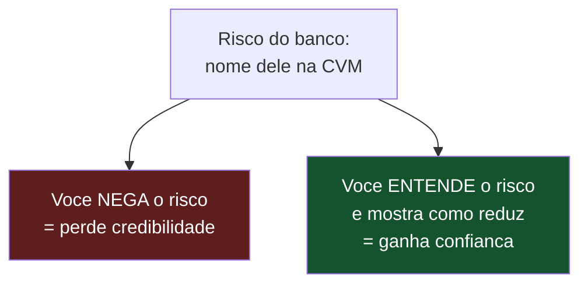
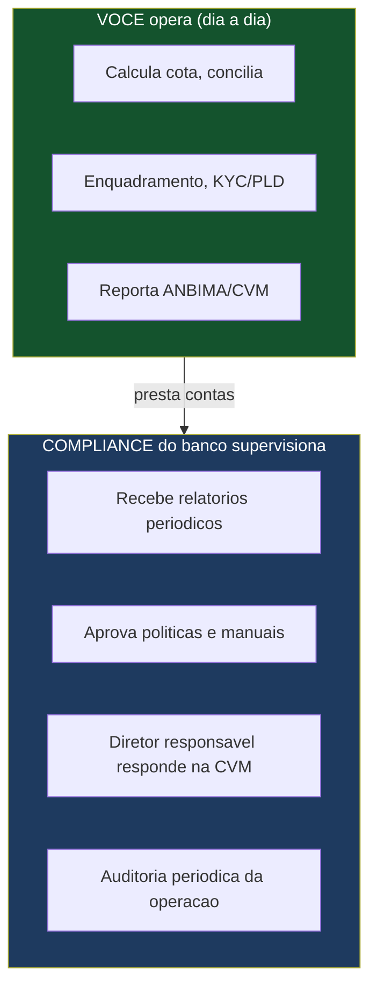
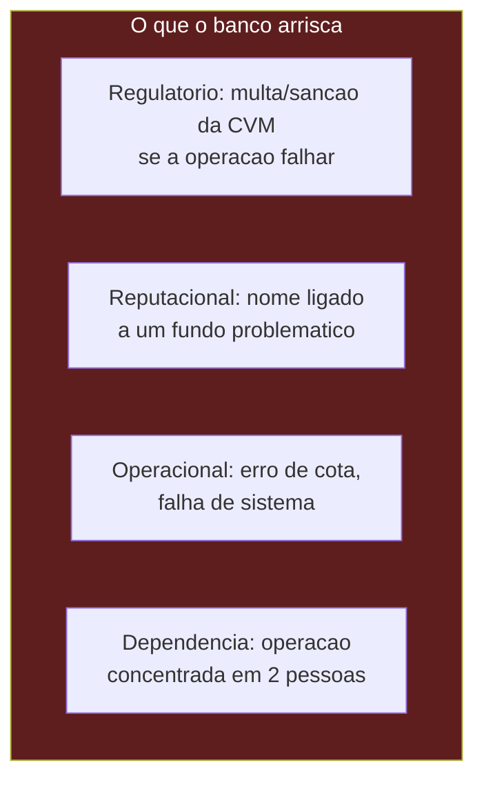
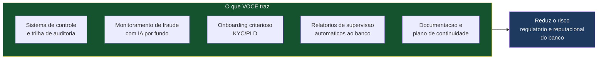

# Obrigações e Riscos do Banco na Parceria

> **Documento de trabalho — v0.1**
> O que o banco parceiro **assume, precisa fazer e arrisca** ao ser o administrador fiduciário formal enquanto você opera. Cobre: a natureza da responsabilidade dele, se e como o compliance do banco se envolve, que acompanhamento ele precisa manter sobre a operação, e como você **reduz** esse risco (que é o núcleo do seu valor para ele).
>
> **Aviso:** baseado na Resolução CVM 175, Resolução CVM 21 e Código ANBIMA vigentes (conferidos jul/2026). Não substitui parecer de advogado de mercado de capitais — e o banco vai querer exatamente esse parecer antes de assinar.

---

## 0. A verdade que abre a conversa: o nome do banco fica na linha

Não adianta suavizar isto, e tentar esconder destrói sua credibilidade: **quem é o administrador fiduciário formal perante a CVM é o banco.** Se algo dá errado num fundo, é o nome do banco que aparece no processo sancionador. Isso é real e o compliance dele sabe. Sua estratégia **não é minimizar esse risco — é demonstrar que você o entende melhor que ninguém e que a sua operação existe justamente para reduzi-lo.**

---

## 1. A NATUREZA DA RESPONSABILIDADE — a boa notícia da CVM 175

Antes dos riscos, uma mudança regulatória que **joga a favor do banco** e que você deve conhecer bem:

- A **Resolução CVM 175 separou e delimitou** as responsabilidades de cada prestador essencial (administrador, gestor, custodiante). Antes, o administrador era o "responsável por quase tudo" e tinha que fiscalizar pesadamente o gestor. Agora, **cada um responde pela sua esfera.**
- A responsabilidade dos prestadores é **subjetiva** (depende de dolo ou culpa comprovados), **não objetiva**. E os serviços são **obrigação de meio, não de fim** — o administrador não garante resultado, garante diligência.
- **Não há solidariedade automática** entre administrador, gestor e custodiante. Se o gestor fraudar, o administrador não é automaticamente culpado — ele só responde se **falhou no seu próprio dever** (de controle, conciliação, fiscalização do que lhe cabe).

> 💡 **Enquadramento para o banco:** "a norma não te torna responsável pelos atos do gestor — te torna responsável por fazer a SUA parte bem feita. E a minha operação é justamente o que garante que a sua parte seja feita com excelência." Isso transforma um medo difuso ("vou ser responsável por tudo") num problema gerenciável ("preciso que a administração seja bem operada").

---

## 2. O QUE O BANCO, COMO ADMINISTRADOR, É OBRIGADO A FAZER

Estas são as obrigações que recaem sobre o administrador (o banco) — e que, na prática, **você executa**, mas ele responde formalmente:

| Obrigação do administrador | Quem executa | Quem responde |
|---|---|---|
| Constituir e registrar o fundo | Você | Banco |
| **Calcular e divulgar cota e PL** | Você | Banco |
| Manter registros contábeis e **conciliar posições** com custodiante | Você | Banco |
| Contratar e **supervisionar** prestadores (gestor, custodiante, auditor) | Você | Banco |
| **Fiscalizar cumprimento da política** de investimento e limites | Você (sistema de enquadramento) | Banco |
| KYC/PLD (prevenção à lavagem) | Você | Banco |
| Comunicar CVM e cotistas em eventos relevantes | Você prepara, banco assina | Banco |
| Convocar/conduzir assembleias de cotistas | Você | Banco |
| Manter canais de comunicação ao investidor | Você (portal) | Banco |

> ⚠️ **O ponto que o compliance vai fazer questão:** a CVM exige que essas funções tenham um **diretor responsável** designado (pessoa do banco). Esse diretor responde pessoalmente — mas de forma **subjetiva** (só se agir com dolo ou culpa). Não é uma bomba-relógio; é uma responsabilidade que se gerencia com boa operação e trilha de auditoria.

---

## 3. SIM, HAVERÁ LIGAÇÃO COM O COMPLIANCE DO BANCO

Respondendo diretamente à sua pergunta: **sim, o compliance do banco se envolve — e é bom que se envolva.** Um banco que coloca o nome na CVM sem envolver o próprio compliance está sendo negligente, e você não quer um parceiro negligente. Como isso funciona:

**O nível de envolvimento do compliance do banco, na prática:**

- **Designação de diretor(es) responsável(is):** o banco aponta quem responde formalmente pela administração fiduciária e pelo compliance/controles. Essas pessoas precisam ter acesso à operação e entender o que está acontecendo.
- **Aprovação das políticas e manuais:** os manuais que você monta (MaM, compliance, ética) precisam ser **revisados e aprovados** pelo compliance do banco antes de irem à CVM. Ele não vai assinar de olhos fechados.
- **Relatórios periódicos:** o banco vai querer receber, com regularidade, relatórios da operação — posições, enquadramento, exceções, incidentes. É a forma de o diretor responsável "dormir tranquilo".
- **Direito de auditar:** o compliance do banco vai querer o direito de auditar sua operação quando julgar necessário — inspecionar processos, revisar a trilha de auditoria, validar controles.
- **Alçadas e escalonamento:** decisões sensíveis (aceitar um fundo de perfil arriscado, precificar um ativo ilíquido, tratar um desenquadramento) devem ter um fluxo de escalonamento que envolve o compliance do banco.

> 💡 **Não veja isso como intromissão — venda como blindagem.** Quanto mais o compliance do banco estiver confortável e informado, mais o banco confia na parceria e mais fundos ele deixa você operar. O envolvimento do compliance é o que **destrava a escala**. Um banco inseguro trava; um banco cujo compliance entende e acompanha, cresce junto.

---

## 4. QUE ACOMPANHAMENTO O BANCO PRECISA MANTER SOBRE A OPERAÇÃO

O banco **não pode** ser um "carimbador ausente" — a CVM não aceita administrador que terceiriza tudo e não olha. Ele precisa manter uma supervisão real (ainda que a operação seja sua). O mínimo:

| Frente de acompanhamento | Frequência típica | O que o banco monitora |
|---|---|---|
| **Cota e PL** dos fundos | Diária/periódica | Se os números estão sendo calculados e divulgados corretamente |
| **Enquadramento** | Contínua | Se os fundos respeitam suas políticas; desenquadramentos |
| **Incidentes e exceções** | Ao ocorrer | Erros de precificação, falhas operacionais, reclamações |
| **Prestadores** | Periódica | Se custodiante e auditor cumprem seus papéis (supervisão baseada em risco) |
| **Relatório de compliance** | Periódico | Visão consolidada da conformidade da operação |
| **KYC/PLD** | Contínua | Clientes e beneficiários finais; operações suspeitas |

> ⚠️ **"Supervisão baseada em risco":** o Código ANBIMA exige que o administrador supervisione os terceiros contratados com **atenção proporcional ao risco** de cada um. Terceiros não associados/aderentes exigem critérios adicionais. Na prática, você constrói o sistema que gera esses relatórios de supervisão automaticamente, e o banco os recebe e revisa.

> 💡 **Precisa de alguém "monitorando" no banco?** Sim, mas não uma equipe. Precisa de **pelo menos o diretor responsável** (que já existe por exigência da CVM) recebendo e revisando os relatórios que sua operação gera, com poder de escalar e questionar. Quanto mais automatizado e transparente for o que você entrega, menos gente o banco precisa alocar — e esse é mais um argumento do seu valor: **você reduz o custo de supervisão do banco.**

---

## 5. OS RISCOS REAIS DO BANCO (nomeados, não escondidos)

| Risco | O que é | Como você reduz |
|---|---|---|
| **Regulatório** | Multa/sanção da CVM se houver falha de diligência | Operação com trilha de auditoria, controles e conformidade documentada |
| **Reputacional** | Nome do banco ligado a um fundo que fraudou/quebrou | Seleção criteriosa de gestores/fundos (onboarding com KYC), monitoramento de fraude |
| **Operacional** | Erro de cálculo de cota, falha de sistema, indisponibilidade | Redundância, testes, conciliação diária, planos de contingência |
| **Dependência de pessoas** | A operação depende de 2 sócios | Documentação, plano de continuidade, contrato prevendo sucessão |

> ⚠️ **O risco de "dependência de 2 pessoas" é real e o banco VAI perguntar.** Tenha resposta pronta: documentação completa da operação, plano de continuidade, e a possibilidade de o banco assumir/substituir a operação se algo acontecer com os sócios. Não tem como fingir que 2 pessoas não é um ponto frágil — tem como mostrar que você planejou para isso.

---

## 6. COMO VOCÊ REDUZ O RISCO DO BANCO (seu argumento central)

Este é o coração do pitch na ótica do banco. Cada risco tem uma resposta sua:

- **Contra o risco regulatório:** operação documentada, controles, conciliação diária, enquadramento automático — tudo com trilha de auditoria que comprova a diligência do administrador perante a CVM.
- **Contra o risco reputacional:** seleção criteriosa de quem entra (nem todo fundo/gestor é aceito), e monitoramento contínuo de fraude (ver documento específico).
- **Contra o risco operacional:** redundância técnica, testes, planos de contingência.
- **Contra a dependência de pessoas:** documentação e plano de sucessão.
- **Reduz o custo de supervisão do banco:** relatórios automáticos e transparentes fazem o compliance do banco trabalhar menos para ficar seguro.

> 💡 **A frase que fecha:** "Você assume a responsabilidade formal, sim — mas eu construí a operação inteira para que a sua parte seja a mais bem feita do mercado, com controles que a maioria das administradoras grandes não tem para fundos pequenos. Eu não te trago só receita nova; eu te trago uma operação que protege o seu nome."

---

## 7. O QUE PRECISA ESTAR NO CONTRATO (para proteger ambos)

Pontos que o contrato de parceria deve cobrir sobre riscos e responsabilidades (a redigir com advogado):

- **Divisão clara de quem faz o quê** (você opera, banco responde formalmente) e das responsabilidades entre as partes.
- **Direito de supervisão e auditoria** do banco sobre a operação.
- **Obrigações de reporte** (o que você entrega ao compliance do banco e com que frequência).
- **Fluxo de escalonamento** de incidentes e decisões sensíveis.
- **Plano de continuidade** e o que acontece se os sócios saírem.
- **Alocação de responsabilidade** em caso de falha (de quem foi a culpa: sua, do gestor, do custodiante).
- **Seguro** (E&O — erros e omissões) — quem contrata, quem paga.
- **Saída da parceria** — como se desfaz, o que acontece com os fundos.

---

> **Resumo em uma frase:** o banco assume a responsabilidade formal perante a CVM (o nome dele fica na linha), mas a CVM 175 joga a favor — responsabilidade subjetiva, de meio, sem solidariedade automática entre prestadores. O compliance do banco **vai e deve se envolver** (designar diretor responsável, aprovar manuais, receber relatórios, ter direito de auditar), mas isso é blindagem, não intromissão — e destrava a escala. Seu valor central não é só receita nova: é uma operação documentada, com controles e monitoramento de fraude, que **reduz o risco regulatório e reputacional do banco e o custo de supervisão dele** — e é isso que faz um banco pequeno topar colocar o nome na linha.

---

## Adendo (jul/2026) — responsabilidades adicionais se o banco também for o custodiante

Se o banco acumular **administração fiduciária + custódia** (o desenho do plano), ele soma as obrigações da **Res. CVM 32**: manter capacidade operacional/tecnológica auditável, diretor responsável específico pela custódia, segregação patrimonial em contas individualizadas por fundo nas centrais (SELIC/B3), liquidação DVP e guarda de documentação. A CVM pode **cassar** a autorização de custódia se as condições deixarem de ser atendidas — mais um motivo pelo qual a plataforma da startup (conciliação diária automatizada, trilhas, batimento custodiante × carteira) reduz o risco do banco em vez de aumentá-lo. Detalhes no **`guia_custodia_conexoes.md`**.

*Documento v0.1. O banco exigirá parecer de advogado de mercado de capitais validando a divisão de responsabilidades antes de assinar — e isso é sinal de um bom parceiro, não de obstáculo.*
