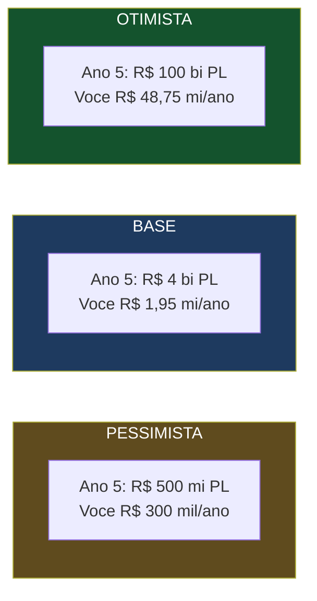
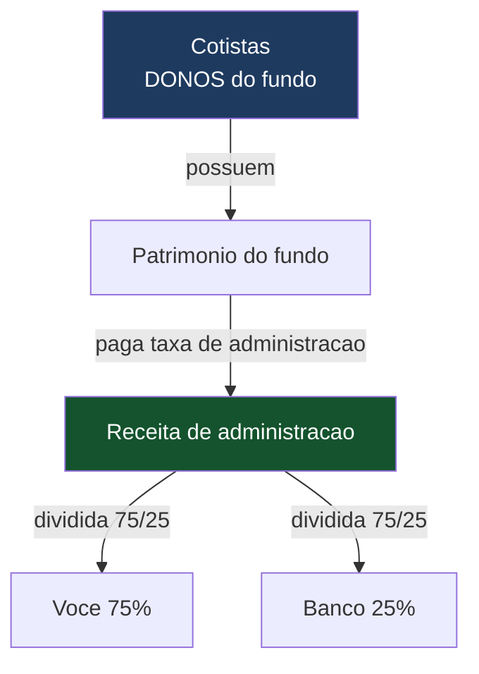

# Potencial Financeiro — Projeções, Custos e Estrutura de Remuneração

> **Documento de trabalho — v0.1**
> Projeções de receita **para você e para o banco**, no curto e longo prazo, em três cenários (pessimista, base, otimista), com os custos envolvidos, a lógica de expansão do negócio, e a explicação de **como você é remunerado** (a divisão 75/25 e o que ela significa — porque você **não** tem sociedade sobre o fundo).
>
> **Aviso:** os números de PL e taxa são premissas de planejamento (algumas fornecidas por você); custos de licença são valores oficiais/estimados conferidos em jul/2026. Não é projeção auditada nem promessa de resultado — é um modelo para orientar a conversa e a decisão.

---

## 0. A tese em uma frase

Fundos pequenos (R$ 5–50 mi) hoje são **inviáveis** nas administradoras grandes porque as taxas fixas os inviabilizam. Você abre esse mercado com custo de software, **monopoliza os pequenos**, e usa a escala para atacar os médios — construindo um PL grande a partir de muitos fundos que ninguém quer atender bem.

---

## 1. AS PROJEÇÕES DE RECEITA (os três cenários)

Receita bruta anual da administradora = **PL total × taxa**. A divisão é **75% você / 25% banco** (ver seção 4).

### 1.1 Cenário PESSIMISTA (taxa fixa 0,08%)

| Período | PL total | Taxa | Receita bruta/ano | Você (75%) | Banco (25%) | Você/mês |
|---|---|---|---|---|---|---|
| Ano 1 | R$ 50 mi | 0,080% | R$ 40.000 | R$ 30.000 | R$ 10.000 | R$ 2.500 |
| Ano 3 | R$ 200 mi | 0,080% | R$ 160.000 | R$ 120.000 | R$ 40.000 | R$ 10.000 |
| Ano 5 | R$ 500 mi | 0,080% | R$ 400.000 | R$ 300.000 | R$ 100.000 | R$ 25.000 |

### 1.2 Cenário BASE (taxa cai com escala)

| Período | PL total | Taxa | Receita bruta/ano | Você (75%) | Banco (25%) | Você/mês |
|---|---|---|---|---|---|---|
| Ano 1 | R$ 200 mi | 0,080% | R$ 160.000 | R$ 120.000 | R$ 40.000 | R$ 10.000 |
| Ano 3 | R$ 1 bi | 0,070% | R$ 700.000 | R$ 525.000 | R$ 175.000 | R$ 43.750 |
| Ano 5 | R$ 4 bi | 0,065% | R$ 2.600.000 | R$ 1.950.000 | R$ 650.000 | R$ 162.500 |

### 1.3 Cenário OTIMISTA (mesmas taxas do base, PL muito maior)

| Período | PL total | Taxa | Receita bruta/ano | Você (75%) | Banco (25%) | Você/mês |
|---|---|---|---|---|---|---|
| Ano 1 | R$ 400 mi | 0,080% | R$ 320.000 | R$ 240.000 | R$ 80.000 | R$ 20.000 |
| Ano 3 | R$ 10 bi | 0,070% | R$ 7.000.000 | R$ 5.250.000 | R$ 1.750.000 | R$ 437.500 |
| Ano 5 | R$ 100 bi | 0,065% | R$ 65.000.000 | R$ 48.750.000 | R$ 16.250.000 | R$ 4.062.500 |

---

## 2. RECEITA LÍQUIDA (descontando os custos fixos da estrutura)

Os custos fixos da estrutura são **anuais e no nível da administradora** (não por fundo). Descontando-os da receita bruta:

**Custos fixos da estrutura (anuais):**

| Custo | Valor/ano |
|---|---|
| Taxa anual CVM (administrador PJ) | R$ 9.519 |
| Infra AWS (~R$ 450/mês) | R$ 5.400 |
| **Contribuição/taxas ANBIMA** (mensalidade + supervisão — ver §5.3 para os valores reais) | ~R$ 25.000–85.000* |
| **Subtotal sem custódia própria** | **variável — ver §5.3** |
| Licença de custódia CVM (se internalizar) | + R$ 38.077 |

*A contribuição ANBIMA não é um número único — depende do PL da instituição e das atividades. A estimativa antiga de "R$ 12.000" estava **subdimensionada**; os valores reais estão na **§5.3**. Nos primeiros anos (PL baixo), fica na ponta de baixo; cresce por faixa.

> ⚠️ **Correção honesta:** eu vinha usando "~R$ 12.000/ano" de contribuição ANBIMA como chute. A tabela oficial 2025 mostra que é mais alto e composto de várias parcelas (§5.3). Isso **não quebra** a viabilidade — nos cenários de receita acima, mesmo somando ~R$ 60–90 mil/ano de custos fixos totais, o negócio segue com margem altíssima a partir do Ano 3. Mas o Ano 1 pessimista fica ainda mais apertado do que eu havia mostrado — reforça a necessidade de capital de giro no começo.

**Receita líquida da administradora (custódia terceirizada):**

| Cenário | Período | Receita bruta | − Custos | = Líquida | Você (75%) | Banco (25%) |
|---|---|---|---|---|---|---|
| Pessimista | Ano 1 | R$ 40.000 | R$ 26.919 | R$ 13.081 | R$ 9.811 | R$ 3.270 |
| Pessimista | Ano 5 | R$ 400.000 | R$ 26.919 | R$ 373.081 | R$ 279.811 | R$ 93.270 |
| Base | Ano 1 | R$ 160.000 | R$ 26.919 | R$ 133.081 | R$ 99.811 | R$ 33.270 |
| Base | Ano 5 | R$ 2.600.000 | R$ 26.919 | R$ 2.573.081 | R$ 1.929.811 | R$ 643.270 |
| Otimista | Ano 5 | R$ 65.000.000 | R$ 26.919 | R$ 64.973.081 | R$ 48.729.811 | R$ 16.243.270 |

> ⚠️ **O Ano 1 pessimista é apertado:** R$ 13 mil líquidos no ano inteiro. É viável (custo baixo, você toca com 2 pessoas), mas **não te sustenta sozinho** no começo — planeje capital de giro ou renda paralela até o PL crescer. A partir do Ano 3, mesmo no pessimista, a coisa engrena.

> 💡 **Note o poder dos custos baixos:** como a estrutura custa ~R$ 27 mil/ano fixos, quase toda a receita marginal vira lucro. Dobrar o PL quase dobra o líquido — é um negócio de alavancagem operacional altíssima, típico de software.

---

## 3. O PLANO DE EXPANSÃO — abrir o mercado, depois monopolizar

**Fase 1 — abrir o mercado dos pequenos.** Hoje, abrir um fundo de R$ 5 mi é proibitivo: as taxas fixas (auditoria, custódia, taxa CVM) consomem a rentabilidade, e as administradoras grandes nem atendem. Você viabiliza esse fundo porque seu custo é de software. **Você cria um mercado que não existia.**

**Fase 2 — monopolizar os pequenos.** Uma vez que você é o único que atende bem fundos pequenos com custo baixo, eles migram para você. Não há concorrência real nesse nicho — as grandes não descem, e ninguém mais tem sua estrutura enxuta.

**Fase 3 — a escala ataca os médios (o sweet spot).** Aqui está o ponto mais interessante:

| PL do fundo | Taxa 0,08% | Taxa 0,05% | Observação |
|---|---|---|---|
| R$ 5 mi | R$ 4.000 | R$ 2.500 | Pequeno — hoje inviável nas grandes |
| R$ 50 mi | R$ 40.000 | R$ 25.000 | Pequeno — seu monopólio |
| R$ 200 mi | R$ 160.000 | R$ 100.000 | **Sweet spot — custo baixíssimo, dá para negociar 0,05%** |
| R$ 500 mi | R$ 400.000 | R$ 250.000 | **Sweet spot** |
| R$ 800 mi | R$ 640.000 | R$ 400.000 | **Sweet spot — limite superior** |
| R$ 2 bi | R$ 1.600.000 | R$ 1.000.000 | Grande — ele tem poder de barganha próprio |
| R$ 5 bi | R$ 4.000.000 | R$ 2.500.000 | Grande — compete com DTVMs grandes |

**Fundos até ~R$ 800 mi são o alvo ideal:** o custo de operá-los é baixíssimo (o mesmo software), então você pode oferecer taxas agressivas como **0,05% do PL** e ainda ter margem enorme. Para um fundo de R$ 800 mi, 0,05% são R$ 400 mil/ano de receita com custo marginal quase zero.

**Fase 4 — os grandes (acima de R$ 800 mi).** Fundos muito grandes já conseguem preços competitivos com as DTVMs grandes pelo **poder de barganha deles** (volume). Você compete por volume, com margem menor por fundo, mas ticket alto. É a camada de topo, atacada depois de dominar as de baixo.

> 💡 **A lógica de monopólio:** você não está brigando por fundos que as grandes querem. Você está pegando os que elas **desprezam** (pequenos), construindo escala e reputação, e subindo a régua. Quando você chega nos médios, já tem volume, sistema maduro e custo imbatível.

---

## 4. COMO VOCÊ É REMUNERADO — a estrutura de receita (e por que você NÃO tem sociedade sobre o fundo)

> **ESTRUTURA ATUALIZADA (2026-07-09):** a divisão vigente é **50% banco / 50% Argus no início**, com **opção de a Argus recomprar 35 pontos percentuais por R$ 2 milhões (corrigidos pelo IPCA), passando a 15% banco / 85% Argus**. O banco (administrador de fato) remunera a Argus como **prestadora de tecnologia/operação** — repasse admitido pela **Res. CVM 175, art. 118, §1º**. ⚠️ **As tabelas de projeção deste guia (§2, §3) foram calculadas na proporção anterior (75/25) — use-as como ordem de grandeza e releia as colunas "Você/Banco" com a nova divisão.** Fundamentação em `due_diligence_juridica.md`.

Esta é a parte que você disse não entender bem, então vou ser bem claro, porque há uma confusão comum aqui.

### 4.1 O que você NÃO tem: sociedade sobre o fundo

**O fundo não é seu, nem do banco, nem do gestor. O fundo é dos cotistas.** Ninguém "possui" o fundo como se fosse uma empresa com sócios. O patrimônio do fundo pertence a quem comprou as cotas. Então **esqueça a ideia de "ter sociedade sobre o fundo"** — isso não existe e nem faria sentido.

### 4.2 O que você TEM: participação na receita de administração

O que se divide **não é o fundo — é a receita da atividade de administração** (a taxa de administração que o fundo paga pelo serviço). Essa receita é gerada pela prestação do serviço de administração fiduciária, e é ela que se reparte entre você e o banco (ver **nota de estrutura atualizada** no início da §4: **50/50 no início, opção de recompra até 85/15**).

**Duas formas de estruturar isso na prática** (a definir com advogado/contador):

**Forma A — Você tem um CNPJ próprio que presta serviço ao banco.** Você abre uma empresa (a "sua" administradora operacional), e ela tem um **contrato de prestação de serviços / partilha de receita** com o banco. O banco é o administrador formal (recebe a taxa dos fundos), e repassa 75% a você via contrato; fica com 25%. Você fatura pela sua PJ.

**Forma B — Revenue share direto sob o banco.** Você opera sob a estrutura do banco (sem PJ intermediária forte), e o contrato prevê que a receita de administração é partilhada 75/25. Menos comum quando você quer construir um ativo próprio (a sua empresa).

> 💡 **Recomendação:** a **Forma A** (CNPJ próprio prestando serviço, com contrato de partilha) costuma ser melhor para você, porque **constrói um ativo seu** — a sua empresa tem contratos, receita recorrente e valor de venda no futuro. Se um dia você quiser vender ou captar investimento, é a PJ que tem valor. (O documento sobre CNPJ vs. vínculo detalha isso.)

### 4.3 Por que 25% para o banco é justo (e como defender)

O banco não está só "emprestando o nome". Ele:
- Assume a **responsabilidade regulatória** (o nome dele na CVM).
- Assume o **risco reputacional**.
- Provê a **infraestrutura institucional** (é instituição financeira, dispensada de capital mínimo).
- Possivelmente provê a **custódia** (economia enorme para os fundos).

25% da receita por assumir o risco formal e destravar toda a operação é um acordo razoável. Em muitos acordos de mercado, a divisão é até mais favorável a quem detém a licença.

> ⚠️ **Ponto de negociação:** acordos assim costumam ter um **piso**. O banco pode querer um valor fixo mínimo (para cobrir o custo dele de supervisão) + o percentual sobre o excedente. Ex.: "R$ X fixos/ano + 25% da receita acima disso". Esteja preparado para essa conversa — é comum e legítima.

---

## 5. CUSTOS — o quadro completo (incluindo os que você esqueceu de citar)

Você pediu para eu incluir custos que você não lembrou. Aqui está o quadro completo, separando **custos da estrutura (seus)** de **custos do fundo (do cotista)**:

### 5.1 Custos da SUA estrutura (administradora) — anuais

| Custo | Valor | Natureza |
|---|---|---|
| Taxa anual CVM (administrador PJ) | ~R$ 9.519 | Tributo, fixo |
| Registro/habilitação CVM (one-time) | ~R$ 2.380 | Uma vez |
| Licença de custódia CVM (se internalizar) | ~R$ 38.077 | Fixo, só se for custodiante |
| Estrutura de custódia (relatório auditor tipo 1, sistemas) | investimento | Só se custodiante |
| Infra AWS/nuvem | ~R$ 5.400 | Escalável |
| Contribuição ANBIMA | ~R$ 12.000 | Estimada |
| **Seguro E&O (erros e omissões)** | a cotar | **Você esqueceu — o banco vai exigir** |
| **Advogado (validações pontuais)** | a cotar | Sob demanda |
| **Contador/tributário da sua PJ** | a cotar | Recorrente |

### 5.2 Custos do FUNDO (do cotista, não seus) — por fundo/ano

| Custo | Valor | Nota |
|---|---|---|
| Taxa CVM do fundo (faixa 1) | ~R$ 3.162/ano | Grátis no 1º ano se criado após abril |
| Auditoria independente | ~R$ 1.500 (modelo em lote) | Obrigatória |
| Custódia | R$ 0 (banco absorve — sua decisão) | Despesa do fundo |
| **Taxa ANBIMA de divulgação do fundo** (bimestral) | ver §5.3 — R$ 65 a R$ 145/bimestre p/ fundos pequenos | Por fundo, por faixa de PL |
| **Taxa de registro de classe ANBIMA** | R$ 1.207 (classe) / R$ 120,70 (subclasse) | Uma vez, no registro |

### 5.3 Os valores REAIS da ANBIMA (tabela oficial 2025)

A "contribuição ANBIMA" que eu vinha estimando por chute na verdade se divide em **várias parcelas distintas**. Aqui estão os valores oficiais da tabela ANBIMA 2025 (reduzida −10% em 2026), separando o que é **seu custo de estrutura** do que é **custo do fundo**:

**Custos da sua estrutura (nível instituição):**

| Item | Base | Valor 2025 |
|---|---|---|
| **Mensalidade associativa** | Faixa de PL da instituição — até R$ 5 mi | R$ 2.275/mês |
| " " | Acima de R$ 5 mi até R$ 60 mi | R$ 6.835/mês |
| " " | Acima de R$ 60 mi até R$ 120 mi | R$ 8.035/mês |
| **Taxa de supervisão de Adm. e Gestão** (anual) | 1 atividade / 2 / 3 | R$ 1.330 / R$ 1.820 / R$ 2.311 |

> ⚠️ **A mensalidade é o grande custo que eu subdimensionei.** Ela é **mensal** e por faixa de PL da instituição. Na faixa inicial (PL até R$ 5 mi) são R$ 2.275/mês = **~R$ 27.300/ano** só de mensalidade — bem mais que os R$ 12.000/ano que eu estimava para o total ANBIMA. **Ponto crucial de negociação com o banco:** se você opera **sob o banco** (que provavelmente já é associado ANBIMA), essa mensalidade **pode já estar paga pelo banco** — some do seu lado. Confirme isso na negociação; muda bastante a conta.

**Custos por fundo (despesa do fundo, não sua):**

| Item | Base | Valor 2025 |
|---|---|---|
| **Taxa de divulgação** (bimestral) | PL até R$ 2,5 mi | R$ 65/bimestre |
| " " | R$ 2,5 mi a R$ 5 mi | R$ 98/bimestre |
| " " | R$ 5 mi a R$ 10 mi | R$ 145/bimestre |
| **Registro de classe** | Por classe | R$ 1.207 |
| **Registro de subclasse** (2ª em diante) | Por subclasse | **R$ 120,70** |

> 💡 **Sobre subclasses (com a ressalva correta):** registrar uma **classe nova** custa R$ 1.207; uma **subclasse**, R$ 120,70. Mas o registro é o menor dos custos — a economia real de subclasse aparece só **quando você consolidaria várias estruturas da mesma estratégia numa só**, poupando **auditoria e contabilidade duplicadas**. Subclasse **não** reduz a taxa CVM (que segue o PL — o mesmo esteja ele fatiado ou não). Não é uma alavanca universal; é condicional. Ver o documento de estruturas de classes/subclasses para quando vale e quando não.

> ⚠️ **Correção de rota registrada:** meu "~R$ 12.000/ano de ANBIMA" era chute e estava baixo. O real, se você tiver que pagar a mensalidade associativa por conta própria, é da ordem de **R$ 27–30 mil/ano** já na faixa inicial. Se o **banco absorver** (por já ser associado), cai muito. Esse é exatamente o tipo de número que só se fecha na negociação — mas agora você tem o valor de tabela para negociar com base em fato, não em estimativa.

### 5.4 Custos que você tende a esquecer
> - **Seguro E&O** (responsabilidade civil profissional) — quase certo que o banco exige.
> - **Contador e tributos da sua PJ** — sua empresa paga impostos sobre a receita (Simples/Presumido/Real a definir).
> - **Custo de aquisição de clientes** — como você atrai gestores? Marketing, comercial, tempo.
> - **Custo de desenvolvimento contínuo** — o software não se mantém sozinho; há evolução, correção, suporte.
> - **Substituição/contingência** — se precisar contratar alguém, o custo de pessoal aparece.

---

## 6. LEITURA HONESTA DO POTENCIAL

- **O pessimista é modesto mas real** — R$ 300 mil/ano para você no Ano 5 não é fortuna, mas é um negócio de 2 pessoas com custo baixo e ativo próprio se formando.
- **O base é um bom negócio** — R$ 1,95 mi/ano para você no Ano 5, com margem altíssima.
- **O otimista é transformador** — mas R$ 100 bi de PL em 5 anos é um número muito agressivo; trate como teto teórico, não como meta. Chegar a R$ 4–10 bi já seria um enorme sucesso.
- **O verdadeiro motor é a alavancagem operacional:** custo fixo baixo + receita que escala com o PL = quase todo crescimento vira lucro. É por isso que a tese funciona.

> 💡 **Para o banco, o enquadramento é:** "com pouco risco e custo baixo, o banco ganha uma nova linha de receita recorrente (25% de algo que hoje é zero), que cresce com o PL e não exige investimento pesado dele. No pior cenário é receita marginal simpática; no cenário base, é relevante; no otimista, é significativa."

---

> **Resumo em uma frase:** a receita é PL × taxa, dividida 75% você / 25% banco — e o que se divide é a **receita de administração**, não o fundo (o fundo é dos cotistas; você não tem sociedade sobre ele). No pessimista você chega a ~R$ 300 mil/ano no Ano 5; no base, ~R$ 1,95 mi; no otimista, muito mais — sempre com margem altíssima porque o custo fixo é ~R$ 27 mil/ano (ou ~R$ 65 mil com custódia própria). O plano é abrir o mercado dos fundos pequenos (hoje inviáveis), monopolizá-los, e subir para os médios até R$ 800 mi (sweet spot onde dá para cobrar 0,05% com margem enorme). Estruture via CNPJ próprio prestando serviço ao banco (constrói um ativo seu), e prepare-se para custos que você esqueceu (seguro E&O, contador, aquisição de clientes) e para o banco querer um piso fixo além do percentual.

*Documento v0.1. Projeções são premissas de planejamento, não promessas. Valide a estrutura societária e tributária com contador/advogado antes de formalizar a divisão de receita.*
