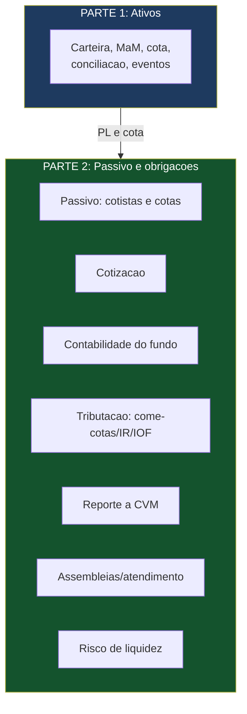
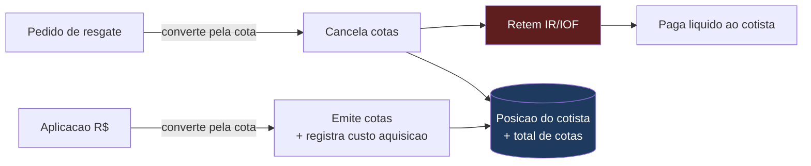
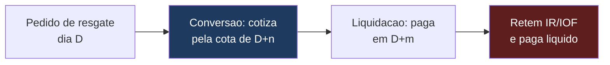
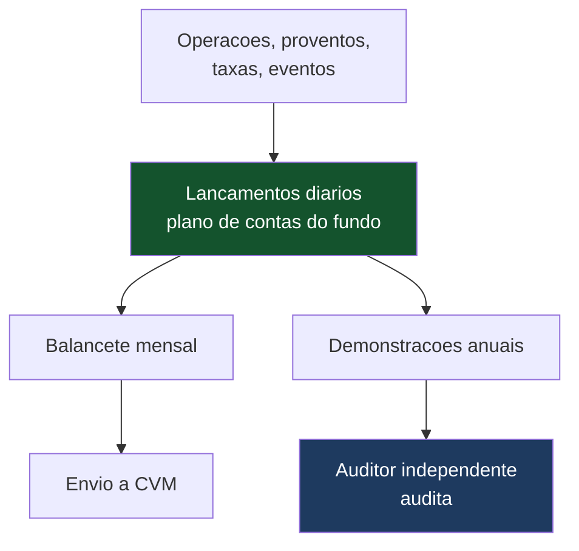
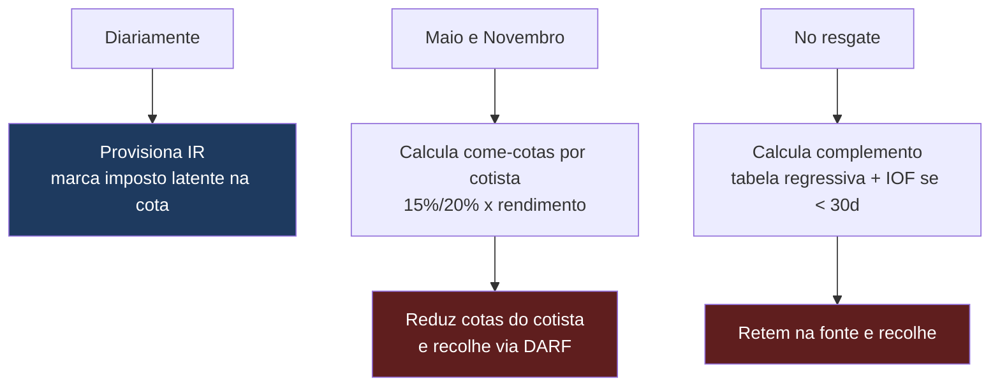
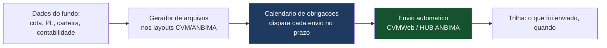
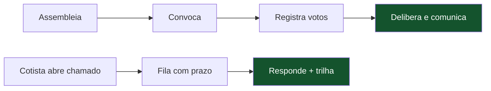
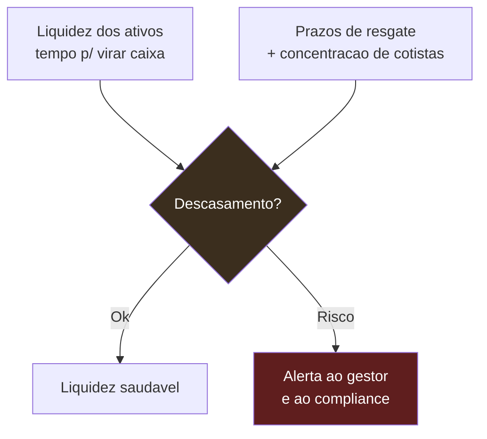
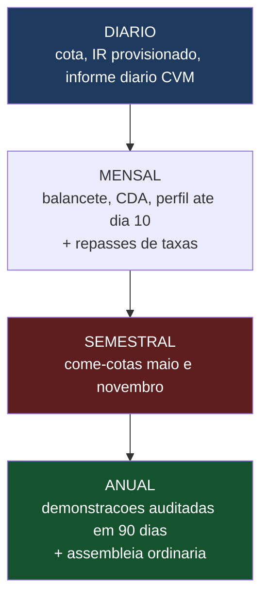

# Guia Técnico Parte 2 — Passivo, Contábil, Fiscal e Obrigações

> **Documento de trabalho — v0.1 (guia técnico prático)**
> A outra metade da controladoria: os **sistemas do lado do passivo e das obrigações** que a administradora precisa construir. Cobre, em nível de "como o sistema faz": **escrituração de cotas / controle de passivo**, **cotização**, **contabilidade do fundo**, **tributação (come-cotas, IR, IOF)**, **reporte periódico à CVM**, **assembleias e atendimento a cotistas**, e **gestão de risco de liquidez**.
>
> **Continuação da Parte 1** (Controladoria de Ativos). Enquanto a Parte 1 cuida da carteira (preços, cota, conciliação de ativos, eventos), esta Parte 2 cuida de **quem são os cotistas, da contabilidade, dos impostos e das obrigações regulatórias**.
>
> **Aviso:** normas conferidas em jul/2026 (Res. CVM 175, Res. CVM 21, Lei 14.754/2023 sobre tributação). A **tributação de fundos muda com frequência e tem exceções por tipo de fundo** — este guia dá o desenho de sistema e a mecânica geral, mas cada caso concreto exige validação de contador/tributarista. Não substitui assessoria técnica/jurídica.

---

## 0. O PRINCÍPIO: O OUTRO LADO DA MOEDA

A Parte 1 respondeu "o que o fundo tem" (ativos). Esta Parte 2 responde "de quem é, quanto rende, quanto paga de imposto e o que precisa ser reportado". São funções que, se você travar numa reunião, custam credibilidade — especialmente **tributação**, onde a Lei 14.754/2023 te coloca (o banco) como **responsável tributário do fundo**.

---

## 1. ESCRITURAÇÃO DE COTAS / CONTROLE DE PASSIVO

**O que é:** se a carteira é o ativo, o **passivo** é quem são os cotistas e quantas cotas cada um tem. Escriturar é manter esse registro vivo — cada aplicação emite cotas, cada resgate as cancela.

### 1.1 A mecânica

- **Aplicação:** o cotista aporta R$; o sistema converte em cotas pela cota da data de conversão (ver §2), e **soma** cotas ao registro do cotista, guardando o **custo de aquisição** (essencial para o IR).
- **Resgate:** o cotista pede saída; o sistema converte cotas em R$ pela cota da data de conversão, **subtrai** cotas, retém IR/IOF (ver §4) e gera o pagamento líquido.
- **Total de cotas:** a soma de todas as cotas emitidas entra no cálculo da cota (cota = PL ÷ nº total de cotas). Passivo e ativo se encontram aqui.

### 1.2 O que o sistema precisa registrar por cotista

| Campo | Por quê |
|---|---|
| Identificação + **beneficiário final (CPF/CNPJ)** | Obrigatório (IN RFB 2.290/2025); sem cotista "opaco" |
| Quantidade de cotas | Posição atual |
| **Custo de aquisição** (por lote/data) | Base do cálculo de IR no resgate e come-cotas |
| Data de cada aplicação | Base da tabela regressiva de IR (prazo) |
| Histórico de movimentações | Trilha e extratos |
| Situação fiscal (isento, PF, PJ, não residente) | Define tributação aplicável |

> 💡 **Resposta de reunião:** "mantenho o registro escritural do passivo — cada cotista, suas cotas, o custo de aquisição por lote e o beneficiário final. Aplicação emite cotas, resgate cancela, e o total de cotas alimenta o cálculo da cota."

---

## 2. COTIZAÇÃO — A CONVERSÃO DE COTAS

**O que é:** aplicação e resgate não viram cotas "no instante". A cotização é a regra de **qual cota (de qual dia)** se usa para converter, e **quando** o dinheiro entra/sai.

### 2.1 Cota de abertura vs. fechamento

- **Cota de abertura:** calculada no início do dia (usa PL do dia anterior atualizado). Permitida para fundos de **baixa volatilidade** (renda fixa). O cotista sabe a cota na hora de aplicar/resgatar.
- **Cota de fechamento:** calculada após o mercado fechar. Usada para ações, multimercado. O cotista só sabe a cota depois do fechamento.

### 2.2 Os dois prazos que o sistema controla

| Marco | O que é | Exemplo |
|---|---|---|
| **Data de conversão (cotização)** | Quando cotas são convertidas pela cota | Resgate D+0, D+1, D+30 |
| **Data de liquidação financeira** | Quando o dinheiro efetivamente sai/entra | D+1 após a conversão |

O regulamento de cada fundo define esses prazos. Fundos de ações costumam ter prazos maiores (mais tempo para o gestor vender ativos e gerar caixa).

> 💡 **Resposta de reunião:** "a cotização segue o regulamento — cota de abertura para baixa volatilidade, de fechamento para os demais; a conversão e a liquidação têm prazos D+ próprios, e no resgate eu retenho IR/IOF antes de pagar o líquido."

> ⚠️ **O sistema precisa de um motor de cotização** que conheça, por fundo, o tipo de cota e os prazos D+ de conversão e liquidação — e que fila os pagamentos para a data certa.

---

## 3. CONTABILIDADE DO FUNDO E DEMONSTRAÇÕES

**O que é:** o fundo tem **contabilidade própria**, com plano de contas padronizado pela CVM, **separada** da sua e da do banco. É dela que saem o balancete mensal e as demonstrações anuais.

### 3.1 Como o sistema faz

- **Escrituração diária:** cada operação, provento, taxa, despesa e evento vira lançamento no plano de contas do fundo (partidas dobradas). O PL contábil tem que bater com o PL da cota.
- **Balancete mensal:** consolidação das contas no fim do mês → enviado à CVM (ver §5).
- **Demonstrações anuais:** ao fim do exercício, demonstrações contábeis + notas explicativas, **auditadas** por auditor independente registrado na CVM.

### 3.2 A interface com o auditor

- O auditor confere a sua contabilidade e a MaM. Você fornece os registros, a trilha e as conciliações (Parte 1 §5).
- É por isso que a **conciliação bem-feita** (Parte 1) é o que faz a auditoria correr sem sobressaltos — auditoria é a validação externa da sua controladoria.

> 💡 **Resposta de reunião:** "a contabilidade do fundo é minha — plano de contas próprio, escrituração diária em partidas dobradas cujo PL bate com a cota, balancete mensal para a CVM e demonstrações anuais que o auditor independente audita." **Aqui vale contador de apoio** — é área que se beneficia de especialista.

---

## 4. TRIBUTAÇÃO — COME-COTAS, IR E IOF (a função mais crítica)

**Ponto central:** a **Lei 14.754/2023 define o administrador fiduciário como o RESPONSÁVEL TRIBUTÁRIO** do fundo. **Você (o banco) calcula, retém e recolhe** os impostos dos cotistas. Erro ou atraso é responsabilidade sua. Esta é a função que você **não pode improvisar** — precisa de motor fiscal correto e tributarista de apoio.

### 4.1 Come-cotas (a antecipação semestral)

| Item | Regra |
|---|---|
| **Quando** | Último dia útil de **maio e novembro** (cota do penúltimo dia útil); ou antes, se houver resgate/amortização/distribuição |
| **Alíquota** | **15%** (fundo de longo prazo) ou **20%** (curto prazo — prazo médio da carteira ≤ 365 dias) |
| **Base** | Diferença positiva entre valor patrimonial da cota e custo de aquisição |
| **Mecânica** | "Come" cotas — reduz a **quantidade de cotas** do cotista, não o valor da cota |
| **Aplica-se a** | Fundos abertos de RF/multimercado e, desde 2024, também **fundos fechados** (salvo regimes específicos) |

### 4.2 IR no resgate (tabela regressiva)

| Prazo da aplicação | Alíquota |
|---|---|
| Até 180 dias | 22,5% |
| 181 a 360 dias | 20% |
| 361 a 720 dias | 17,5% |
| Acima de 720 dias | 15% |

No resgate, retém-se o **complemento** entre a alíquota da tabela e o que o come-cotas já antecipou.

### 4.3 Regimes diferentes

- **Fundos de ações:** **sem come-cotas**; IR de **15%** só no resgate, sobre o ganho. Mais simples.
- **IOF:** incide sobre resgates em **menos de 30 dias** (tabela regressiva 96%→0%); zero após 30 dias.
- **FIP / ETF-RV / FIDC "entidade de investimento"**, **FIAs**, **FI-Infra/incentivados**: regimes específicos (sem come-cotas ou isenção PF). Existem exceções por tipo — o motor fiscal precisa saber o regime de cada fundo.

### 4.4 Como o sistema faz (o motor fiscal)

**Componentes:**
- **Provisão diária de IR:** a cota reflete o imposto latente (o cotista vê a cota já "consciente" do IR). Evita salto na data do come-cotas.
- **Motor de come-cotas:** em maio/novembro, para cada cotista, apura rendimento (VP da cota − custo de aquisição), aplica alíquota, reduz cotas, gera o recolhimento.
- **Motor de resgate:** calcula complemento pela tabela regressiva conforme o prazo de cada lote, aplica IOF se < 30 dias, retém e paga líquido.
- **Controle por regime:** cada fundo tem seu regime tributário parametrizado (RF, ações, FIP, etc.).
- **Geração de guias e obrigações acessórias:** DARF nos códigos de receita corretos, e informações à Receita (DCTF; e a possibilidade de informar CPF/valor do cotista que não forneceu recursos, para afastar a responsabilidade do administrador).

> 💡 **Resposta de reunião (a que evita o travamento):** "sou o responsável tributário pela Lei 14.754. Provisiono IR diariamente na cota; em maio e novembro apuro o come-cotas por cotista — 15% ou 20% conforme o prazo médio da carteira — reduzindo cotas; no resgate retenho o complemento pela tabela regressiva (22,5% a 15%) e IOF se for antes de 30 dias; recolho por DARF. Fundos de ações não têm come-cotas, só 15% no resgate. Cada fundo tem o regime parametrizado, e trabalho com tributarista para os casos especiais."

> ⚠️ **Por que isto é o mais sério:** recolher errado/atrasado é infração e cai sobre o administrador (banco). O motor fiscal tem que estar **certo** — é a área de maior risco operacional e onde o apoio de tributarista não é opcional.

---

## 5. REPORTE PERIÓDICO À CVM (o calendário de obrigações)

Além do HUB ANBIMA (Parte 1), há um **calendário de envios à CVM** que o administrador cumpre. Atraso gera multa ao administrador (banco).

| Documento | Periodicidade | Prazo |
|---|---|---|
| **Informe diário** (PL, cota, aplicações, resgates, nº cotistas) | Diária | **1 dia útil** |
| **Balancete** | Mensal | até **10 dias** após o mês |
| **Composição e Diversificação das Aplicações (CDA)** | Mensal | até **10 dias** (FIDC: 15) |
| **Perfil mensal** | Mensal | até **10 dias** |
| **Lâmina** (se houver) | Mensal | até 10 dias |
| **Form. de informações complementares** | Quando muda | 5 dias úteis |
| **Demonstrações contábeis + parecer do auditor** | Anual | **90 dias** após o exercício |
| **Fato relevante** | Ao ocorrer | Imediato |
| **SCR (Banco Central)** | Se houver crédito | Conforme BACEN |

### 5.1 Como o sistema faz

- **Gerador de arquivos:** produz cada documento no layout exigido (informe diário, CDA em XML, balancete, etc.) a partir dos dados que você já tem.
- **Calendário de obrigações:** um agendador que sabe todos os prazos e **dispara/alerta** cada envio — o que impede o atraso que gera multa.
- **Trilha:** registro do que foi enviado e quando (prova de cumprimento).

> 💡 **Resposta de reunião:** "informe diário em D+1; balancete, CDA e perfil mensais até o dia 10; demonstrações auditadas anualmente em 90 dias; fato relevante imediato; mais o HUB ANBIMA. Um calendário de obrigações no sistema dispara cada envio no prazo — automatizar isso é parte do que baixa o custo de operar cada fundo."

> 💡 **Este é um argumento comercial, não só técnico:** as grandes administradoras têm equipes inteiras para esse calendário. O seu diferencial é que o **sistema faz** — o mesmo motor serve 1 ou 500 fundos.

---

## 6. ASSEMBLEIAS E ATENDIMENTO A COTISTAS

### 6.1 Assembleias de cotistas

- Você **convoca e conduz**: ordinária anual (aprovar contas/demonstrações) e extraordinárias (mudança de regulamento, troca de gestor/administrador, eventos relevantes).
- O sistema apoia com: geração de convocação, registro de presença/votos, apuração e **registro das deliberações**, comunicação dos resultados.

### 6.2 Atendimento a cotistas / SAC

- Canal para dúvidas, reclamações e solicitações (extratos, informe de rendimentos, segunda via).
- **Módulo de chamados** (já previsto no dashboard): o cotista/gestor abre uma solicitação (inclusive conciliação — "esse número não bate"), e você trata com prazo e trilha.

> 💡 **Resposta de reunião:** "convoco e conduzo as assembleias, com registro das deliberações; e mantenho um canal de atendimento com chamados e prazos — o mesmo módulo trata dúvidas, extratos e pedidos de conciliação."

---

## 7. GESTÃO DE RISCO DE LIQUIDEZ

**O que é:** garantir que o fundo consegue pagar resgates sem prejudicar cotistas. Pela Res. CVM 21, é **responsabilidade conjunta** de administrador e gestor.

### 7.1 Como o sistema faz

- **Descasamento ativo × passivo:** compara a liquidez dos ativos (quanto tempo para virar caixa) com os prazos de resgate do passivo.
- **Concentração de cotistas:** monitora os maiores cotistas — um grande resgate é o principal risco de liquidez.
- **Previsão de caixa:** projeta entradas (proventos, vencimentos) e saídas (resgates agendados, taxas) — a mesma tela do dashboard, agora como ferramenta de risco, não só de visualização.
- **Alertas:** sinaliza quando o descasamento ou a concentração cruzam limites.

> 💡 **Resposta de reunião:** "monitoro o descasamento entre a liquidez dos ativos e os prazos de resgate, e a concentração de cotistas, alimentando a previsão de caixa. É responsabilidade conjunta com o gestor, e o sistema alerta quando cruza limites."

---

## 8. COMO TUDO SE ENCAIXA NO CICLO (além do diário)

A Parte 1 mostrou o **ciclo diário** (posição → preço → conciliação → cota). A Parte 2 acrescenta ciclos **mensais, semestrais e anuais**:

| Frequência | O que roda |
|---|---|
| **Diário** | Cota, provisão de IR, informe diário à CVM, conciliação (Parte 1) |
| **Mensal** | Balancete, CDA, perfil (até dia 10); apuração e repasse de taxas (split 25/75) |
| **Semestral** | Come-cotas (maio e novembro) |
| **Anual** | Demonstrações auditadas (90 dias); assembleia ordinária |
| **Ao evento** | Fato relevante, eventos corporativos, resgates, assembleias extraordinárias |

---

## 9. RESUMO — O QUE CONSTRUIR NA PARTE 2 (ordem de prioridade)

| Ordem | Sistema | Por quê |
|---|---|---|
| 1 | **Controle de passivo / escrituração** (cotistas, cotas, custo de aquisição, beneficiário final) | Sem isso não há cota nem IR |
| 2 | **Motor de cotização** (cota abertura/fechamento, prazos D+) | Aplicação/resgate corretos |
| 3 | **Motor fiscal** (provisão diária, come-cotas, IR regressivo, IOF, DARF) | Você é o responsável tributário — não pode errar |
| 4 | **Contabilidade do fundo** (plano de contas, balancete, demonstrações) | Base do reporte e da auditoria |
| 5 | **Reporte à CVM** (gerador de arquivos + calendário de obrigações) | Obrigatório; atraso gera multa |
| 6 | **Risco de liquidez** (descasamento, concentração, previsão) | Conjunto com o gestor |
| 7 | **Assembleias e atendimento** (convocação, chamados) | Relação com cotistas |

> **Onde chamar reforço:** **tributação** (tributarista) e **contabilidade do fundo** (contador) são as duas áreas em que o apoio especializado não é opcional. Saber isso é sinal de competência, não de fraqueza.

---

> **Resumo em uma frase:** a Parte 2 é o lado do passivo e das obrigações — você constrói o **controle de passivo** (cotistas, cotas, custo de aquisição, beneficiário final), o **motor de cotização** (conversão por cota de abertura/fechamento e prazos D+), a **contabilidade própria do fundo** (plano de contas, balancete, demonstrações auditadas), o **motor fiscal** (você é o responsável tributário pela Lei 14.754 — provisão diária de IR, come-cotas em maio/novembro a 15%/20%, complemento regressivo e IOF no resgate, com regimes específicos por tipo de fundo), o **reporte à CVM** (informe diário D+1, balancete/CDA/perfil mensais, demonstrações anuais, tudo disparado por um calendário de obrigações), as **assembleias e o atendimento a cotistas**, e a **gestão de risco de liquidez**. Somada à Parte 1 (ativos), você tem o desenho completo da controladoria — com tributação e contabilidade sendo as áreas onde o apoio de especialista é obrigatório.

*Documento v0.1. A tributação (Lei 14.754/2023 e alterações) tem muitas exceções por tipo de fundo e muda com frequência; este guia dá o desenho de sistema e a mecânica geral, mas cada caso exige validação de contador/tributarista.*
