# Guia Técnico Parte 1 — Controladoria de Ativos (a carteira)

> **Documento de trabalho — v0.1 (guia técnico prático)**
> Mapa concreto dos **sistemas que a sua administradora precisa construir** no **lado dos ativos**: como registrar e contabilizar cada tipo de ativo na cota, como você se conecta às operações do cliente (corretora, Cetip/B3), como funciona por classe de ativo (ações, renda fixa, derivativos, private equity), os eventos corporativos, o **sistema de marcação a mercado (MaM)**, o motor de cota, a conciliação de carteira e o tratamento de repasses.
>
> **Este é a Parte 1 de 2.** A **Parte 2** (Guia Técnico — Passivo, Contábil, Fiscal e Obrigações) cobre o lado do passivo: escrituração de cotas, cotização, contabilidade do fundo, **tributação (come-cotas/IR/IOF)**, reporte periódico à CVM, assembleias/atendimento a cotistas e risco de liquidez.
>
> **Aviso:** metodologias e fontes conferidas em jul/2026; a ANBIMA/B3/CVM atualizam manuais. A MaM deve seguir seu próprio Manual de Precificação aprovado. Não substitui assessoria técnica/jurídica.

---

## 0. O PRINCÍPIO CENTRAL: VOCÊ NÃO OPERA, VOCÊ CONTABILIZA A VERDADE

Antes de qualquer sistema, entenda o seu papel: **o gestor decide e opera; o custodiante guarda e liquida; você (administrador) controla e contabiliza.** Você **não** compra ações nem manda ordens à bolsa. Você **recebe** as informações das operações (do custodiante e da corretora do gestor), **precifica**, calcula **PL e cota**, e **reporta**. Seu sistema é uma **máquina de controladoria e contabilidade de fundos**, não uma mesa de operações.

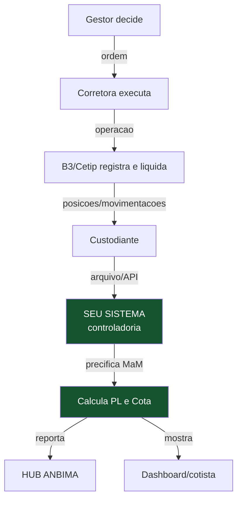

---

## 1. OS MÓDULOS DO SISTEMA (o mapa geral)

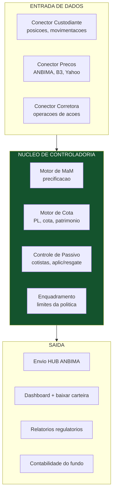

Os módulos **1, 2 e 3** captam dados; o **núcleo (4–7)** é o coração que você constrói e onde mora o diferencial; a **saída (8–11)** entrega para regulador, cliente e cotista.

---

## 2. COMO CADA TIPO DE ATIVO ENTRA NA COTA

Para cada classe de ativo há: (a) **como a operação chega até você**, e (b) **como você marca a mercado**. Esta é a parte central do seu pedido.

### 2.1 AÇÕES (renda variável)

**Como o cliente opera:** o gestor manda ordens a uma **corretora** (CTVM). A corretora executa na B3. A operação é liquidada e a **posição fica no custodiante** do fundo.

**Como a informação chega até você:**
- Pelo **custodiante**, que recebe da B3 as posições e movimentações do fundo e te repassa (arquivo ou API).
- No fluxo padrão do mercado, a **corretora envia à asset/gestor** arquivos de operações (ex.: arquivos de alocação **NEGS/TORDIST** intraday), e o **custodiante** consolida as posições de fechamento. Você integra ao custodiante para receber a posição oficial.
- A B3 oferece **APIs para desenvolvedores** (`https://developers.b3.com.br/apis`) e o ecossistema **iMercado** (comunicação padronizada administrador↔gestor↔custodiante↔corretora). Como novo administrador, você tipicamente acessa via **custodiante**, que já tem a conexão bruta (Secure Client / clearing da B3).

**Como marcar a mercado:**
- **Fonte primária: preço de fechamento do pregão da B3** do dia (para ações líquidas). A norma ANBIMA manda usar a **B3** (ou o mercado de maior liquidez) como fonte primária de renda variável.
- Ativos sem negociação regular: usar modelo/critério definido no seu Manual de Precificação (valor justo).

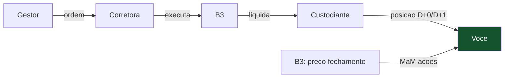

### 2.2 RENDA FIXA (títulos públicos, debêntures, CDBs, crédito privado)

**Como o cliente opera:** títulos públicos são liquidados/custodiados no **Selic**; títulos privados (debêntures, CDBs, LFs) no **Segmento Cetip da B3**. O gestor negocia; o custodiante liquida e registra.

**Como a informação chega até você:**
- Pelo **custodiante**, que tem conexão com **Selic** (títulos públicos) e **Cetip/B3** (privados). Ele te envia as posições e movimentações.
- Você **não envia transações diretamente à Cetip** — quem faz isso é o custodiante. Você **recebe** dele o que foi registrado/liquidado. (Se o banco parceiro for o custodiante, essa conexão é dele.)

**Como marcar a mercado:**
- **Títulos públicos:** **taxas indicativas da ANBIMA** do mercado secundário (fonte primária da MaM de RF). Grátis para os últimos 5 dias úteis; API `https://api.anbima.com.br/feed/precos-indices/v1/titulos-publicos/...`.
- **Debêntures:** **taxas indicativas ANBIMA de debêntures** + curvas de crédito. Mesma origem.
- **Crédito privado sem preço ANBIMA:** aí entra o **Comitê de Precificação / modelo de spread** definido no seu Manual — marcar pela curva + spread de crédito, com revisão do comitê. É o ponto que exige julgamento humano.
- **Fórmula base:** PU = fluxo de pagamentos descontado pela taxa de MaM; para os prazos intermediários, **interpolação exponencial** por dias úteis. Na ausência da taxa ANBIMA (ex.: emissão nova), usa-se a taxa média do leilão.

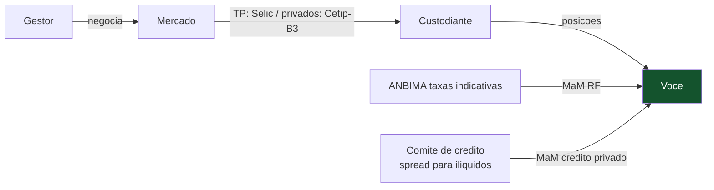

### 2.3 DERIVATIVOS (swaps, NDF, futuros, opções)

**Como o cliente opera:** derivativos listados na B3 (futuros, opções) ou de balcão (swaps, NDF) registrados na B3. Custodiante/corretora liquidam e informam.

**Como a informação chega até você:**
- Listados: via **custodiante/corretora** (posições, ajustes diários, margens).
- Balcão (swap/NDF): registrados na B3; você recebe do custodiante.

**Como marcar a mercado:**
- **Fonte primária: B3** (curvas referenciais, ajustes). A norma manda usar a B3 como fonte primária de derivativos, ou o mercado de maior liquidez.
- Derivativos que produzam **resultado fixo/predeterminado** são avaliados **em conjunto como renda fixa** e ajustados diariamente.
- Sem negociação regular: modelo próprio (curvas + parâmetros claros) no seu Manual.

### 2.4 PRIVATE EQUITY (FIP)

**Como o cliente opera:** FIP investe em participações em empresas (ações/cotas de empresas-alvo, muitas vezes fechadas). Não há pregão diário. É o caso **mais distante da automação**.

**Como a informação chega até você:**
- Não vem de bolsa. Vem de **eventos societários e documentos**: aportes, chamadas de capital, laudos de avaliação, demonstrações das investidas.
- O reporte à ANBIMA para FIP é **trimestral/anual** (ANBIMA Input / Base de Dados FIP), não diário.

**Como marcar a mercado:**
- **Valor justo por laudo de avaliação** das participações, com metodologia definida (fluxo de caixa descontado, múltiplos, último round), revisada periodicamente e por auditor.
- **Não é preço de tela** — é avaliação. Exige julgamento, comitê e, frequentemente, avaliador externo.

> ⚠️ **PE é o módulo mais complexo e menos automatizável.** Comece por Renda Fixa e Ações (preços observáveis, MaM diária padronizável); deixe FIP para uma fase madura, porque a precificação é por laudo, não por fonte de preço.

### 2.5 EVENTOS CORPORATIVOS (o que os ativos geram ao longo da vida)

Além de comprar e vender, os ativos **geram eventos** que você precisa reconhecer na contabilidade e refletir na cota. Ignorar um evento = cota errada.

**Como cada evento chega e o que o sistema faz:**

| Evento | Ativo | O que o sistema faz |
|---|---|---|
| **Dividendos / JCP** | Ações | Reconhece provento a receber na data-com; credita no caixa na data de pagamento; ajusta MaM |
| **Juros / cupom** | Títulos, debêntures | Provisiona o cupom pro rata; credita no caixa no vencimento do cupom |
| **Amortização** | Títulos, alguns fundos | Reduz o principal do ativo; credita o valor amortizado no caixa |
| **Vencimento** | Títulos | Baixa o ativo; credita principal + juros finais no caixa |
| **Grupamento / desdobramento** | Ações | Ajusta quantidade sem alterar o valor total da posição |
| **Bonificação** | Ações | Aumenta quantidade conforme o fator do evento |
| **Subscrição** | Ações | Registra o direito; exerce ou vende conforme decisão do gestor |

**Como o sistema trata:**
- **Fonte:** os eventos vêm do **custodiante/escriturador** e das centrais (B3). Você recebe, não descobre sozinho.
- **Calendário de eventos:** o sistema mantém um calendário do que está por vir (cupons, vencimentos, datas-com) — isso alimenta a **previsão de caixa** e evita esquecer um crédito.
- **Reconhecimento contábil:** cada evento vira lançamento (provento a receber → caixa), refletido na cota do dia certo.

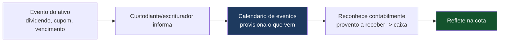

> 💡 **Se perguntarem "e quando a ação paga dividendo, como entra?":** "recebo o aviso do custodiante/escriturador, reconheço o provento a receber na data-com e credito no caixa no pagamento — tudo refletido na cota. Um calendário de eventos provisiona o que está por vir e alimenta a previsão de caixa."

---

> **Nota:** este é o **Guia Técnico Parte 1 — Controladoria de Ativos** (o lado da carteira: preços, cota, conciliação de ativos, eventos). O **lado do passivo** (cotistas, cotização), a **contabilidade do fundo**, a **tributação** (come-cotas/IR/IOF), o **reporte à CVM** e as **assembleias/atendimento** estão no **Guia Técnico Parte 2 — Passivo, Contábil, Fiscal e Obrigações**.

---

## 3. O SISTEMA DE MARCAÇÃO A MERCADO (MaM) — COMO CONSTRUIR

A MaM é **atualizar diariamente o valor de cada ativo** ao preço justo de mercado. É obrigatória e deve seguir o seu **Manual de Precificação** (documento que você registra na habilitação). Estrutura do sistema:

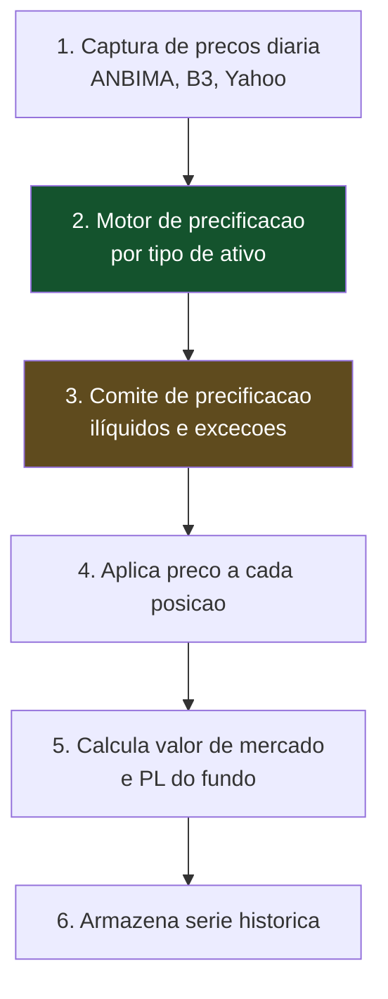

### 3.1 Regra de fonte primária por ativo (o "de-para")

| Ativo | Fonte primária de preço | Frequência | Custo |
|---|---|---|---|
| Ações | **Fechamento B3** | Diária | Público/grátis (Yahoo/B3) |
| Títulos públicos | **Taxas indicativas ANBIMA** | Diária | Grátis (5 dias úteis) / API Feed paga p/ histórico |
| Debêntures | **Taxas indicativas ANBIMA** + curva de crédito | Diária | Grátis (5 dias úteis) |
| CDB/LF | Curva + spread do emissor | Diária | Modelo próprio |
| Crédito privado ilíquido | **Comitê + curva + spread** | Diária/periódica | Julgamento (comitê) |
| Derivativos listados | **B3** (ajustes, curvas) | Diária | Público |
| Swap/NDF (balcão) | **B3** (curvas referenciais) ou modelo | Diária | Público/modelo |
| FIP / participações | **Laudo de valor justo** | Trimestral+ | Avaliação (comitê/externo) |

### 3.2 Componentes a construir
1. **Captura diária automatizada** dos preços (raspagem/API ANBIMA + B3 + Yahoo), **armazenando** para série histórica (o grátis da ANBIMA é só 5 dias — você precisa guardar diariamente).
2. **Motor de cálculo** por tipo: para RF, desconto de fluxo pela taxa + interpolação exponencial por dias úteis; para ações, aplicar fechamento; para derivativos, curvas.
3. **Comitê de precificação** (processo + tela): trata ilíquidos, exceções, ausência de fonte, spreads de crédito. É a parte humana obrigatória.
4. **Trilha de auditoria:** registrar de onde veio cada preço e quando (a norma pede cotação obtida no máximo em 15 dias para certos casos).

> 💡 **Resposta direta à sua pergunta:** sim, você tem que **construir um sistema de MaM**. Para **renda fixa** usa ANBIMA (+ comitê de crédito para o que não tem preço); para **ações** usa o **preço de fechamento do dia** da B3 (não o do dia anterior, salvo regra específica do fundo/cota de abertura). O sistema aplica a fonte primária de cada ativo, com o comitê cobrindo as exceções.

---

## 4. O MOTOR DE CÁLCULO DE COTA (o produto final)

Depois de precificar, o sistema calcula o valor da cota — o número que importa para o cotista.

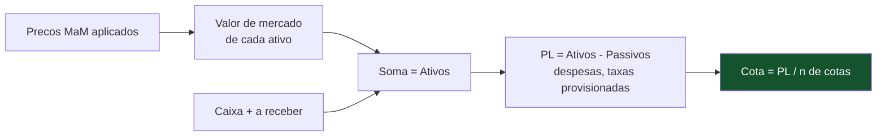

- **PL** = valor de mercado dos ativos + caixa − passivos (taxas provisionadas: administração, gestão, performance, custódia, taxa CVM apropriada, auditoria).
- **Cota** = PL ÷ número de cotas.
- **Provisão de taxas:** as taxas devem ser provisionadas diariamente (inclusive no nível de subclasse, se houver). A cota já sai **líquida** das taxas.
- **Cotização:** cota de abertura (só fundos de baixa volatilidade — RF) ou de fechamento (após o mercado). Aplicações/resgates entram pela cota da regra do fundo.

---

## 5. CONCILIAÇÃO DE CARTEIRA E TRATAMENTO DE REPASSES (o dia a dia da controladoria)

Esta é a função mais operacional e mais crítica da administradora — e a que mais protege o banco. Conciliar é **confrontar fontes independentes de informação e garantir que batem**; se não batem, há erro ou fraude. Repasses são **os movimentos de dinheiro que a administradora processa e distribui**. Nenhum dos outros temas importa se a conciliação falhar: uma cota calculada sobre posição errada é uma cota errada.

### 5.1 Conciliação de carteira — o que é e por que existe

Você tem **três fontes** que deveriam contar a mesma história sobre o fundo, e seu trabalho é garantir que contam:

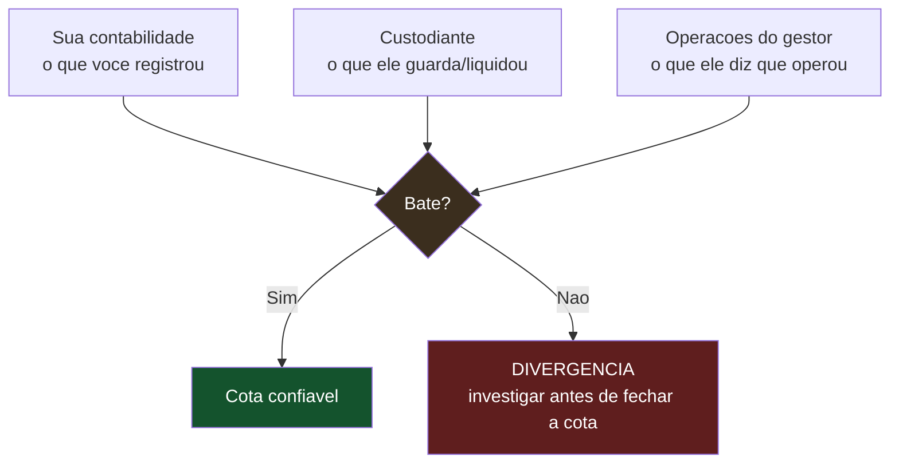

**As conciliações que você roda todo dia:**

| Conciliação | Confronta | O que pega |
|---|---|---|
| **Posição × custodiante** | Sua carteira contábil vs. posição no custodiante | Ativo fantasma, quantidade errada, falha de liquidação |
| **Operações × gestor** | O que o gestor diz que operou vs. o que liquidou | Ordem não executada, alocação errada, boleta divergente |
| **Caixa × conta do fundo** | Seu saldo de caixa contábil vs. extrato bancário do fundo | Movimento não contabilizado, taxa cobrada errada |
| **Eventos corporativos** | Dividendos/juros/amortizações esperados vs. recebidos | Provento não creditado, valor errado |
| **Passivo × cotistas** | Cotas emitidas/resgatadas vs. movimentação financeira | Cotização errada, aplicação/resgate não batendo |

> ⚠️ **A regra de ouro:** a cota **não fecha** enquanto houver divergência material não explicada. Fechar cota sobre carteira não conciliada é exatamente a falha que a CVM pune. O sistema deve **bloquear ou sinalizar criticamente** o fechamento quando a conciliação não bate.

### 5.2 Como a conciliação funciona na prática (o processo)

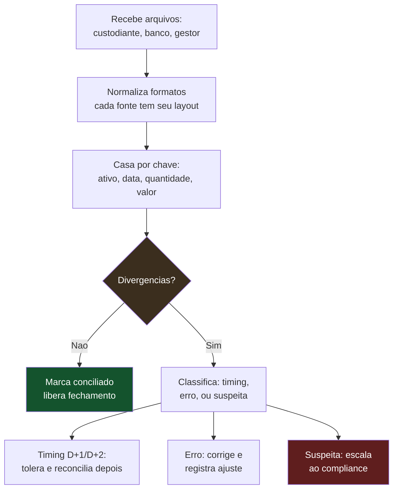

- **Nem toda divergência é problema.** Muitas são **timing** — a operação foi feita hoje mas liquida em D+2, então a posição no custodiante só reflete depois. O sistema precisa entender os prazos de liquidação de cada mercado (ações D+2, títulos públicos D+0/D+1) para não gerar alarme falso.
- **A trilha de auditoria é o produto.** Cada divergência, sua classificação e sua resolução ficam registradas. Isso é o que comprova a diligência do administrador — e é o que faltou nos casos punidos pela CVM.

### 5.3 Tratamento de repasses — os fluxos de dinheiro que você processa

"Repasse" é qualquer movimento em que a administradora **recebe e destina dinheiro** relacionado ao fundo. São vários tipos, e cada um tem uma mecânica:

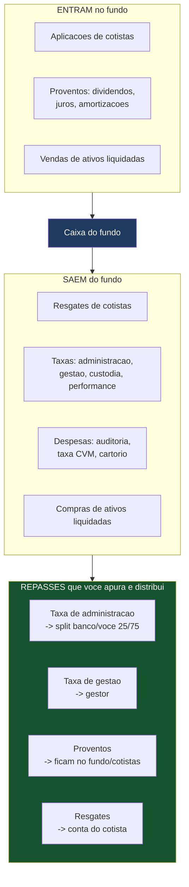

**Os repasses que você calcula e executa/instrui:**

| Repasse | Origem | Destino | Frequência |
|---|---|---|---|
| **Taxa de administração** | Provisionada diária, cobrada do fundo | Dividida **25% banco / 75% você** | Mensal (típico) |
| **Taxa de gestão** | Provisionada diária, cobrada do fundo | Gestor | Mensal |
| **Taxa de performance** | Se atingir benchmark | Gestor (e/ou split) | Conforme regulamento |
| **Taxa de custódia** | Cobrada do fundo | Custodiante (ou R$ 0 se banco absorve) | Mensal |
| **Despesas do fundo** | Taxa CVM, auditoria | Terceiros/CVM | Na competência |
| **Resgates** | Pedido do cotista | Conta do cotista | Conforme cotização |
| **Proventos** | Ativos da carteira | Permanecem no fundo (viram caixa/reinvestimento) | Ao evento |

> 💡 **O repasse que é a sua receita:** a **taxa de administração** é de onde sai o seu dinheiro. O sistema provisiona diariamente (para a cota já sair líquida), a apura no fechamento do mês, e calcula o **split 25/75** entre banco e você. Automatizar isso é o que garante que você receba certo, todo mês, em todos os fundos — sem planilha manual.

### 5.4 Provisão vs. pagamento (um ponto que confunde)

As taxas são **provisionadas todo dia** (para a cota refletir o custo diariamente e ser justa), mas **pagas periodicamente** (mensal). O sistema controla os dois:
- **Provisão diária:** a cada cálculo de cota, aprovisiona 1/21 (dias úteis) da taxa mensal, deduzindo do PL. A cota já nasce líquida.
- **Pagamento/repasse:** no fim do mês, o valor provisionado acumulado é efetivamente cobrado do fundo e repassado aos destinatários (gestor, custodiante, e o split banco/você).

> ⚠️ **Se você errar a provisão, erra a cota.** Provisionar a menos infla a cota artificialmente (e depois cai quando cobra); provisionar a mais deprime. A consistência entre provisão diária e pagamento mensal precisa fechar — é mais uma conciliação (provisão acumulada × valor efetivamente cobrado).

### 5.5 O que o sistema precisa ter para conciliação e repasses

| Componente | Função |
|---|---|
| **Importador multi-fonte** | Lê arquivos de custodiante, banco, gestor (layouts diferentes) e normaliza |
| **Motor de casamento (matching)** | Casa registros por chave; identifica divergências |
| **Classificador de divergências** | Separa timing × erro × suspeita; aplica tolerâncias por prazo de liquidação |
| **Motor de provisão** | Provisiona taxas diariamente por fundo (e subclasse) |
| **Apurador de repasses** | Calcula quanto vai para cada destino; aplica o split 25/75 |
| **Instrução de pagamento** | Gera as ordens de repasse (o pagamento efetivo é instruído ao custodiante/banco) |
| **Trilha de auditoria** | Registra tudo: divergências, resoluções, provisões, repasses |
| **Painel de exceções** | Mostra ao operador o que não conciliou e precisa de ação |

> 💡 **Você instrui, o custodiante/banco paga.** Assim como você não liquida ativos, você tipicamente **não move o dinheiro fisicamente** — você apura e **instrui** o repasse; a tesouraria do fundo (custodiante/banco) executa. Você é a inteligência que diz "quanto, para quem, quando", com a trilha que comprova.

---

## 6. CONEXÕES — QUEM SE LIGA COM QUEM (resumo prático)

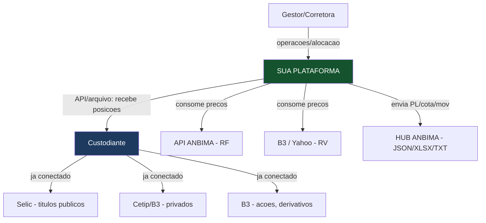

**O ponto-chave das conexões:** você **não constrói** a conexão institucional bruta com Selic/Cetip/B3 — isso é do **custodiante** (que, na Rota A, pode ser o próprio banco). Você constrói:
- **Integração com o custodiante** (receber posições e movimentações — arquivo ou API).
- **Consumo de preços** (APIs ANBIMA/B3/Yahoo).
- **Envio ao HUB ANBIMA** (API JSON/XLSX/TXT — obrigatório).
- **Recepção de operações** do gestor/corretora (para conciliar).

> 💡 **Sobre "como eu me conecto com a Cetip para enviar as transações":** em regra, **você não envia** — quem registra e liquida na Cetip/Selic/B3 é o **custodiante**. Você **recebe** dele as posições conciliadas e contabiliza. Se o banco parceiro for o custodiante, essa conexão já está do lado dele. Sua conexão é **com o custodiante**, não diretamente com as centrais.

---

## 7. O CICLO DIÁRIO COMPLETO (o "batch" que roda todo dia)

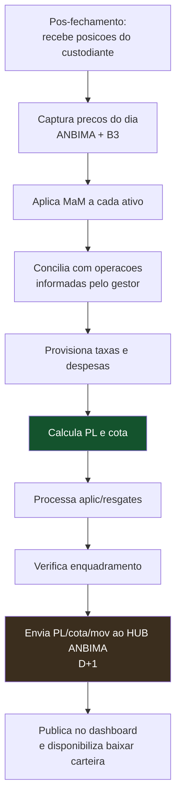

Este ciclo é o **coração operacional**. Ele roda automaticamente todo dia útil, com o **comitê de precificação** intervindo nas exceções (ilíquidos, ausência de preço). Automatizar bem este batch é o que permite operar 50, 200, 500 fundos com 2 pessoas.

---

## 8. RESUMO — O QUE CONSTRUIR, EM ORDEM DE PRIORIDADE

| Ordem | Sistema | Por quê primeiro |
|---|---|---|
| 1 | **Conector do custodiante** (recebe posições/movimentações) | Sem isso, não há o que contabilizar |
| 2 | **Captura e armazenamento de preços** (ANBIMA/B3/Yahoo) | Base da MaM; guardar histórico desde o dia 1 |
| 3 | **Motor de MaM** (por tipo de ativo) + **Comitê** | Precifica a carteira |
| 4 | **Motor de cota** (PL, cota, provisão de taxas) | O produto final |
| 5 | **Conciliação** (posição × custodiante × gestor) | Sem isso a cota não é confiável; é o que protege o banco |
| 6 | **Envio ao HUB ANBIMA** (API) | Obrigatório, D+1 |
| 7 | **Controle de passivo** (cotistas, aplic/resgate) + **KYC/PLD** | Onboarding e movimentação |
| 8 | **Apuração de repasses** (taxas, split 25/75) | Como você e o banco recebem |
| 9 | **Enquadramento** (limites da política) | Conformidade |
| 10 | **Dashboard + baixar carteira** (API cliente) | Experiência do gestor |
| 11 | **Relatórios regulatórios + contabilidade do fundo** | Reporte a cotista e CVM |

Comece por **Renda Fixa e Ações** (preços observáveis, MaM padronizável); adicione **derivativos** depois; deixe **FIP** para fase madura.

> **Esta é a ordem do lado dos ativos (Parte 1).** O lado do passivo e das obrigações tem sua própria ordem de prioridade — controle de passivo, cotização, motor fiscal, contabilidade, reporte à CVM — detalhada no **Guia Técnico Parte 2 §9**. Na prática, os dois lados são construídos em paralelo: sem passivo não há cota, sem ativos não há o que contabilizar.

---

> **Resumo em uma frase:** você constrói uma **máquina de controladoria** — que recebe posições do custodiante (não se conecta direto à Cetip/Selic/B3, isso é do custodiante), precifica cada ativo pela sua fonte primária (ANBIMA para renda fixa + comitê para crédito ilíquido; fechamento B3 para ações; B3 para derivativos; laudo para FIP), **concilia** as fontes (posição × custodiante × gestor) antes de fechar, calcula PL e cota líquidos de taxas, **apura os repasses** (taxas e o split 25/75 banco/você), envia ao HUB ANBIMA e mostra ao gestor via dashboard e "baixar carteira". A conciliação é o que torna a cota confiável e protege o banco; o sistema de MaM é obrigatório e segue seu Manual de Precificação; o ciclo diário automatizado é o que permite escalar para centenas de fundos.

---

## Adendo (jul/2026) — dois módulos que faltavam no mapa técnico

1. **Ciclo de aprovação da cota (batimento com o gestor):** entre "calcular a cota" e "publicar" existe uma etapa formal que o guia não detalhava — a **prévia de D-1 vai ao gestor**, que aprova ou rejeita apontando divergência; rejeições voltam como lançamentos da controladoria (ajuste de preço/quantidade/caixa, com trilha) e geram **nova versão** da cota; reprocessamentos retroativos republicam os dias seguintes em cascata. O informe diário à CVM só sai após a aprovação. Este fluxo está implementado no piloto (fechamentos versionados) e deve ser requisito do motor real.
2. **O lado do custodiante como sistema próprio:** o guia dizia corretamente que a startup "não se conecta direto à Selic/B3 — isso é do custodiante"; a pesquisa detalhou o que existe do outro lado: mensageria **RSFN/SPB** (catálogos SEL/STR + mensageria B3), contas individualizadas por fundo nas centrais, liquidação **DVP** em D+1/D+2, agenda de eventos corporativos e a geração dos **arquivos diários de posição/extrato** que alimentam a conciliação. Interfaces, adesões e homologação no **`guia_custodia_conexoes.md`**; maquete funcional no 4º portal do piloto.

*Documento v0.1. As fontes primárias de preço (ANBIMA/B3) são definidas por norma; sua implementação concreta deve seguir o Manual de Precificação aprovado no credenciamento. Confirme metodologias nos manuais ANBIMA/B3 vigentes.*
