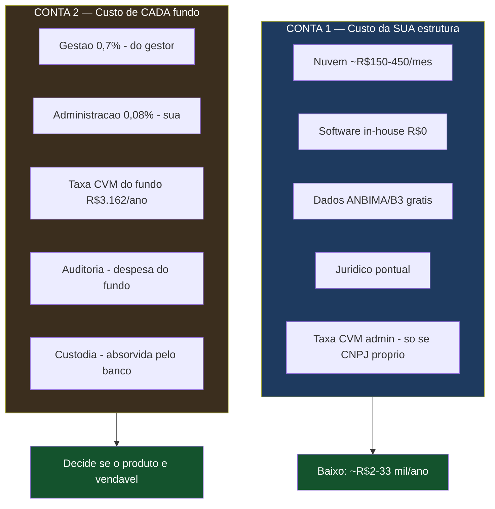
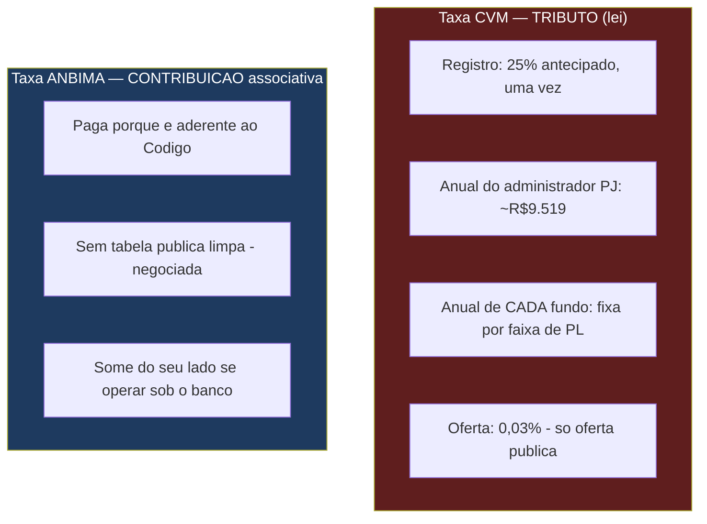
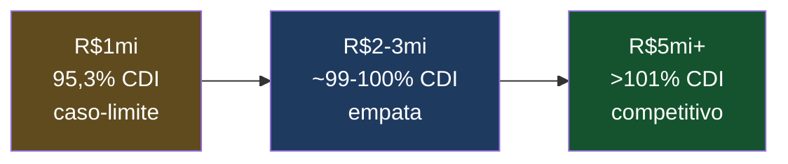
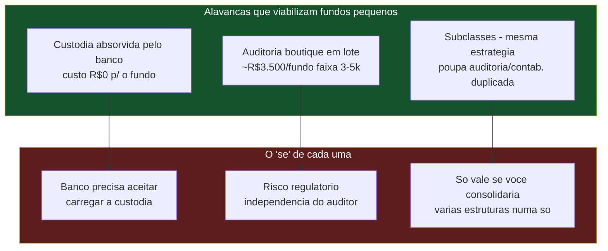

# Planilha de Custos e Viabilidade — Administradora *Low-Cost* (v0.4 — Consolidada)

> **Documento de trabalho — v0.4**
> Consolida os custos da **estrutura** (a sua empresa) E a **viabilidade econômica de cada fundo** (o produto que você vende), com números reais pesquisados. Premissas do projeto: 2 sócios sem funcionários, sócio já certificado (CGA + CGE), sistema e site **in-house**, jurídico via conhecido advogado + IA, sem escritório, e operação sob a **Rota A** (parceria com banco que se habilita como administrador e custodiante).
>
> **Duas contas diferentes, não confundir:**
> 1. **Custo da estrutura** (Seções 2–6): quanto custa manter *a sua administradora* funcionando. É baixo.
> 2. **Custo de cada fundo** (Seções 7–9): quanto de custo *um fundo* carrega, e quanto sobra para o cotista. É o que decide se o produto é vendável.
>
> **Aviso:** valores de referência (jun/2026); taxas regulatórias são oficiais, custos negociados (auditoria, custódia) são faixas a confirmar. Não é aconselhamento contábil/jurídico/financeiro.

---

## 1. Mapa das Duas Contas

---

## 2. Infraestrutura Tecnológica (dimensionada p/ ~50 fundos)

Cálculo de cota é processamento **batch diário**, não carga contínua. Dimensionamento modesto:

| Recurso | ~50 fundos | Racional |
|---|---|---|
| CPU | 2 vCPUs (t3.medium) | Batch pós-fechamento; picos curtos |
| RAM | 4 GB | Carteiras pequenas, sequencial |
| Banco SQL | 20–50 GB (1º ano), +5–15 GB/ano | Posições, cotistas, histórico — dados leves |
| APIs a consumir | 4–6 fontes | ANBIMA, B3/Yahoo, HUB ANBIMA, custodiante, Tesouro/Selic |

**Custo real de nuvem (AWS, pesquisado):**

| Item | Config | ~R$/mês |
|---|---|---|
| App (EC2 t3.medium 24/7) | 2 vCPU, 4 GB | ~R$ 165 |
| Banco (RDS PostgreSQL t3.medium + 50GB) | 2 vCPU, 4 GB | ~R$ 250 |
| Backup/S3 | — | ~R$ 28 |
| E-mail (Amazon SES) | ~US$0,10/1.000; 62 mil grátis/mês via EC2 | ~R$ 0–6 |
| **Total nuvem** | | **~R$ 450/mês** |

Com free tier (1º ano), instâncias reservadas ou VPS simples: **~R$ 150–250/mês**. Se hospedado sob o banco: **~R$ 0**.

---

## 3. Custos Iniciais da Estrutura (One-Time)

| Item | Nota | CNPJ próprio | Sob o banco |
|---|---|---|---|
| Constituição PJ | LTDA | R$ 1.000–2.000 | R$ 0 |
| Jurídico de estruturação | Conhecido + IA | R$ 0–3.000 | R$ 0–3.000 |
| Taxa habilitação CVM (25%) | Só se registro próprio | R$ ~2.380 | R$ 0 |
| Certificações (CGA/CGE) | **Já possui** | R$ 0 | R$ 0 |
| Setup tecnológico (MVP) | Sócios constroem | R$ 0 | R$ 0 |
| Integrações (ANBIMA/custodiante/B3) | APIs públicas | R$ 0 | R$ 0 |
| Website + marca + domínio | Você faz | R$ ~40 | R$ ~40 |
| Manuais (MaM, compliance) | IA + validação | R$ 0–1.500 | R$ 0–1.500 |
| **TOTAL INICIAL** | | **~R$ 3.400–8.900** | **~R$ 40–4.500** |

---

## 4. Custos Recorrentes Mensais da Estrutura

| Item | Enxuto | Base |
|---|---|---|
| Pró-labore sócios | R$ 0 | R$ 0 |
| Risco/Compliance | R$ 0 (sócios/banco) | R$ 0 |
| Software de fundos | R$ 0 (in-house) | R$ 0 |
| Nuvem | R$ 150 | R$ 450 |
| Dados de mercado | R$ 0 (ANBIMA grátis/B3 público) | R$ 0 |
| Contabilidade PJ | R$ 0 (via banco) | R$ 300–600 |
| Jurídico | R$ 0 (pontual) | R$ 0 |
| E-mail/SaaS | R$ 6 | R$ 50 |
| **TOTAL MENSAL** | **~R$ 156** | **~R$ 500–950** |

---

## 5. Taxas Regulatórias — Como Funcionam (CVM e ANBIMA)

Ponto que confunde: são **duas naturezas diferentes**.

### 5.1 Taxa CVM do fundo (a que pesa no produto) — valores oficiais Lei 14.317

| PL do fundo/classe | Taxa CVM anual (fixa) |
|---|---|
| até R$ 5.031.489,20 | **R$ 3.162,29** |
| até R$ 10.062.978,40 | R$ 4.743,42 |
| até R$ 20.125.956,80 | R$ 7.115,15 |
| acima | R$ 9.486,88+ |

> ⚠️ É **fixa por faixa, não some para fundo pequeno**. Um fundo de R$ 1 mi paga os mesmos R$ 3.162 que um de R$ 5 mi. É o "vilão" dos fundos minúsculos.

**Três atenuantes legítimos:**
- **1º ano grátis:** fundo criado **depois de abril** não paga taxa anual no 1º ano (sem base de cálculo no 1º quadrimestre). Alívio de fluxo de caixa na largada — **não é permanente**, entra no ano 2.
- **Subclasses:** vários cotistas na **mesma estratégia** podem ser subclasses de uma classe. **Correção importante:** isso **não dilui a taxa CVM** — a taxa CVM incide sobre o PL, que é o mesmo esteja ele numa classe ou fatiado. O que subclasses poupam é a **duplicação de auditoria/contabilidade/registro** que existiria se você criasse estruturas separadas para a mesma estratégia. É economia de **custo fixo por estrutura**, condicional a você de fato consolidar várias estruturas — não uma redução de imposto.
- **Despesa do fundo:** a taxa do fundo é paga pelo fundo (repassada a cotistas), não pelo seu caixa.

### 5.2 Taxa ANBIMA
- É **contribuição de instituição aderente** ao Código ANBIMA (não tributo).
- **Na Rota A (sob o banco):** o banco é o aderente; os fundos entram sob a adesão dele; **você não paga adesão própria**. A adesão pode ser pedida junto com a habilitação CVM no mesmo protocolo (SSM).

---

## 6. Consolidado da Estrutura — 1º Ano

| Cenário | Inicial | Mensal ×12 | Anual extra | **TOTAL** |
|---|---|---|---|---|
| Enxuto (sob banco) | ~R$ 40 | ~R$ 1.900 | ~R$ 0 | **~R$ 1.900** |
| Enxuto (CNPJ próprio) | ~R$ 3.400 | ~R$ 1.900 | ~R$ 9.519 | **~R$ 14.800** |
| Base (CNPJ próprio) | ~R$ 8.900 | ~R$ 9.000 | ~R$ 15.519 | **~R$ 33.400** |

> **A estrutura custa pouco.** O gargalo nunca foi custo de operação — é fechar a parceria e captar fundos.

---

## 7. Custo de CADA Fundo e o Que Sobra para o Cotista

Esta é a conta que decide se o produto vende. Modelo: fundo RF crédito privado, gestão 0,7%, sua administração (mín. R$ 1.200/ano), **auditoria em lote R$ 3.500/ano** (auditor boutique parceiro, carteira simples e dados conciliados — faixa defensável R$ 3–5k; R$ 1,2–1,5k seria aviltamento de honorários, ver `guia_auditor_independente.md` §11), **custódia R$ 0** (absorvida pelo banco custodiante), taxa CVM conforme faixa. Premissa: CDI 10,5%, ativos rendendo CDI+1 (11,5% bruto).

### 7.1 Regime permanente (com taxa CVM, ano 2+)

| PL do fundo | Custo total % | Líquido % | % do CDI |
|---|---|---|---|
| R$ 1 milhão | 1,49% | 10,01% | **95,3%** |
| R$ 2 milhões | 1,11% | 10,39% | 98,9% |
| R$ 5 milhões | 0,91% | 10,59% | **100,9%** |
| R$ 10 milhões | 0,86% | 10,64% | 101,3% |
| R$ 20 milhões | 0,83% | 10,67% | 101,6% |
| R$ 50 milhões | 0,80% | 10,70% | 101,9% |

### 7.2 Primeiro ano (fundo criado após abril, sem taxa CVM)

| PL do fundo | Custo total % | Líquido % | % do CDI |
|---|---|---|---|
| R$ 1 milhão | 1,17% | 10,33% | 98,4% |
| R$ 2 milhões | 0,95% | 10,55% | 100,5% |
| R$ 5 milhões | 0,85% | 10,65% | 101,4% |

> 💡 **Leitura (com auditoria realista R$ 3–5k):** o produto **empata o CDI por volta de R$ 2–3 milhões** e entrega **acima do CDI de R$ 5 mi em diante**. O fundo de R$ 1 mi isolado ficou em **95,3% do CDI** no regime permanente (era 97,3% com a premissa antiga de R$ 1,5k) — para ele a saída é **agrupar via subclasses** (várias carteiras da mesma estratégia dividem **UMA** auditoria, diluindo o custo fixo) ou o alívio do **1º ano** (98,4% do CDI). Trocar a auditoria de R$ 1,5k para R$ 3,5k custou ~2 pontos percentuais de CDI no fundo de R$ 1 mi — é o preço da honestidade (o número baixo demais seria aviltamento e traria risco regulatório). **A alavanca que salva o fundo pequeno não é espremer o auditor, é a subclasse.**

---

## 8. As Três Alavancas de Viabilidade (e seus riscos)

| Alavanca | Efeito | Risco / limite honesto |
|---|---|---|
| **Custódia via banco (R$ 0)** | Remove o maior custo fixo | Depende de o banco se licenciar como custodiante e absorver o custo; só compensa pra ele em escala (a taxa CVM de custodiante é ~R$ 38 mil/ano, diluída entre muitos fundos) |
| **Auditoria boutique em lote (R$ 3–5k)** | Reduz o 2º maior custo fixo (mercado ~R$ 11k) | Preço abaixo de ~R$ 3k vira **aviltamento de honorários** + risco de trabalho raso; a economia legítima vem de **carteira simples + dados conciliados + volume**, não de "carimbo". Ver `guia_auditor_independente.md` |
| **Subclasses** | Poupa auditoria/contabilidade/registro **duplicados** (NÃO a taxa CVM) | Economia **condicional**: só vale se você consolidaria várias estruturas da mesma estratégia numa só. A taxa CVM segue o PL e não muda. Um grupo por estratégia = classe única, sem ganho |

> ⚠️ **A conta fecha se os três "se" se sustentarem na negociação real.** Cada alavanca é possível, mas nenhuma é automática — e as três são justamente o que o compliance do banco vai examinar.

---

## 9. Custódia — Quem Paga e Por Que Pode Ser R$ 0 no Fundo

- Custódia exige **autorização própria** da CVM (Resolução 32): lista fechada — bancos, corretoras, DTVMs. Um banco básico **pode** pedir, mas **não tem automaticamente**.
- **Custo de o banco se tornar custodiante:** taxa CVM de custodiante ~**R$ 38.077/ano** (fixa, do banco) + montagem de estrutura (sistemas, conciliação, controles auditados — investimento relevante).
- **Por isso só compensa em escala:** R$ 38 mil ÷ 200 fundos = ~R$ 190/fundo; ÷ 50 fundos = ~R$ 762/fundo; com poucos fundos, internalizar é *mais* caro que terceirizar.
- **Decisão estratégica:** começar terceirizando custódia (despesa do fundo) e internalizar no banco quando o volume justificar; OU o banco absorve desde o início como aposta de escala, permitindo custódia R$ 0 no fundo (a premissa otimista das tabelas da Seção 7).

---

## 10. Os Custos Reais Que Sobram

| Custo | Natureza | Ordem de grandeza |
|---|---|---|
| **Tempo dos sócios sem salário** | Não-monetário, o maior | Meses até a escala |
| **Fatia ~20% do banco** | Redução de margem | % da receita |
| **Nuvem** | Caixa mensal | ~R$ 150–450/mês |
| **Taxa CVM do fundo** | Despesa do fundo | R$ 3.162/ano por fundo <R$5mi (some no 1º ano; **não** é reduzida por subclasse — segue o PL) |
| **Taxa CVM admin / ANBIMA** | Some se operar sob o banco | — |
| **Auditoria** | Despesa do fundo | ~R$ 3–5k/fundo (boutique registrada na CVM, em lote) |

---

> **Conclusão em uma frase:** a **estrutura** custa pouco (~R$ 2–33 mil/ano) e não é o gargalo; o **produto** (cada fundo) é competitivo a partir de ~R$ 2 milhões de PL e supera o CDI de R$ 5 mi em diante, graças a três alavancas — custódia absorvida pelo banco, auditoria adaptada e subclasses — cada uma com um "se" que a negociação com o banco precisa confirmar. O fundo de R$ 1 milhão é caso-limite: só fecha bem no primeiro ano (sem taxa CVM) ou agrupado em subclasses. O gargalo permanece o de sempre: fechar a parceria e captar os fundos.

*Documento v0.4. Números de tributos são oficiais (Lei 14.317); auditoria e custódia são faixas a confirmar em cotação/negociação. Decisão pendente: CNPJ próprio vs. sob o banco, e se o banco internaliza custódia desde já ou depois.*
