# Plano de Negócio — Administradora Fiduciária *Low-Cost* para Fundos Pequenos

> **Documento de trabalho — v0.2 (consolidado)**
> Este é um rascunho estruturado da ideia. Ele organiza a proposta e **sinaliza abertamente os pontos frágeis** que ainda precisam ser validados. As caixas de aviso (⚠️) não são para desencorajar — são o mapa do que resolver antes de investir capital ou tempo sério. Um plano honesto sobre seus próprios riscos vale mais que um plano bonito e cego.

---

## 1. Sumário Executivo

**A ideia em uma frase:** criar uma administradora fiduciária de fundos de investimento cuja infraestrutura tecnológica é desenhada, desde o primeiro dia, para operar centenas ou milhares de **fundos pequenos** (R$ 1–10 milhões) a um custo marginal baixo, servindo um segmento que os administradores tradicionais consideram pouco lucrativo.

**Proposta de valor central:** tornar economicamente viável a existência de fundos pequenos, cobrando uma taxa de administração enxuta (≈0,08% do PL ao ano, com mínimo mensal de R$ 100), viabilizada por automação intensiva (cálculo de cota, enquadramento, reporte, monitoramento) e por uma arquitetura pensada para escala desde a origem.

**Diferencial operacional — *deploy* ágil de fundos:** além do custo baixo, a plataforma permite **iniciar e encerrar fundos de forma rápida e padronizada**. Onde a estruturação tradicional de um fundo é lenta e artesanal, a infraestrutura padroniza e automatiza o ciclo de vida (constituição → operação → encerramento), reduzindo drasticamente o tempo e o atrito para colocar um fundo de pé — e para desmontá-lo quando deixa de fazer sentido. Isso transforma o fundo de um projeto pesado num instrumento ágil.

**Modelo de acesso ao mercado:** como a atividade de administrador fiduciário exige ser instituição autorizada pelo Banco Central, a empresa operaria **em parceria com um banco pequeno/regional que já possua (ou obtenha) a licença de DTVM**, dividindo resultado com esse parceiro.

**Meta financeira de referência:** atingir ~R$ 200 milhões de PL sob administração e, a partir dessa base, buscar ~R$ 700 mil de lucro anual.

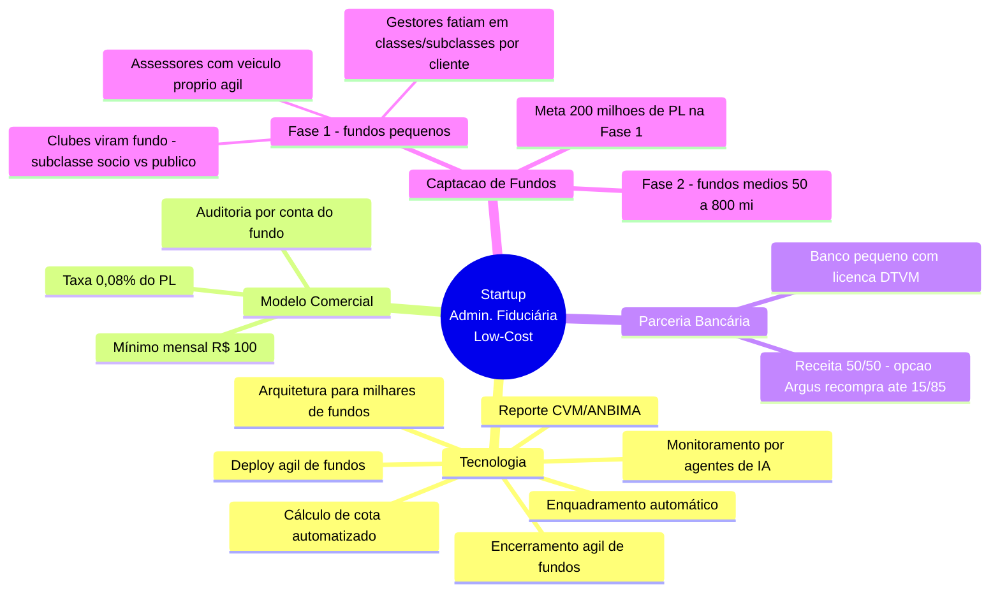

---

## 2. O Problema de Mercado

### 2.1 A lacuna identificada

Os administradores fiduciários tradicionais (bancos e grandes DTVMs) estruturam seus custos e mínimos de forma que **fundos pequenos se tornam inviáveis ou caros**:

- O custo operacional de administrar um fundo é majoritariamente **fixo por fundo** (cálculo de cota, enquadramento, reporte, auditoria), não proporcional ao PL.
- Por isso, cobram **mínimos mensais altos** (tipicamente alguns milhares de reais), que num fundo de R$ 5 milhões representam um percentual efetivo elevado.
- Resultado: quem quer abrir um fundo pequeno encontra poucas opções acessíveis.

### 2.2 A hipótese central do negócio

> **Hipótese:** se a infraestrutura for construída *desde a origem* para escala (custo marginal por fundo tendendo a baixo), é possível servir lucrativamente o segmento de fundos pequenos que os incumbentes evitam.

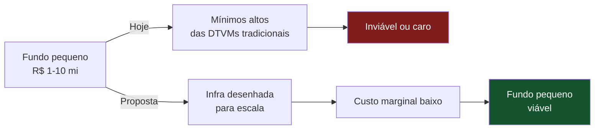

> ⚠️ **Ponto frágil nº 1 — a hipótese ainda não está validada.**
> A razão de os incumbentes evitarem fundos pequenos pode não ser só ineficiência tecnológica — pode ser que **parte relevante do custo por fundo seja irredutível** (auditoria independente, responsabilidade fiduciária, fiscalização humana, atendimento a exceções). Se for esse o caso, mesmo uma infraestrutura ótima não torna o segmento lucrativo. Ver Seção 8 (Análise de Riscos).

---

## 3. Modelo de Negócio

### 3.1 Estrutura de receita

| Item | Definição |
|---|---|
| Taxa de administração | ≈ 0,08% do PL ao ano |
| Mínimo mensal por fundo | R$ 100 |
| Auditoria e demais taxas | Pagas pelo fundo (repassadas aos cotistas), fora da receita da empresa |

**Como o mínimo interage com o percentual:** em fundos pequenos, o mínimo de R$ 100/mês (R$ 1.200/ano) quase sempre supera os 0,08%. Só a partir de **R$ 1,5 milhão de PL** por fundo é que os 0,08% (R$ 1.200/ano) empatam com o mínimo. Abaixo disso, a receita efetiva é o piso de R$ 100/mês.

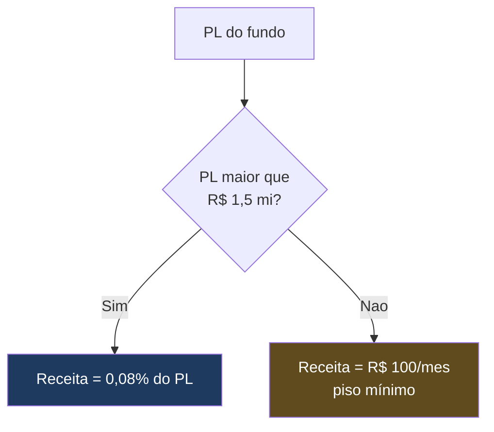

### 3.2 Simulação de receita na meta de R$ 200 milhões de PL

O resultado **depende fortemente do tamanho médio dos fundos**, porque o mínimo domina em fundos pequenos. Dois cenários:

| Cenário | Nº de fundos | PL médio | Receita anual bruta aprox. |
|---|---|---|---|
| A — muitos fundos minúsculos | 200 fundos | R$ 1 mi | 200 × R$ 1.200 = **R$ 240 mil** (domina o mínimo) |
| B — fundos médios | 25 fundos | R$ 8 mi | 25 × ~R$ 6.400 = **R$ 160 mil** (0,08% ≈ mínimo) |

> ⚠️ **Ponto frágil nº 2 — a meta de "R$ 700k de lucro" precisa de premissas explícitas (e ficou ainda mais apertada com o mínimo de R$ 100).**
> Note o paradoxo: no Cenário A (fundos minúsculos) a receita bruta parece maior, mas o **custo operacional também explode**, porque são 200 fundos para operar, auditar e fiscalizar — cada um com seu overhead. No Cenário B a receita é menor mas o custo é menor.
> **Atenção ao número:** com o mínimo em R$ 100, mesmo o cenário de maior receita bruta (Cenário A) gera **R$ 240 mil brutos** — ou seja, cerca de **um terço** da meta de R$ 700k de **lucro**, e isso **antes** de descontar custos operacionais e a fatia do banco parceiro (50% no início; 15% se a Argus exercer a opção de recompra). Para atingir R$ 700k de lucro seria necessário um PL total **muito maior** que R$ 200 mi, ou um PL médio por fundo bem acima de R$ 1,5 mi (onde o percentual passa a superar o mínimo), ou uma combinação dos dois. Esta conta precisa de uma planilha de custos detalhada (ver Seção 7). **Cada redução do mínimo (de R$ 500 → R$ 200 → R$ 100) torna o produto mais atraente para quem abre o fundo, mas derruba proporcionalmente a receita por fundo pequeno** — do mínimo original de R$ 500, a receita por fundo pequeno caiu 80%. Isso empurra a meta de lucro para um PL total substancialmente maior e reforça a pergunta central: qual é o PL médio por fundo que faz a conta fechar?

### 3.3 Viabilidade na ótica do cotista — o produto é vendável?

A receita da administradora é uma coisa; se o *fundo* entrega retorno competitivo ao cotista é outra, e decide se há o que vender. Modelo de referência: fundo RF crédito privado, gestão 0,7%, sua administração (mín. R$ 1.200/ano), **auditoria adaptada R$ 1.500**, **custódia R$ 0** (absorvida pelo banco custodiante), taxa CVM real por faixa. Premissa: CDI 10,5%, ativos rendendo CDI+1 (11,5% bruto). Detalhamento completo na planilha de custos.

| PL do fundo | Custo total | Líquido ao cotista | % do CDI (regime permanente) |
|---|---|---|---|
| R$ 1 milhão | 1,29% | 10,21% | **97,3%** (caso-limite) |
| R$ 2 milhões | 1,01% | 10,49% | 99,9% |
| R$ 5 milhões | 0,87% | 10,63% | **101,2%** |
| R$ 10 milhões | 0,84% | 10,66% | 101,5% |
| R$ 50 milhões | 0,80% | 10,70% | 101,9% |

> 💡 **Achado central de viabilidade:** com as alavancas de custódia absorvida pelo banco e auditoria adaptada em lote, o produto é **competitivo a partir de ~R$ 2 milhões de PL** e supera o CDI de R$ 5 milhões em diante. O vilão dos fundos minúsculos são os **custos fixos** (auditoria, custódia, taxa CVM de R$ 3.162/ano), que não escalam para baixo — por isso o fundo de R$ 1 milhão fica em 97,3% do CDI no regime permanente (fecha bem apenas no 1º ano, quando não há taxa CVM). *Nota corretiva:* eu tratava "subclasses para diluir a taxa CVM" como uma terceira alavanca — isso estava errado. A taxa CVM segue o PL e não é diluída por subclasse; subclasses só poupam auditoria/contabilidade duplicadas quando você consolidaria várias estruturas da mesma estratégia (ver guia de estruturas de classes/subclasses).

> ⚠️ **Implicação para o modelo comercial:** isso sugere um **piso econômico de PL** por fundo (para crédito privado, ~R$ 2 mi) acima do piso regulatório (R$ 1 mi). E reforça que o negócio não é "administrar fundos pequenos isolados", mas **operar uma plataforma que dilui custos fixos na escala** — via muitos fundos rodando no mesmo software (custo marginal quase zero por fundo). *A diluição real vem da escala do software*, não de subclasses; subclasses só ajudam no caso específico de consolidar várias estruturas da mesma estratégia. Três ressalvas honestas: (a) os números são **antes do IR** do cotista; (b) CDI+1 é spread conservador — crédito privado real costuma mirar mais, o que melhora tudo; (c) **não vender o número do 1º ano como permanente** — a taxa CVM entra no ano 2 e a expectativa quebrada respinga na reputação (e no banco).

---

## 4. Arquitetura Tecnológica

A tese técnica é: **construir para milhares de fundos desde o início**, de modo que adicionar o fundo nº 500 custe quase o mesmo que o fundo nº 5.

### 4.1 Módulos do sistema

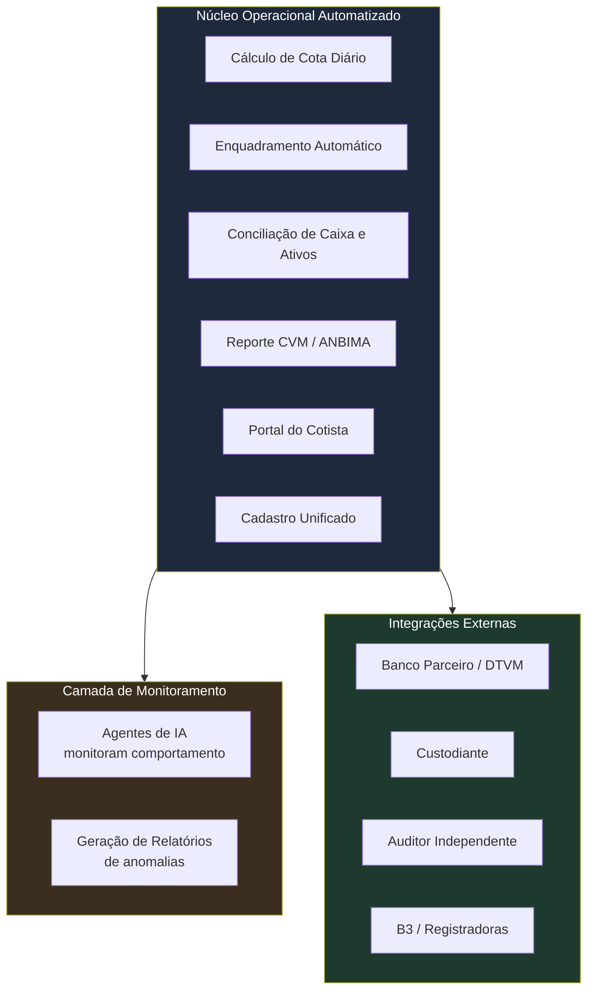

### 4.2 Princípio de escalabilidade

| Camada | Escala com nº de fundos? | Observação |
|---|---|---|
| Cálculo de cota, enquadramento, reporte | **Não** (custo marginal ~zero) | É software puro; aqui a tese funciona bem |
| Monitoramento por IA | **Não** (custo marginal ~zero) | Processamento automatizado |
| Auditoria independente | **Sim** (linear) | Um auditor externo por fundo; ver ⚠️ nº 3 |
| Fiscalização de conduta / exceções / atendimento | **Parcialmente** | Casos ambíguos exigem humano; cresce com nº de fundos |

> ⚠️ **Ponto frágil nº 3 — nem todo custo por fundo é automatizável.**
> A automação zera brilhantemente a camada de processamento (a maior em volume de tarefas), mas **não zera** a auditoria independente obrigatória (custo externo linear, ainda que repassado ao fundo) nem o resíduo de fiscalização humana e responsabilidade. O plano deve tratar essas camadas como custo real que cresce com a escala, não como algo que "a IA resolve".

### 4.3 Ciclo de vida ágil do fundo (*deploy* e encerramento rápidos)

Um dos diferenciais centrais é tratar o fundo como algo que se **cria e se encerra rapidamente**, em vez de um projeto artesanal e demorado. A plataforma padroniza cada etapa do ciclo de vida, com modelos pré-configurados (regulamento, políticas, integrações) que reduzem o tempo de constituição e o atrito de encerramento.

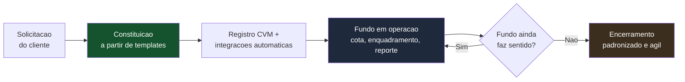

**Por que isso é valioso para o cliente:**

- **Menor tempo até operar:** um gestor ou assessoria consegue colocar um fundo de pé em prazo muito menor que o convencional.
- **Baixo custo de saída:** encerrar um fundo que não vingou deixa de ser um processo caro e travado, o que reduz o risco percebido de *tentar*.
- **Experimentação viável:** com criação e encerramento ágeis, o fundo vira um instrumento que se pode testar — combina diretamente com o público de fundos pequenos e de assessorias criando fundos próprios.

> ⚠️ **Ressalva honesta sobre "apagar fundos de forma ágil":** a agilidade é real na camada de *software e onboarding*, mas o encerramento de um fundo tem etapas **regulatórias e legais que não se comprimem à vontade** — liquidação de ativos, pagamento de cotistas, demonstrações finais, auditoria de encerramento, baixa junto à CVM e à Receita. "Ágil" aqui significa *o mais rápido que a regulação permite, sem gargalo operacional interno* — não significa instantâneo nem livre de prazos legais. Vale mapear o fluxo mínimo de encerramento para não prometer ao cliente uma velocidade que a norma não autoriza.

---

## 5. Estrutura Regulatória e Parceria Bancária

### 5.1 A restrição fundamental

Pela regulação da CVM, **administrador fiduciário precisa ser instituição autorizada pelo Banco Central** (tipicamente uma DTVM). Uma startup de tecnologia **não pode**, sozinha, exercer a função. Daí a necessidade da parceria.

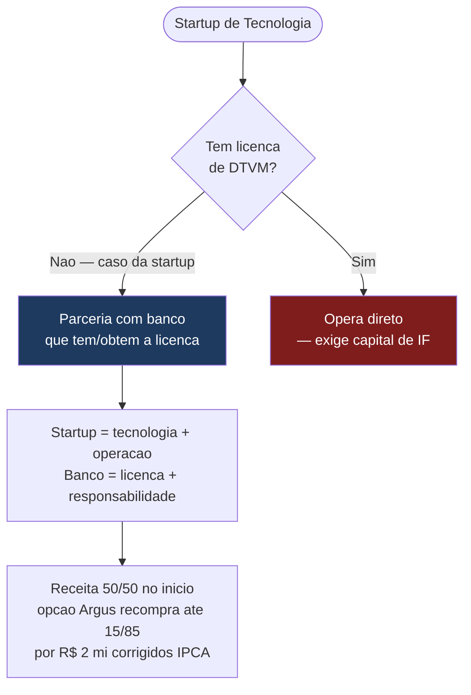

### 5.2 Papéis na parceria

| Parte | Aporta | Recebe |
|---|---|---|
| Startup (Argus) | Tecnologia, operação e originação — **prestadora de serviço** contratada pelo banco | Remunerada por parcela da taxa (Res. 175 art. 118 §1º): **50%** no início, até **85%** se exercer a opção |
| Banco parceiro (DTVM) | **Administrador de fato**: licença, diretores, **decisão, controle e responsabilidade** | **50%** no início; **15%** + **R$ 2 mi (IPCA)** se a Argus exercer a opção de recompra de 35 p.p. |

> ⚠️ **Ponto frágil nº 4 — o desafio comercial mais difícil do plano.**
> Um banco que empresta sua licença de DTVM assume **responsabilidade regulatória e reputacional** pela operação da startup. Se a startup errar (erro de enquadramento, fraude de um gestor não detectada), **é o banco que responde perante a CVM e os cotistas**. Bancos pequenos tendem a ser *conservadores* com risco regulatório, não arrojados. Convencer um a topar é o gargalo central — e não é resolvido por preço baixo (que até piora a percepção de risco). Este é o item que mais precisa de validação de mercado real (conversas com bancos) antes de qualquer construção.

---

## 6. Estratégia Comercial (Go-to-Market)

Há dois desafios comerciais paralelos:

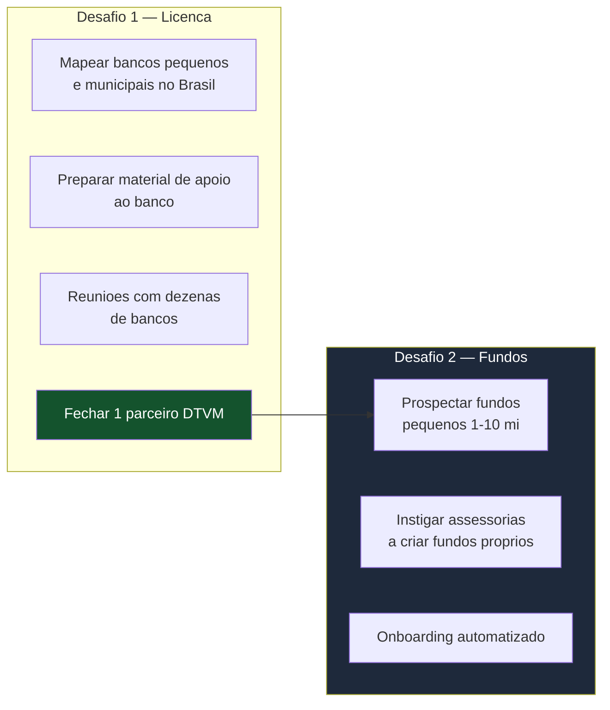

### 6.1 Desafio 1 — Encontrar o banco parceiro

- **Alvo:** bancos menores e regionais/municipais, que não têm operação própria de administração fiduciária e poderiam ver na parceria uma nova linha de receita.
- **Necessário mapear:** o que exatamente um banco precisa para se habilitar/operar como DTVM, para que a startup possa **auxiliá-lo na empreitada** (due diligence regulatória, requisitos de capital, estrutura).
- **Processo:** reuniões com dezenas de bancos até conversão.
- **Oferta:** **50%** da receita de administração para o banco no início (muito acima do que uma administradora tradicional dá a um parceiro), com **opção** de a Argus recomprar 35 p.p. por **R$ 2 mi (IPCA)**, deixando o banco com 15%.

> ⚠️ **Nota:** por que um banco pequeno que *não tem* DTVM toparia montar uma (processo caro e demorado, com capital regulatório) para hospedar a operação de um terceiro? A proposta é mais realista se mirar bancos que **já possuem** a licença e a subutilizam, do que bancos que teriam que obtê-la do zero. Vale segmentar os alvos entre "já tem licença" e "teria que obter".

### 6.2 Desafio 2 — Captar os fundos: os quatro segmentos-alvo

A captação **não é genérica** ("achar fundos pequenos"). Ela mira **quatro segmentos concretos**, com um gancho específico para cada um. Três atuam **agora** (fundos pequenos); o quarto é um **segundo passo**, quando a operação já estiver calibrada.

**Argumento transversal (vale para os três primeiros):** hoje não há opção barata e viável para abrir e operar um fundo pequeno, e o *deploy* é ágil — colocar o fundo de pé em prazo muito menor que o convencional e encerrá-lo com baixo atrito. Isso reduz o custo (e o medo) de tentar.

#### Fase 1 — fundos pequenos (R$ 1–10 mi), agora

**1. Clubes de investimento que querem virar fundo.** Clubes (até 50 participantes, público restrito) que já provaram a estratégia e querem captar do **público em geral**. Migram para fundo — e a estrutura de **subclasses** permite que os **sócios fundadores fiquem numa subclasse com taxa de gestão menor** que a do público novo (mesmo portfólio de ativos, passivo diferente). Gancho concreto: *"cresça captando do público sem punir quem começou com você"*.

**2. Assessores de investimento (AAI) que precisam de um veículo ágil.** Escritórios que hoje alocam o capital dos clientes **ordem a ordem**. Com um fundo próprio, concentram esse capital num **único veículo**, gerido de forma unificada, barata e rápida de constituir — em vez de replicar a mesma alocação em dezenas de contas.
> ⚠️ **Fronteira regulatória:** o AAI **não pode gerir nem administrar** (CVM). O desenho legítimo é o AAI como **distribuidor/originador** de um fundo cujo **gestor é habilitado** (próprio ou parceiro). Precisa de validação jurídica para não cruzar a linha de gestão/distribuição irregular.

**3. Gestores que fatiam uma estratégia em vários veículos sob medida — o multiplicador de captação.** Este é o segmento de **maior alavancagem**. Um mesmo gestor pode oferecer a sua seleção de ativos sob **benchmarks e condições diferentes para cada perfil de cliente**: um veículo que mede *alpha* contra o **Ibovespa + S&P 500**, outro contra **Ibovespa + CDI**, outro com **taxa/carência** distinta, outro para **público qualificado vs. varejo**. Cada tipo de cliente encontra o veículo que lhe cabe → **a captação total do gestor cresce muito**, porque ele deixa de perder o cliente que não se encaixava no fundo único.
> A mecânica: **classe** separa **ativos** (estratégias/exposições genuinamente distintas, cada uma com CNPJ próprio); **subclasse** separa **passivo** (público, taxas, benchmark de performance, carência) sobre o **mesmo portfólio**. Na estrutura tradicional, cada veículo desses seria um **fundo novo e caro**; na plataforma, o **custo marginal é quase zero** — é isso que torna o "fundo sob medida por cliente" economicamente possível. (Detalhe e limites em `guia_estruturas_classes_subclasses.md`; **subclasse não dilui taxa CVM** — a economia é de auditoria/contabilidade quando se consolidaria várias estruturas da mesma estratégia.)

#### Fase 2 — fundos médios (R$ 50–800 mi), o segundo passo

**4. Fundos médios, com a operação já calibrada e experiente.** Depois de dezenas de fundos pequenos rodando — e a parceria com o banco madura —, subir de ticket. A lógica é poderosa: **uma infraestrutura barata o suficiente para viabilizar um fundo de R$ 1 milhão barateia *enormemente* um fundo de R$ 200 milhões**, onde a mesma automação rende uma economia de custo muito maior em valor absoluto. **Teto natural (~R$ 800 mi):** acima disso, o fundo já tem escala para **negociar taxas baixas diretamente** com os grandes administradores e corretoras famosas — não é nosso alvo. O *sweet spot* é o médio "órfão de preço": grande demais para ser ignorado, pequeno demais para ter poder de barganha.

**Meta:** somar os fundos das quatro portas — ~R$ 200 mi de PL agregado na Fase 1, escalando com os médios na Fase 2.

---

## 7. Projeção Financeira (estrutura para preencher)

> Esta seção é um **esqueleto a ser preenchido** com uma planilha de custos real. Sem ela, a meta de lucro é uma aspiração, não uma projeção.

### 7.1 Receita (exemplo no cenário de R$ 200 mi de PL)

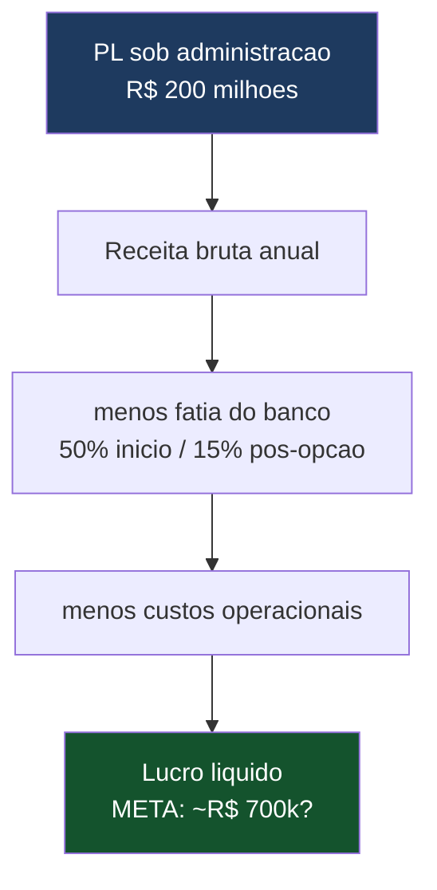

### 7.2 Custos a mapear (checklist)

- [ ] Divisão de resultado com banco parceiro (50% início → 15% pós-opção de recompra de R$ 2 mi IPCA)
- [ ] Equipe (operação, compliance, atendimento, tecnologia)
- [ ] Desenvolvimento e manutenção dos sistemas
- [ ] Infraestrutura de nuvem / dados
- [ ] Jurídico e regulatório contínuo
- [ ] Provisão para risco / contingência fiduciária
- [ ] Custo de aquisição de clientes (fundos) e de bancos
- [ ] Seguro (E&O / responsabilidade), se aplicável

> ⚠️ **Ponto frágil nº 5 — o lucro depende de o custo por fundo ser realmente baixo E do mix de tamanhos.**
> Refazer a conta com número de fundos, PL médio e custo unitário explícitos. A meta de R$ 700k precisa sobreviver ao Cenário A (muitos fundos minúsculos = muito overhead) e não só ao Cenário B.

---

## 8. Análise de Riscos (honesta)

Esta seção existe porque um plano que esconde seus riscos falha caro. Nenhum destes é necessariamente fatal — mas todos precisam de resposta antes de investir pesado.

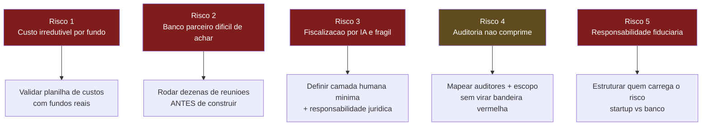

| # | Risco | Por que importa | Mitigação proposta |
|---|---|---|---|
| 1 | Custo por fundo pode ser irredutível | Se verdadeiro, o segmento de fundos pequenos é estruturalmente deficitário | Planilha de custos real; testar com fundos-piloto |
| 2 | Achar banco parceiro | É o gargalo comercial nº 1; banco assume risco reputacional | Validar com dezenas de reuniões **antes** de construir a tecnologia |
| 3 | Fiscalização de fraude via IA é frágil | IA pega o descuidado, não o fraudador competente; a fraude é feita para "as contas fecharem" | Camada humana mínima de compliance; definir claramente responsabilidade |
| 4 | Auditoria barata pode gerar ressalvas | Ofício CVM 2025: ressalvas recorrentes viram indício de negligência do administrador | Auditor eficiente (não escopo cortado); pulverizar para preservar independência |
| 5 | Responsabilidade fiduciária | Quem responde por dinheiro de terceiros? Sem capital de banco, exposição é existencial | Contrato claro startup↔banco; provisão; seguro |

> ⚠️ **Ponto frágil nº 6 — independência do auditor vs. escala.**
> Concentrar centenas de fundos em um único auditor barato cria **dependência econômica** que compromete a independência dele (vedado). Preservar a independência exige pulverizar entre vários auditores — o que reduz o poder de negociar preço-camarada. Há uma tensão real entre "auditor único barato" e "escala".

---

## 9. Roadmap Sugerido

A ordem importa: **validar o que pode matar o negócio antes de gastar construindo.**

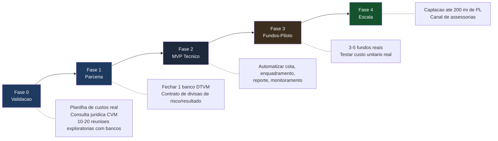

### Fase 0 — Validação (antes de construir nada)
1. Montar **planilha de custos** detalhada por fundo e por escala.
2. **Consulta jurídica** com especialista em mercado de capitais (estrutura, canal de assessorias, divisão de risco com banco).
3. **10–20 reuniões exploratórias com bancos** para testar o apetite pela parceria — este é o teste que mais rápido revela se o plano vive ou morre.

### Fase 1 — Parceria
4. Fechar 1 banco parceiro com licença de DTVM.
5. Contrato claro de divisão de resultado **e de responsabilidade**.

### Fase 2 — MVP Técnico
6. Construir o núcleo automatizado (cota, enquadramento, reporte, monitoramento).

### Fase 3 — Fundos-Piloto
7. Rodar 3–5 fundos reais e **medir o custo unitário real** (validar ou refutar a hipótese central).

### Fase 4 — Escala
8. Captação até a meta de PL, ativando o canal de assessorias.

---

## 10. Perguntas em Aberto (a resolver na próxima iteração)

1. **Custo unitário real por fundo** — quanto custa, de fato, operar 1 fundo pequeno ponta a ponta (incluindo a fatia humana irredutível)?
2. **Apetite bancário** — existe banco pequeno disposto a hospedar a operação sob sua licença? Em que condições?
3. **Mix de tamanho dos fundos** — qual PL médio torna a conta positiva? Há um piso de tamanho de fundo abaixo do qual você recusa o cliente?
4. **Responsabilidade** — no contrato com o banco, quem carrega qual parcela do risco fiduciário, e como isso é provisionado?
5. **Canal de assessorias** — é juridicamente limpo estimular assessorias a criar fundos próprios? Quais as fronteiras?
6. **Concorrência adjacente** — players digitais (ex.: Kanastra, QI Tech) focam crédito privado/FIDC de ticket alto; confirmam-se ausentes no nicho de fundos pequenos "genéricos"? Por quê?

---

## 11. Alternativa Estratégica a Considerar

Como contraponto honesto ao modelo "ser a administradora", vale manter no radar uma variação que **elimina de uma vez os pontos frágeis nº 4 (banco parceiro), nº 5 (fiscalização) e o risco fiduciário**:

> **Vender a tecnologia para quem já é administrador**, em vez de operar a administração. Nesse modelo, a startup fornece o software de controladoria/cálculo de cota/enquadramento/monitoramento para DTVMs e administradores existentes — sem precisar de licença, sem carregar risco fiduciário, sem depender de um banco topar hospedar a operação.

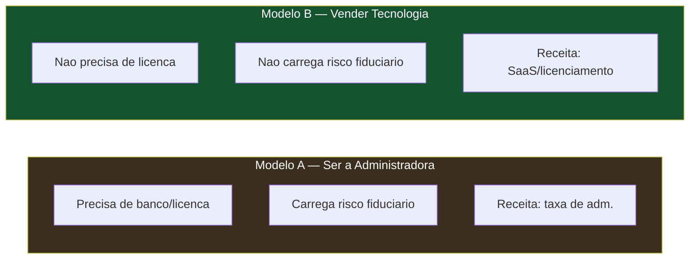

Não é para abandonar o Modelo A — é para manter o B como comparação viva, porque ele usa os mesmos ativos (tecnologia + conhecimento do fluxo de fundos) sem as travas regulatórias que pesam sobre o Modelo A.

---

---

## Adendo (jul/2026) — correções e detalhes da pesquisa regulatória/operacional

1. **Custódia é autorização separada (Res. CVM 32/2021, alterada pela 209/24).** O plano tratava "custódia absorvida pelo banco" como um dado; na verdade o banco parceiro precisa pedir autorização específica de custodiante à CVM (elegíveis: bancos, caixas, corretoras/DTVMs) demonstrando capacidade operacional e tecnológica — e depois aderir às infraestruturas (B3 Central Depositária/Balcão, SELIC, RSFN/SPB). Detalhes, custos e roadmap pós-licença no novo **`guia_custodia_conexoes.md`**. Impacto no plano: a alavanca "custódia R$ 0" segue válida, mas tem custo fixo real por trás (tarifas B3/links RSFN/equipe de retaguarda) que deve entrar na planilha de custos como custo do banco compensado pelo split.
2. **O dia a dia validado**: o ciclo real é batch D-1 → prévia de cota → **aprovação/rejeição pelo gestor** → correção via lançamentos → publicação → **informe diário à CVM em 1 dia útil**; mensais (balancete, CDA, perfil) em 10 dias úteis. Assembleias de cotistas podem ser 100% eletrônicas (Res. 175). Tudo já espelhado no piloto (v3).
3. **Sandbox regulatório (Res. CVM 29/2021):** não é caminho necessário no Plano A (parceria com banco licenciado — a atividade roda sob autorizações ordinárias). Vira **plano B** se as conversas com bancos falharem: exige novo ciclo aberto (o 1º rodou 2021–2026; 33 propostas, 4 autorizadas) e aprovação seletiva. Monitorar edital; o LEAP (laboratório CVM/Fenasbac) é vitrine útil, não autorização. Ver Seção 4 do guia de custódia.
4. **Taxas de gestão/performance não são padronizáveis pela plataforma** — são pactuadas pelo gestor no regulamento de cada fundo. A única taxa da plataforma é a de administração (0,08% a.a., piso R$ 100/mês).

*Documento de trabalho. Próximo passo sugerido: preencher a planilha de custos da Seção 7 (agora incluindo os custos de custódia do adendo) e rodar as reuniões exploratórias da Fase 0 — os dois testes que mais rápido dizem se a hipótese central se sustenta.*
